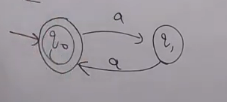
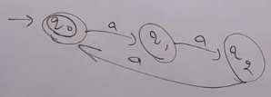
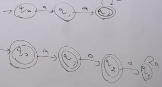
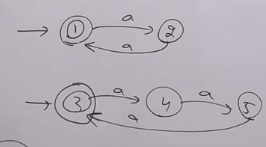
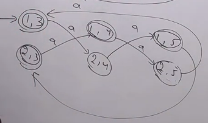
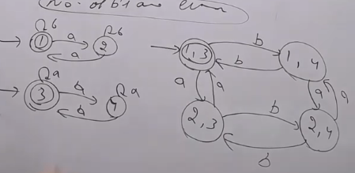

# Unary alphabet Questions

## All possible strings over $\Sigma$

- L = {$\epsilon$, a,aa,aaa, ...}
- q0 and loop a over it and q0 is the final state

## Even number of a's OR L = { $a^{2n} | n \ge 0$ }

- L = {$\epsilon$, aa, aaaa, aaaaaa, ...}

## Even number of a's except null string OR L = { $a^{2n} | n \ge 1$ }

- L = {aa, aaaa, aaaaaa, ...}
- add one more state in beginning  say q0' which if accept a goes to the final state q1.

## L = { $a^{3n} | n \ge 0$ }

## At least 2 a, At most 2 a

## L = { $ a^{2x+3y} | x,y \ge 0 $}

- First find the language string
- L = {$\epsilon$, aa,aaa,aaaa,aaaaa,aaaaaa,aaaaaaa, ...}
- $\epsilon$ is accepted so initial is final state
- a is not accepted jump to q1 bu tit is not final
- now again if a accepted jump to q2(final)
- loop a over q2 now

## L = { $ a^{n} | n=2x or 3y, x,y \ge 0}

- L = { $\epsilon$, aa, aaa, a4, a6, a8, a9, a10, a12}
- Concept of divisibilty, here by 2 or 3
- lcm 6, so draw 6 states

- other method is draw two different diagram for n=2x and n=3y

- Now take cross product and connect from the top diagram
- Final states are those where any one final of above are coming

- if and is there in place of or then just make final state which consist both final states

## No. of a's are even & No. of b's are even

