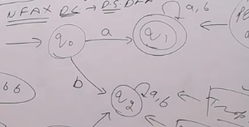
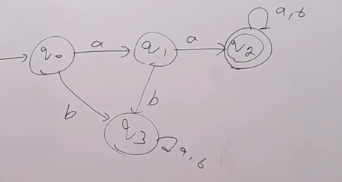
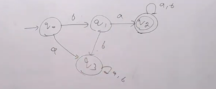
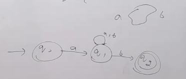
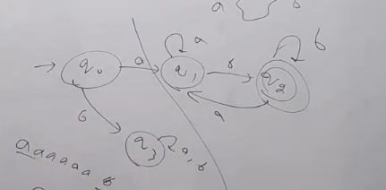
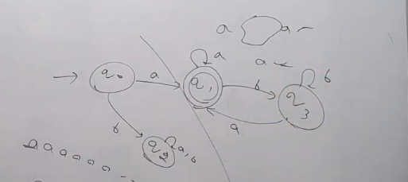
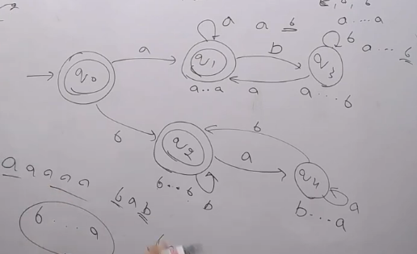
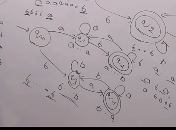
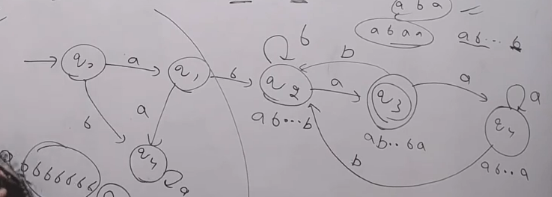
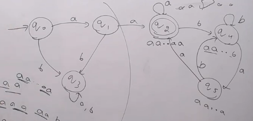

## **Here there would be states like Permanent accept, Permanent Reject state**

- Like if started with desired string send it to **Permanent Accept**
- If started with undesired string send it to **Permanent Reject**

**Construct an FA for strings over a & b, starting with a.**
- Below is DFA, for NFA we can remove the Permanent Dead State q2  

**Construct an FA for strings over a&b starting with 'aa'.**
- Below given is DFA, for NFA we can remove the Permanent Dead State q3  

**Construct an FA for strings over a&b starting with 'ba'.**
- Below given is DFA, for NFA we can remove the Permanent Dead State q3  

# If |S| = n => NFA = (n+1), DFA = (n+2)

## Starting and Ending Merge cases

**Construct an FA for strings over a&b starting with 'a' and ending with 'b.**  

- Line drawn shows that never include the states that leads to permanent dead state

**Construct an FA for strings over a&b starting with 'a' and ending with 'a'.**  

- For NFA remove the q2 dead state

**Construct an FA that start and end with same letter over a&b.**

- We made 2 different paths for a abd b for the memory purpose like whether it started with a or it started with b, due to this we can get the logic of with which letter to end with, else we won't get any proper FA.
- q0 is final for S = $\epsilon$, q1 is final for S = a,aa,aba,...
- q2 is final for S = b,bb,bab,...

**Construct an FA that start and end with different letter over a&b.**  

### From above 2 question you may have noticed that only final states are change
### To accept Complementart language in DFA just swap the final and non-final stages

### *****
**Q. Not start with a and not end with a**

- L = not start with 'a' or not end with 'a'
- $\hat L$ = not (not start with 'a' or not end with 'a')
- $\hat L$ = start with 'a' and end with 'a'
- Hence diagram will be same from one above just final and non-final states are interchanged i.e. q1 will be non-final and q0,q2 and q3 will be final.

**Q. Start with 'ab' and end with 'ba'**

**Q. Start with 'aa' and end with 'aa'**

