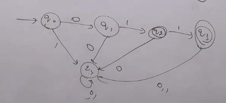
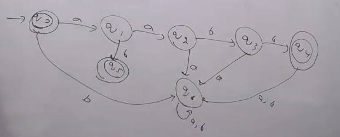
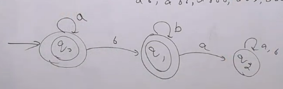
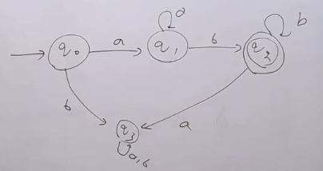
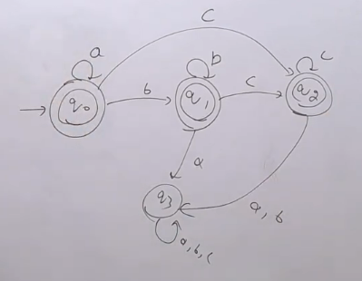
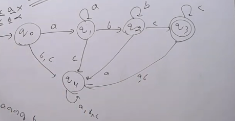
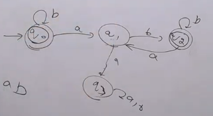
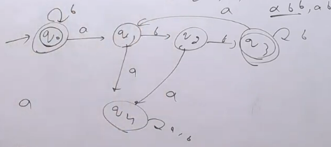
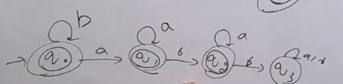
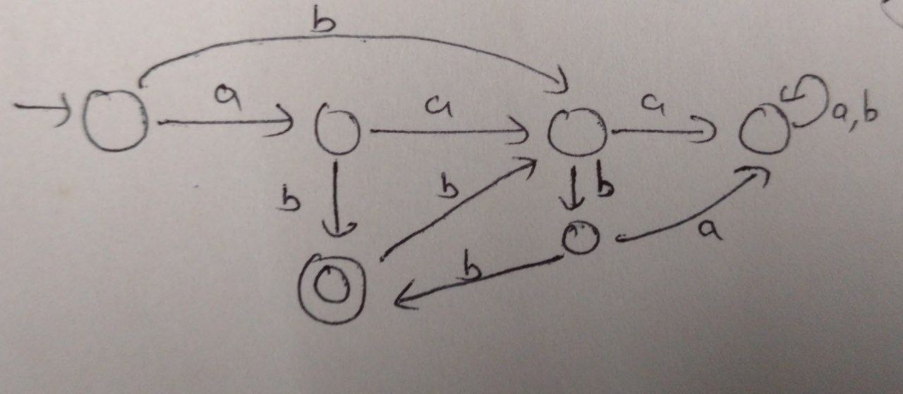

# Theorem for Infinite Language

- **If for the given language L, the minimum string length is n, then the minimum number of states in DFA/NFA will be n+1.**

# Theorem for Finite Language

- **If for the given language L, the maximum string length is n, then**
    - **For DFA minimum number of states will be n+1.**
    - **For NFA minimum number of states will be n+2.**

- Example: L = { 01,011}
- $|W_{max}|$ = 3
- 4 states in DFA and 5 states in NFA

- remove dead state for NFA

- Example: L = {$ a^{n}b^{n} | n \le 2 $}
- L = {$ \epsilon, ab, aabb $}
- $|W_{max}|$ = 4
- 5 states in DFA and 6 states in NFA

- remove dead state for NFA

# Followed by something type

## Any number of a's followed by any number of b's
## L = { $ a^{n}b^{m} | n, m \ge 0 $ }

- L =  { $ \epsilon, a, aa, aaa, ..., $
          b, bb, bbb, bbbb, ....,
          ab, aab, abb, abbb, ... }
- Infinite Language, $|W_{min}|$ = 1

- For, NFA remove the q2 dead state

## L = { $ a^{n}b^{m} | n, m \ge 1 $ }

- L =  { ab, aab, abb, abbb, ... }

- For, NFA remove the q3 dea state

## L = { $ a^{n}b^{m}c^{p} | n, m,p \ge 0 $ }

## L = { $ a^{n}b^{m}c^{p} | n, m,p \ge 1 $ }

## In general if
## L = { $ a^{n}b^{m}c^{p}d^{q}e^{r} | n, m,p,q,r \ge 1 $ }
- NFA =6, DFA = 7
## L = { $ a^{n}b^{m}c^{p}d^{q}e^{r} | n, m,p,q,r \ge 0 $ }
- NFA =5, DFA = 6

## L = {$ a^{n} b^{m} | n,m \ge 0 $} then DFA for $L^{C}$?

- Image-75 is for L = {$ a^{n} b^{m} | n,m \ge 0 $}
- For, $L^{C}$, we have to change the final states to non-final states and vice-versa. (DFA)

## L = {$ a^{n} b^{m} | n,m \ge 1 $} then DFA for $L^{C}$?
- Image-76 is for L = {$ a^{n} b^{m} | n,m \ge 1 $}
- For, $L^{C}$, we have to change the final states to non-final states and vice-versa. (DFA)
- This is same for question for strings starting with b or only a's or containing substring ba.

## L = {$ a^{n} b^{m} c^{p} | n,m,p \ge 0 $} then DFA for $L^{C}$?

- Image-77 is for L = {$ a^{n} b^{m} c^{p} | n,m,p \ge 0 $}
- For, $L^{C}$, we have to change the final states to non-final states and vice-versa. (DFA)

## Every "a" is followed by a "b"

- L = { $\epsilon$, b, bb, bbb, ...
        ab, abb, abbb, ....}
- Since, $\epsilon$ is accepte initial is or final.
- Any number of initial b's are accepted so loop b over q0
- If a occurs then jumg to other state, also don't make it final as we at least one b behind any a occurred.
- Now for q1, if a occurs then dead state
- if b occurs jump to other final state.

## Complement of every "a" is followed by a "b"

- Complement means there won't be b behind a, so ending with a.
- Also if if 2 a occurs, it will be complement of 'a' followed by 'b'.
- Language containing aa as substring or ending with a.

## Every 'a' is followed by 'bb'

## Every 'a' is never followed by 'bb'

## L = {$a^nb^m | n=m mod 3$}
