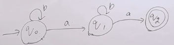
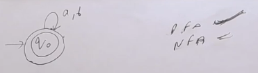
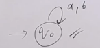
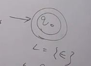
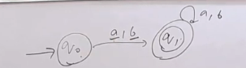
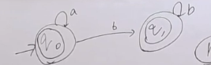
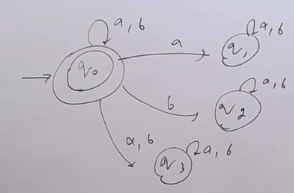
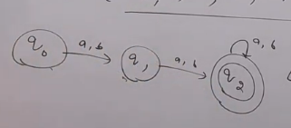
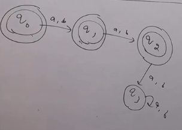

### Every DFA is NFA

### Question 1

- Given diagram is not DFA as there is no path defined for q2
- Given diagram is NFA

**Language Accepted will be**
- a. All possible Strings over a & b which ends with a
- b. All possible Strings over a & b which constains exactly 2 a's
- c. All possible Strings over a & b which constains exactly 2 a's and ends with a (Correct Answer)
- d. All possible Strings over a & b which constains 'aa' as substring
- e. This FA will accept strings over a & b that ends with a. (Correct Answer) {This doesn't enforce for all strings to be correct, it just states it gives condition about there exist not for all so it is right}

### Question 2

- Given diagram is DFA, and as every DFA is NFA so it is NFA
- DFA because each input gives a unique move
- The Language accepts all possible strings over a & b (null included)

- We can make infinite DFA for a given language
> THere exists unique DFA for a given regular language which is minimum number of states

### Question 3
#### Minimum number of states for a DFA accepting L = $\phi$

- 1
- Also, there can be infinite number of states possible but minimum number of states will be 1

- Don't draw any final state that's it

### Question 4

- Given image is NFA and not DFA
- Also L = { $\epsilon$ } as there is no path defined

### Question 5

- Given image is NFA and DFA

**Language Accepted will be**
- a. All possible Strings over a & b starting with a or b (Correct Answer)
- b. All possible Strings over a & b ending with a or b (Correct Answer)
- c. All possible Strings over a & b which constains atleast one a
- d. All possible Strings over a & b which constains atleast one b
- e. All possible Strings over a & b which constains atleast one a or b (Correct Answer)
- f. All possible Strings over a & b whose length is atleast 1 (Correct Answer)
- g. All possible Strings over a & b
- h. All possible Strings over a & b except null string (Correct Answer)

### Question 6

- Given image is NFA and not DFA

**Language Accepted will be**
- a. All possible Strings over a & b
- b. Any number of a's followed by any number of b's (Correct Answer)
- c. All possible Strings over a & b which 'b' is not followed by 'a' (Correct Answer)
- d. All possible Strings over a & b which doesn't contain 'ba' as substring (Correct Answer)
- e. L = { $a^{n}b^{m}  | n \geq 0, m \geq 0$ } (Correct Answer)
- f. L = { $a^{n}b^{n}  | n \geq 0$ } (It misses the strings like aab, abb, aabbbb, etc)

### Question 7

- Given image is NFA and not DFA

**Language Accepted will be**
- a. All possible Strings over a & b

### Question 8

- Given image is NFA and DFA

**Language Accepted will be**
- a. All possible Strings over a & b with length at least 2

### Question 9

**Language Accepted will be**
- a. All possible Strings over a & b with length at most 2