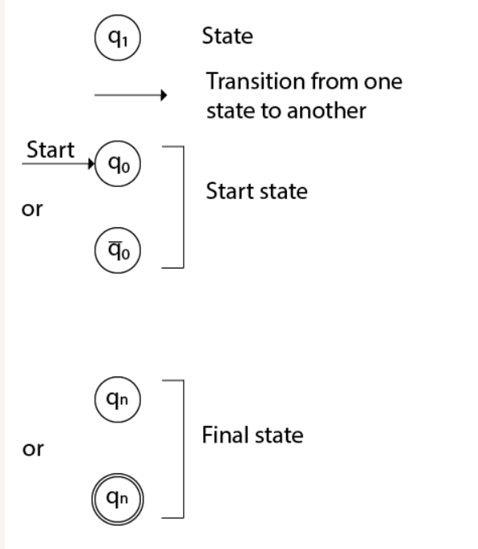
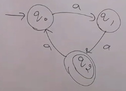
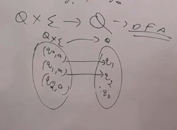
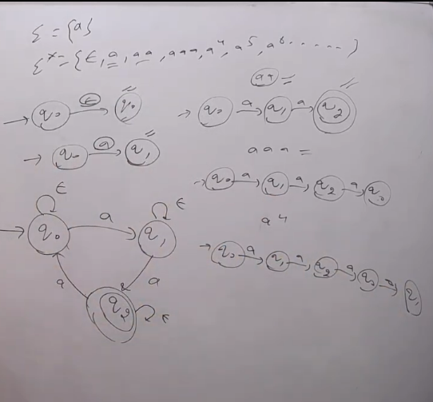
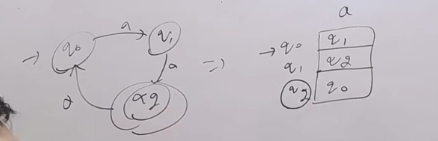
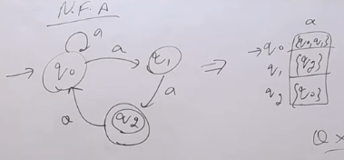
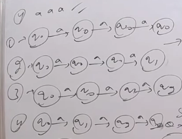
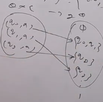

- There are two ways to represent FA
    1. Transition Diagram
    2. Transition Table
- Transition Table is a table where we write all the possible moves of FA
- Transition Diagram is a diagram where we draw all the possible moves of FA

# Transition Diagram

From Diagram:
    - Q = {q0,q1,q2}
    - $\Sigma$ = {a}
    - $\delta$ :
        - $\delta(q_{0},a)$ = { $q_{1}$ }  
        - $\delta(q_{1},a)$ = { $q_{2}$ }  
        - $\delta(q_{2},a)$ = { $q_{0}$ }  
    - $q_{0}$ = q0  
    - f = { $q_{2}$ }  

**Delta Diagram**  

### Example 1 Related to Above Transition Diagram

  

Here $\Sigma$ = {a}  
$\therefore \Sigma^{*} ={ \{\epsilon, a, aa, aaa, ...  \}} $  
**From Below Definition Accepted Strings will be**
- $ aa, a^{5}, a^{8}, a^{11}, ... $  

**Accepted Languages are**
- L = { $ a^{2}, a^{5}, a^{8}, ... $ }  
- $\therefore$ L = { $a^{3n+2}|n \ge 0 $ } = { $a^{3n+2}|n > -1 $ }, { $a^{3n-1}|n \ge 1 $ }, { $a^{3n-1}|n > 0 $ }, { $a^{3n-4}|n \ge 2 $ }, etc.. **For MSQ Purpose**

### String Accepted by DFA
1. Start from $q_{0}$
2. After reading the entire input String
3. DFA is any one of the final state
- Then String is accepted by DFA

### Language Accepted by DFA
- Set of all Strings accepted by the DFA  
- Language is accepted by DFA if all strings in 'L' are accepted and all Strings not in 'L' are rejected.

**Suppose in the above Diagram instead of q2, q0 and q2 both can be final state then:**
- Above Language cannot be said to be accepted language because it misses some Strings which are accepted.
- Strings accepted are:
    - $\epsilon, a^{2}, a^{3}, a^{5}, a^{6}, a^{8}, a^{9}, ... $
- $\therefore$ L = { $a^{3n+2} \cup a^{3m} | n,m \ge 0 $ }

## Transition Table

Each cell must have exactly one entry State.

> If there are no final states in DFA or NFA, then L = $\phi$

## Transition Diagram and Table of NFA

**Example of String Input**

- Accepted Strings are $ a^{2}, a^{3}, a^{4}, a^{5}, ... $
- L = { $ a^{2}, a^{3}, a^{4}, a^{5}, ... $ }
- L = { $ a^{n} | n \ge 2 $}

**State Transition Function** 

**String Accpeted by NFA**

- FIrst two conditions are same as DFA
- There exists any one path after accessing it NFa is at any one of the final state.
