# Length at Least 1

- Construct two states where from initial to final we go by reading a character.
- Read one character so we got at least one character.
- Now loop on the final state so we can read any number of character.  
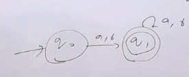

# Length at Least 2

- there will be three states here as we need to read at least two character.  
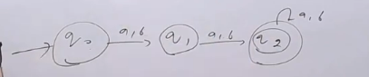

# Length at Most 1

- Strings accepted by this DFA are $\epsilon$, a, b
- We need 3 states, first will be final handling $\epsilon$, second will be final handling a and b, third will be non final which is a trap state if string is greater than 1.
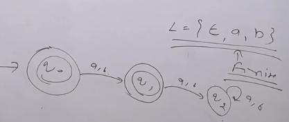

# Length at Most 2

- 4 states and 4th state is trap state

# Length exactly 1

- 3 states and 2nd state is final state
- 3rd state is trap state

# Length exactly 2

- 4 states and 3rd state is final state
- 4th state is trap state

# Length at least 1 a

- 2 States and 2nd state is final state
- b loops on both state as it hardly matters
- for initial state we can read a and go to final state while for final state we can read a and go to final state again  
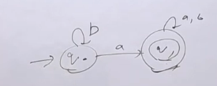

# Length at least 2 a
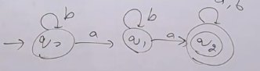

# Length at most 1 a
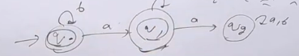
- 2 states in NFA, just remove the a link from q1

# Length at most 2 a
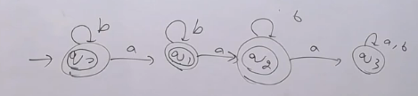

# Length exactly 1 a
- Just remove intial final state

# Length exactly 2 a
- Just remove intial final state and first final state

# Length at least 1 a and at least 1 b

- For such question we will follow grid automata
- At least 1 a, so 2 states in  row to handle a
- At least 1 b, so 2 states in column to handle b
- Total 4 states, 2 * 2 grid  
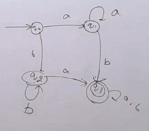

# Length at least 2 a and at least 2 b

- At least 2 a, so 3 states in  row to handle a
- At least 2 b, so 3 states in column to handle b
- Total 9 states, 3 * 3 grid  
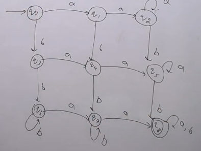

# Length at most 1 a and at most 1 b

- At most 1 a, so 2 states in  row to handle a
- At most 1 b, so 2 states in column to handle b
- one extra dead state to handle more than 1 a or b
- Total 5 states, 2 * 2 grid + 1 dead state  
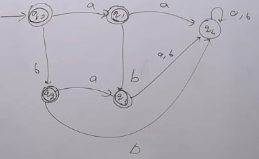
- No need to draw Dead State for NFA

# Length at most 2 a and at most 2 b

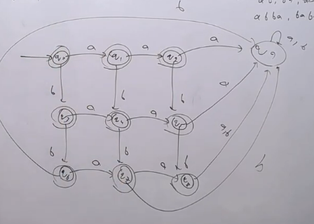

## Same goes with the exactly just the final states now for exactly 2 a and 2 b will be q3 only

# At least 2 a and at most 2 b
- 9 states  
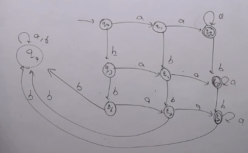

# At least 1 a or at least 1 b
- Draw 4 states, 2*2 grid  
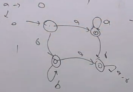
- Will look something like above, now we cn see that 2,3,4th are the same so we need to merge them
- hence final will be of just 2 states  
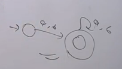

# Atleast 2 a or Atleast 2b
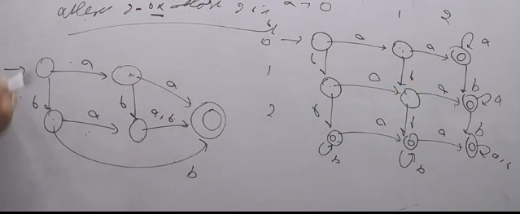
- Every time the corner edges are merged