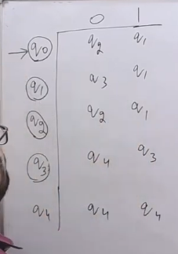

DFA --Algorithm--> min DFA

- Step 1: Remove all unreachable states from initial DFA state.
- Step 2: Group all states into two sets: Final and Non-Final.
- Step 3: Check Behavior of each state with respect to each input symbol.

**Find minimized DFA for the following DFA:**  

- From step 1: we eliminate state q5 because it is unreachable.
> - Check the states from the initial state, make a set in which reachable states are added and then check the states from the states in the set and add the reachable states to the set. Repeat this process until no new state is added to the set.
> - Don't pick state from table pick from the set being formed.
- From step 2: we group all states into two sets: Final and Non-Final.

| Non-Final | Final |
|-----------|-------|
| q0,q1,q3,q6,q7 | q2,q4 |

Now we check behavior of each state with respect to each input symbol.
- q0 both 0 and 1 to non-final family.
- q1 0 to final family and 1 to non-final family.
- q3 both 0 and 1 to non-final family.
- q6 both 0 and 1 to non-final family.
- q7 both 0 and 1 to non-final family.
- q2 0 to non-final family and 1 to final family.
- q4 0 to final family and 1 to non-final family.

So now we have groups like

| G-1 | G-2 | G-3 | G-4 |
|-----------|-------|-------|-------|
| q0,q3,q6,q7 | q1 | q2 | q4 |

- Again check behavior of each state with respect to each input symbol where the states are in same group.

- q0 0 to G-1 and 1 to G-2.
- q3 both 0 and 1 to G-1.
- q6 both 0 and 1 to G-1.
- q7 0 to G-2 and 1 to G-1.

So now we have groups like

| G-1 | G-2 | G-3 | G-4 | G-5 | G-6 |
|-----------|-------|-------|-------|-------|-------|
| q0 | q3,q6 | q7 | q1 | q2 | q4 |

- Again check behavior of each state with respect to each input symbol where the states are in same group.

- q3 0 to G-2 and 1 to G-4
- q6 0 to G-2 and 1 to G-4

Now no further breaking possible and also q3 and q6 have same behavior so we can merge them and let it name q36

- Finally we have only 6 states in minimized DFA.

- Minimize DFA Table:

| State | 0 | 1 |
|-------|---|---|
| ->q0 | q0 | q1 |
| q1 | q2 | q3 |
| (q2) | q0 | q36 |
| q36 | q36 | q7 |
| (q4) | q2 | q36 |
| q7 | q1 | q0 |

**Q. Find minimized DFA for the following DFA:**  

**Ans.**  

**Q. Find minimized DFA for the following DFA:**  

**Ans.**  
