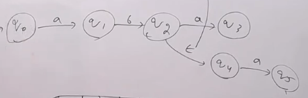
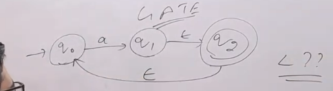
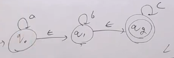
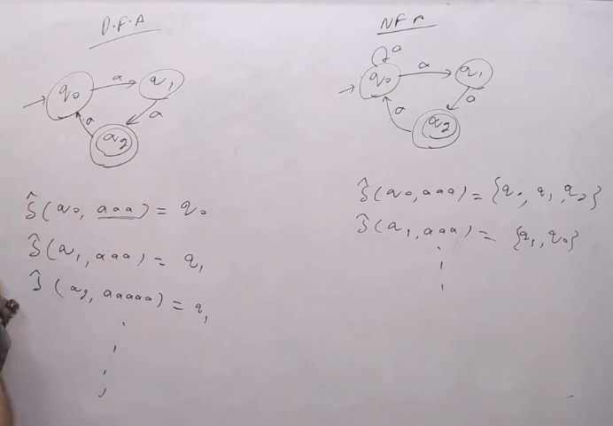
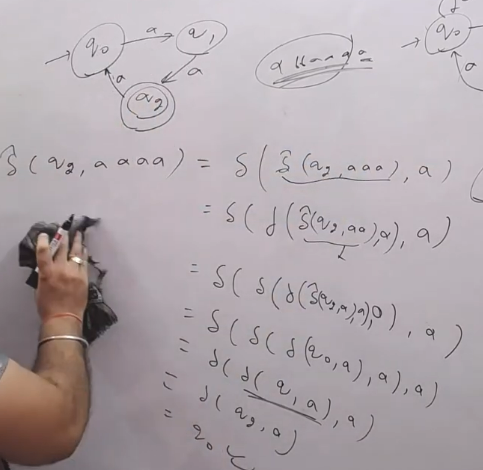
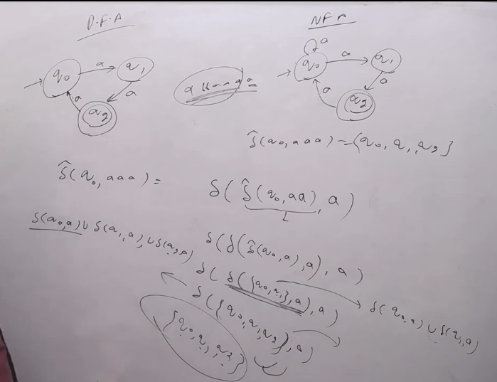
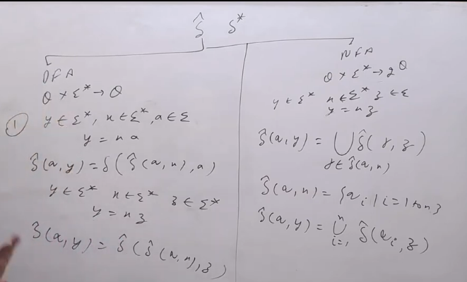

## It is not possible in DFA to have more than one transition for a given state and input symbol, Hence with null move in DF we will be at the current state only.

## In NFA we can have more than one transition for a given state and input symbol, Hence with null move in NFA we can be at the current state or we can go to other state as well.

- In the NFA diagram if there is a path from one state to other state with null move, means it can move to other state without reading any input symbol, then it is called NFA with null move.

- Whenever there is a null move we have two choices either we can take null move or we can take input symbol.
- Like in the below image

- Even if there is no input symbol we still have two choices either we can take null move or stay at the same state.

- We can convert this NFA with Null move to NFA without null move by using Algorithm.
- Hence Power of NFA with null move is equal to power of NFA without null move is equal to power of DFA.

**Q. What language is accepted by below NFA with null move?**

- There is nothing to jump from initial with $\epsilon$ as input. so null is not possible.
- Reading a $\epsilon$ == a we can go to final state.
- Similarly we can go with a $\epsilon \epsilon a \epsilon$ == aa to final state.
- Hence all strings with a's are accepted by this NFA.

**Q. What language is accepted by below NFA with null move?**

- L = $\{a^{n}b^{m}c^{p} | n,m,p \geq 0\}$

### Extended Transition Function ($\hat{\delta}$)

- $\hat{\delta}$ is a function which takes a state and a string as input and gives a set of states as output, while $\delta$ takes a state and a symbol as input and gives a state as output.

- We wrote $\delta$ = Q x $\Sigma$ -> Q || Q x $\Sigma$ -> $2^{Q}$
- We write $\hat{\delta}$ = Q x $\Sigma^{*}$ -> Q || Q x $\Sigma^{*}$ -> $2^{Q}$

- $\hat{\delta}$(q0,ababab) = $\delta$($\hat{\delta}$(q0,ababa),b)
- $\hat{\delta}$(q,y) = $\delta$($\hat{\delta}$(q,x),a) where y = xa
- $\hat{\delta}$(q,x) = $\hat{\delta}$($\hat {\delta} $(q,y),z) where x = yz, y and z are strings.

- Example

- Solve $\hat{\delta}$(q0,ababab)
- break it into $\hat{\delta}$(q0,ababa) and b
- further keep breaking it until we get a single symbol
- Now keep solving it in reverse order

#### **Above is true only in the case of DFA**
#### **In case of NFA we have to take union of all the states.**
- $\hat{\delta}$(q,y) = $\bigcup_{p \in \hat{\delta}(q,x)} \delta(p,a)$ where y = xa
- $\hat{\delta}$(q,y) = $\bigcup_{p \in \hat{\delta}(q,x)} \hat{\delta}(p,z)$ where y = xz, where x and z are strings.

- Used this as here set of states are possible, the output is not a single state.
- Like reading a string ababab,
    - now suppose before reading the final b we are at state q4,q3,q5.
    - We have reached this state by reading the x = ababa, and as it is NFA we can be at multiple states at a time.
    - Now we have to read b, so we have to take union of all the states we can reach by reading b from q4,q3,q5.
    - Like reading b from q4 we can reach q0, reading b from q1 we can reach q4 and reading b from q5 we can reach q3.
    - Here $\hat{\delta}$(q,x) = {q4,q3,q5} so we have to take union of all the states we can reach by reading b from q4,q3,q5.
    - i.e. $\delta$(q4,b) $\cup$ $\delta$(q3,b) $\cup$ $\delta$(q5,b) = {q0,q4,q3}
    - Therefore, $\hat{\delta}$(q,y) = {q0,q4,q3} where y = xa = ababab

#### A point don't know the heading of this point
- $\hat{\delta}$(q,x) = {$q_{i} | i = 1,...,n$}
- $\hat{\delta}$(q,y) = $\bigcup_{i=1}^{n} \delta(q_{i},z)$ where y = xz

- Example

### Summary 
