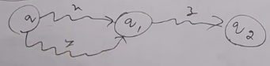
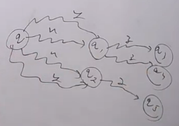
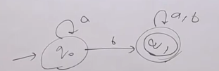

### Property 2

$$ \hat \delta(q, x) = \hat \delta(q,y) \implies \hat \delta(q, xz) = \hat \delta(q, yz) $$
- Means reading a string x you go to state q, also reading a string y you go to same state q, then reading a string xz you go to same state as reading yz
- Here q can be any state not necessarily initial state

- Same stands for NFA here just there can be set of states

#### Q. $$ \hat \delta(q, x) = \hat \delta(q,y) \implies \hat \delta(q, zx) = \hat \delta(q, zy) ?$$ 

- Answer is NO
- Because $$ \hat \delta(q, x) = \hat \delta(q,y) $$ means that reading x and y you go to same state from q to q1. Means above condition is valid only for a specific state only not for all states.
- Now reading z first we may go to some other state other than one defined in above condition. And for that other state say q2
$$ \hat \delta(q2, x),\hat \delta(q2, y) $$ 
may or may not be equal. So we can't say that
$$ \hat \delta(q, zx) = \hat \delta(q, zy) $$

### Property 3 (Right invariance )

- To strings x and y are equivalent if after reading both from initial state we reach same state

- Like here 
    - Reading a we go to q0
    - Reading aa we go to q0
    - Hence $ a \equiv aa $
- Similarly,
    - Reading b we go to q1
    - Reading ab we go to q1
    - Reading abb we go to q1
    - Reading abba we go to q1
    - Hence $ b \equiv ab \equiv abb \equiv abba $

- **Mathematically**
$$ x \equiv y \iff \hat \delta(q_{0}, x) = \hat \delta(q_{0}, y) $$

- We can also write it as:
$$ \hat \delta(q_{0}, x) = \hat \delta(q_{0}, y) \implies \hat \delta (q_{0}, xz) = \hat \delta(q_{0}, yz) $$
- Note here we have passed q0 as initial state. So this condition is valid only for initial state. Not for any other state.

#### Q. If $ 011 \equiv 101 $ then
[x] $ 0110 \equiv 1010 $  
[x] $ 01101000 \equiv 10101000 $  
[] $ 100011 \equiv 100101 $  
[] $ 01110 \equiv 10111 $

- Answer is first two options
- third option is the condition of zx and zy and in forth option the later string is not same for both

### Mathematical Definition of Language accepted by DFA and NFA

- **DFA**
    - A language L is accepted by DFA M if
    $$ L = \{ x \in \Sigma^{*} | \hat \delta(q_{0}, x) \in F \} $$
    - Means all strings x which after reading from initial state we reach final state
- **NFA**
    - A language L is accepted by NFA M if
    $$ L = \{ x \in \Sigma^{*} | \hat \delta(q_{0}, x) \cap F \neq \phi \} $$
    - Means all strings x which after reading from initial state we reach some final state
