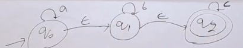

# Algorithm to convert NFA with null moves to NFA without null moves

## Note: Number of states in NFA with null moves is equal to the number of states in NFA without null moves.

## Algorithm

**Let's take an Example:**

- Step 1:
    - Find all the states that can be reached from the different states using null moves (Epsilon Closure).
        - $ \hat \delta(q_{0}, \epsilon) = \{ q_{0},q_{1},q_{2}  \} $
        - $ \hat \delta(q_{1}, \epsilon) = \{ q_{1},q_{2}  \} $
        - $ \hat \delta(q_{2}, \epsilon) = \{ q_{2}  \} $
- From this we can get which states are final for NFA without null moves.
    - $ F = \{ q_{0},q_{1},q_{2}  \} $
    - We get which state will be final by checking it's epsilon closure, if it contains any final state then it will be final state.

- Step 2:
    - Create a table of all the states and all the symbols.

- Write all reachable state after reading symbol from that state
- While reading we can take consideration of reading the string as $\epsilon^{*}a\epsilon^{*}$ or $\epsilon^{*}b\epsilon^{*}$ or $\epsilon^{*}c\epsilon^{*}$

- for [q0,a] we can reach
    - q0 as self loop
    - q1 as a $\epsilon$
    - q2 as a $\epsilon$ $\epsilon$

- for [q0,b] we can reach
    - q1 as $\epsilon$ b
    - q2 as $\epsilon$ b $\epsilon$

| States | a | b | c |
| ------ | - | - | - |
|  ->(q0)     | {q0,q1,q2} | {q1,q2} | {q2} |
| (q1)     | - | {q1,q2} | {q2} |
| (q2)     | - | - | {q2} |

-> means initial state

() means final state

- Step 3:
    - Create the diagram from the table.

**Q. Convert the following NFA with null moves to NFA without null moves**

- Epsilon CLosure of all states
    - $ \hat \delta(q_{0}, \epsilon) = \{ q_{0},q_{1},q_{3}  \} $
    - $ \hat \delta(q_{1}, \epsilon) = \{ q_{1},q_{3}  \} $
    - $ \hat \delta(q_{2}, \epsilon) = \{ q_{2}  \} $
    - $ \hat \delta(q_{3}, \epsilon) = \{ q_{3}  \} $

- Transition Table

- for [q0,0] we can reach
    - q0 as self loop
    - q1 as 0 $\epsilon$
    - q3 as 0 $\epsilon$ $\epsilon$
- for [q0,1] we can reach
    - q3 as $\epsilon$ $\epsilon$ 1
- for [q1,0] we can reach
    - q2 as 0
    - q3 as $\epsilon$ 0
- for [q1,1] we can reach
    - q3 as $\epsilon$ 1

| States | 0 | 1 |
| ------ | - | - |
|  ->(q0) | {q0,q1,q3} | {q3} |
| (q1) | {q2,q3} | {q3} |
| q2 | - | {q1,q3} |
| (q3) | {q3} | {q3} |

**Q. Convert the following NFA with null moves to NFA without null moves**

- Epsilon CLosure of all states
    - $ \hat \delta(q_{0}, \epsilon) = \{ q_{0},q_{1},q_{2},q_{3}  \} $
    - $ \hat \delta(q_{1}, \epsilon) = \{ q_{1},q_{2}  \} $ 
    - $ \hat \delta(q_{2}, \epsilon) = \{ q_{2}  \} $
    - $ \hat \delta(q_{3}, \epsilon) = \{ q_{3},q_{2}  \} $

- Transition Table

| States | 0 | 1 |
| ------ | - | - |
|  ->(q0) | {q0,q1,q2,q3} | {q1,q2},q3 |
| (q1) | - | {q1,q2} |
| q2 | - | {q3,q2} |
| (q3) | - | {q3,q2} |