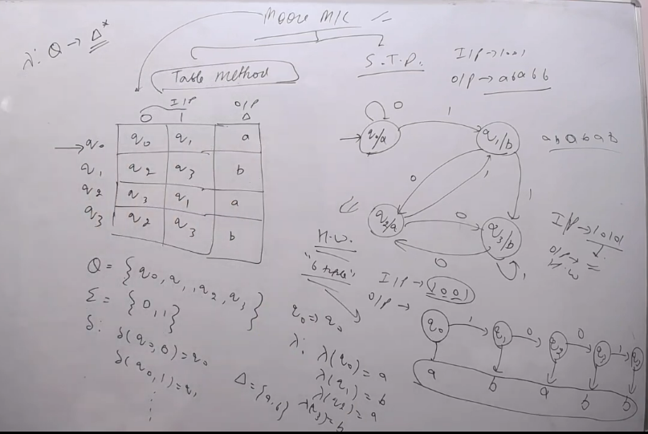
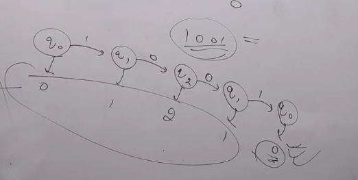
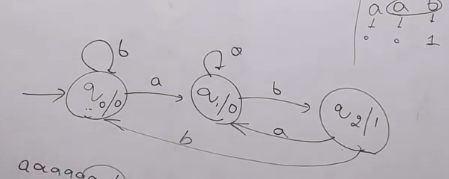
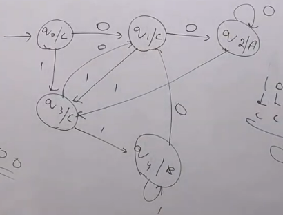

## Finite Automata is divided into 2 parts
#### Acceptors and Transducers
### Acceptors
#### Acceptors are used to accept or reject a string i.e. input is string and output is either yes or no
#### Acceptors are of 2 types
##### 1. DFA (Deterministic Finite Automata)
##### 2. NFA (Non-Deterministic Finite Automata)
### Transducers
#### Transducers are used to convert one string to another string i.e. input is string and output is also a string
#### Transducers are of 2 types
##### 1. Moore Machine
##### 2. Mealy Machine

### Transducers are represented by 6-tuple (Q, Σ, O, δ, λ, q0)
- Q is a non-empty finite set of states
- Σ is a non-empty finite set of input symbols
- O is a non-empty finite set of output symbols
- δ is a transition function which maps Q x Σ -> Q
- λ is a output function which maps Q x Σ -> O
- Here $\delta$ here state Q x Σ -> Q (Similar to DFA) and λ here state Q x Σ -> O

#### Moore Machine: are finite state machines with output value and its output depends only on the present state. 

- It can be defined as (Q, q0, ∑, O, δ, λ) where:
    - Q is a finite set of states
    - q0 is the initial state
    - ∑ is a finite set of symbols called the input alphabet
    - O is a finite set of symbols called the output alphabet
    - δ is the transition function where δ: Q x ∑ -> Q
    - λ is the output function where λ: Q -> O

- Example of Moore Machine
    - For $\Sigma = {a, b}$ and $O = {0, 1}$, the Moore machine can give output as follows:
    - $\lambda (q0) = \epsilon$
    - $\lambda$ (q1) = 100
    - $\lambda$ (q2) = 010111

- Good Example  

##### Construct a Moore Machine which generate a residue modulo 3 as output when input is binary number

  
- Easy trick to make such machine is just run a cycle of 3 states (as modulo 3) in horizontal manner. 
- We have learnt making such machine in DFA - NFA construction section in divisible by 3 section.
- Here 0,1,2 written in output state is residue modulo 3 means if we are at state 0 written in circle is 0 means number is divisible by 3.

- If input string is 1001 then output will be 0  

- If input string is 10101011 then output will be 1

##### Construct a Moore Machine which generate a residue modulo 5 as output when input is base 4 number

- Easy trick to make such machine is just run a cycle of 5 states (as modulo 5) in horizontal manner.

##### Construct a Moore Machine which gives output 1 on every occurence of substring "ab" in input string

- First of all make states with their output, form a basic structure of reading ab as input and giving output 1
- Then draw the other paths

##### Construct a Moore Machine which gives output 1 on every occurence of substring "baa" in input string

##### Construct a Moore Machine which gives output A if end with 00, output B if end with 11 and output C for other cases

