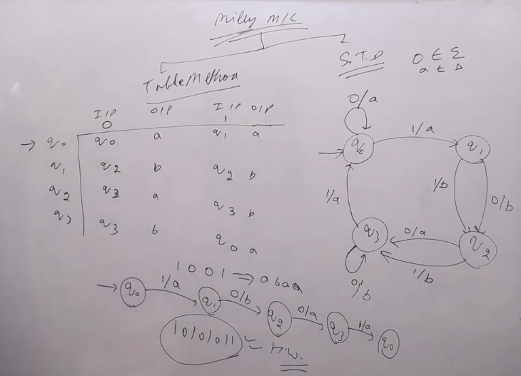
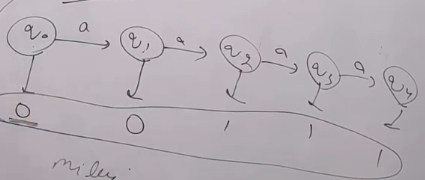
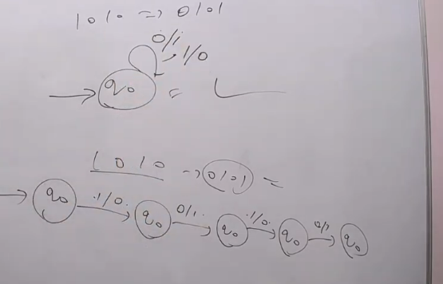
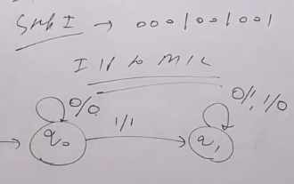
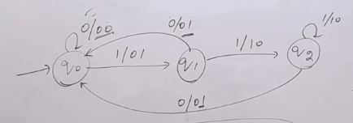

## Mealy Machine: are finite state machines with output value and its output depends on the present state and present input symbol.

- It can be defined as (Q, q0, ∑, O, δ, λ) where:
    - Q is a finite set of states
    - q0 is the initial state
    - ∑ is a finite set of symbols called the input alphabet
    - O is a finite set of symbols called the output alphabet
    - δ is the transition function where δ: Q x ∑ -> Q
    - λ is the output function where λ: Q x ∑ -> O

- Example of Mealy Machine
    - For $\Sigma = \{a, b\}$ and $O = \{0, 1\}$, the Moore machine can give output as follows:
    - $\lambda (q0, a) = \epsilon$
    - $\lambda$ (q0, b) = 1
    - $\lambda$ (q1, a) = 0
    - $\lambda$ (q1, b) = 1011
    - $\lambda$ (q2, a) = 1000101
    - $\lambda$ (q2, b) = 010111

#### Representation of Mealy Machine

- Table Diagram and State Diagram  

### Output difference for both Moore and Mealy Machine

- Here we have made a table which can be Moore as it constains only one output column and Mealy as it contains one output column and one input column.

| Present State | $\frac{Input/New State}{(a)}$ | Output |
|---------------|-----------------|--------|
| q0            | q1              | 0      |
| q1            | q2              | 0      |
| q2            | q3              | 1      |
| q3            | q4              | 1      |
| q4            | q0              | 0      |

- For input aaaa
- Moore Output will be 00110
    - First we are at q0 -> 0
       - From table now we move to state q1
    - Now we are at q1 -> 0
       - From table now we move to state q2
    - Now we are at q2 -> 1
        - From table now we move to state q3
    - Now we are at q3 -> 1
        - From table now we move to state q4
    - Now we are at q4 -> 0
        - From table now we move to state q0  

- In image last one will have 0

> In Case of Moore initial gives a free output so for all the input we will have same initial output symbol.

- Mealy Output will be 0011
    - First we are at q0
        - Reading a we move to q1 and output 0
    - Now we are at q1
        - Reading a we move to q2 and output 0
    - Now we are at q2
        - Reading a we move to q3 and output 1
    - Now we are at q3
        - Reading a we move to q4 and output 1

#### Mealy Machine to find 1's complement of Binary String

#### Moore Machine to find 2's complement of Binary String
- Trick to find 2's Complement
    - Traverse the String in reverse order
    - Find the first 1 from right
    - Flip all the bits after that 1  

# Gate Question

1. 11 -> 01
2. 10 -> 00
3. Sum of present & previous bits
4. none
> Answer is 3