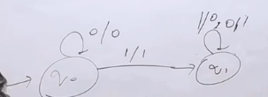
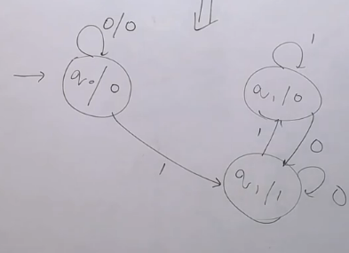

### Creating a Moore Machine which gives output like Mealy Machine

## Question 1

#### Mealy Machine Table

| Present State | Input (0) | Input (1) | 
|---------------|--------|--------|
| q0            | q1,a   | q2,b   |
| q1            | q2,a   | q1,a   |
| q2            | q0,a   | q0,a   |
| q3            | q3,b   | q3,a   |

- For each state find the output from the table
- If one state goes to different outputs for different inputs, then create a new state for each output
- While filling next state for splitted inputs it will be same for both, as of parent in Mealy Machine

#### Moore Machine Table

| Present State | Input (0) | Input (1) | Output |
|---------------|--------|--------|---------|
| ->q0          |   q1   |$q2_{b}$|    a    |
| q1            |$q2_{a}$|   q1   |    a    |
| $q2_{a}$      |   q0   |   q0   |    a    |
| $q2_{b}$      |   q0   |   q0   |    b    |
| $q3_{a}$      |$q3_{b}$|$q3_{a}$|    a    |
| $q3_{b}$      |$q3_{b}$|$q3_{a}$|    b    |

- Now for any input of Mealy there will be same output for Moore but initial state will give an extra output, to deal with it we can ignore it or can add an dummy initial state as q0' and make it initial state.

| Present State | Input (0) | Input (1) | Output |
|---------------|--------|--------|----------|
| ->q0'         |   q1   |$q2_{b}$|$\epsilon$|
| q0            |   q1   |$q2_{b}$|    a     |
| q1            |$q2_{a}$|   q1   |    a     |
| $q2_{a}$      |   q0   |   q0   |    a     |
| $q2_{b}$      |   q0   |   q0   |    b     |
| $q3_{a}$      |$q3_{b}$|$q3_{a}$|    a     |
| $q3_{b}$      |$q3_{b}$|$q3_{a}$|    b     |

now the initial state will not give extra output as we have marked it's output as $\epsilon$.

- Suppose take input 1001

- Mealy Machine Output
---
    - q0 -1-> q2(b)
    - q2 -0-> q0(a)
    - q0 -0-> q1(a)
    - q1 -1-> q2(a)
    - Output: baaa

- Moore Machine Output
---
    - q0' ($\epsilon$) -1-> $q2_{b}$
    - $q2_{b}$ (b) -0-> q0
    - q0 (a) -0-> q1
    - q1 (a) -1-> $q2_{a}$(a)
    - $q2_{a}$ (a):
    - Output: baaa

## Question 2

- If initial state is slipt then we can make any one of them as initial state.
- Also if we are making any dummy state it can follow any one of them as output of it will be $\epsilon$ and state transtion of both are same.

#### Mealy Machine Table

| Present State | Input (0) | Input (1) |
|---------------|-----------|-----------|
| ->q0          | q1,a      | q2,b      |
| q1            | q2,a      | q1,b      |
| q2            | q0,a      | q0,b      |
| q3            | q3,b      | q3,a      |

#### Moore Machine Table

| Present State | Input (0) | Input (1) |  Output  |
|---------------|-----------|-----------|----------|
| ->q0'         | q1,a      | q2,b      |$\epsilon$|
| $q0_{a}$      | q1,a      | q2,b      | a        |
| $q0_{b}$      | q1,a      | q2,b      | b        |
| $q1_{a}$      | q2,a      | q1,b      | a        |
| $q1_{b}$      | q2,a      | q1,b      | b        |
| $q2_{a}$      | q0,a      | q0,b      | a        |
| $q2_{b}$      | q0,a      | q0,b      | b        |
| $q3_{a}$      | q3,b      | q3,a      | a        |
| $q3_{b}$      | q3,b      | q3,a      | b        |

## Question 3

#### Mealy Machine Table

| Present State | Input (0) | Input (1) |
|---------------|-----------|-----------|
| ->q1          | q2,a      | q3,a      |
| q2            | q2,b      | q3,a      |
| q3            | q2,a      | q3,b      |

#### Moore Machine Table

- As in Mealy Machine there is no entry for q1 in cells so output of q1 will be $\epsilon$ and it will be initial state. No need to make dummy state.

| Present State | Input (0) | Input (1) |  Output  |
|---------------|-----------|-----------|----------|
| ->q1          | q2,a      | q3,a      |$\epsilon$|
| $q2_{a}$      | q2,b      | q3,a      | a        |
| $q2_{b}$      | q2,b      | q3,a      | b        |
| $q3_{a}$      | q2,a      | q3,b      | a        |
| $q3_{b}$      | q2,a      | q3,b      | b        |

## Question 4
### Creating a Moore Machine Diagram from Mealy Machine Diagram

