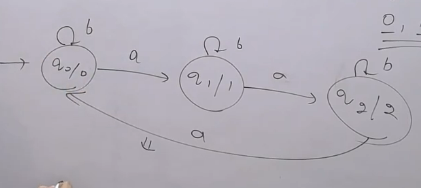
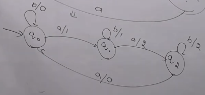
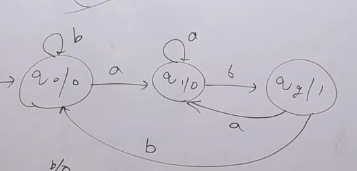
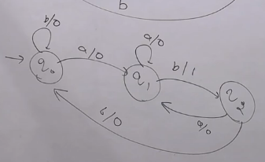

# Creating a Mealy Machine from a Moore Machine which generates the output String.

## Question 1

### Moore Machine Table

| Present State | Input (0) | Input (1) |  Output  |
|---------------|-----------|-----------|----------|
| ->q0          | q1        | q2        | a        |
| q1            | q2        | q3        | b        |
| q2            | q0        | q2        | b        |
| q3            | q1        | q0        | a        |

### Mealy Machine Table

- Check from the initial input state
- At q0 reading 0 we go to q1 and at q1 the output is b
- At q0 reading 1 we go to q2 and at q2 the output is b
- Similarly, we can fill the table

| Present State | Input (0) | Output (0) | Input (1) | Output (1) |
|---------------|-----------|------------|-----------|------------|
| ->q0          | q1        | b          | q2        | b          |
| q1            | q2        | b          | q3        | a          |
| q2            | q0        | a          | q2        | b          |
| q3            | q1        | b          | q0        | a          |

- Again here we need to add a dummy initial state to get an extra output to cop-up with the initial state of the Moore Machine

| Present State | Input (0) | Output (0) | Input (1) | Output (1) | Input ($\epsilon$) | Output ($\epsilon$) |
|---------------|-----------|------------|-----------|------------|-------------------|--------------------|
| ->q0'          |           |           |         |           | q1                | a                  |
| ->q0          | q1        | b          | q2        | b          |                   |                    |
| q1            | q2        | b          | q3        | a          |                   |                    |
| q2            | q0        | a          | q2        | b          |                   |                    |
| q3            | q1        | b          | q0        | a          |                   |                    |

- Generally adding dummy initial state is not a good practice. As we discussed in the first that Transducer follow DFA rules (Does not accept null move). But if we want the exact output we need to implement that.

## Question 2: Creating from state transition diagram

- a modulo 3 counter

## Question 3: Creating from state transition diagram

- "ab" as substring

