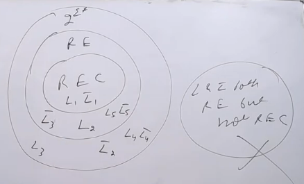

## Closure Properties of RE and REC

- Actually, for every problem there is a turing machine.
- If problem consist of some other problem in it, then the turing maching to which main problem is passed used the turing machine of the subproblem while solving the main problem.

**Concatenation**
- If L1 is RE using TM1 and L2 is RE using TM2
- Then L1.L2 is RE using TM3 and TM3 will use TM1 and TM2 to solve the problem.
- The input concatenated string is then sliced into 2 parts and passed to TM1 and TM2 respectively.
- There are many ways to partition the string, we will try all of them and pass only the copy which gives actual w1 and w2.
- It gives yes if both TM1 and TM2 gives yes.
- Also, this operation is closed under RE.
- Also, this operation is closed under REC.

**Union**
- If L1 is RE using TM1 and L2 is RE using TM2 then L1 U L2 is RE using TM3.
- If L1 is REC using TM1 and L2 is REC using TM2 then L1 U L2 is REC using TM3.

**Intersection**
- If L1 is RE using TM1 and L2 is RE using TM2 then L1 $\cap$ L2 is RE using TM3.
- If L1 is REC using TM1 and L2 is REC using TM2 then L1 $\cap$ L2 is REC using TM3.

**Complement**
- If L1 is RE using TM1 then L1' uses TM2, but it is not necessary that L2 is RE.
    - Take a case where w is not in L1, then TM1 will either reject it or loop forever. In loop forever case, TM2 will also loop forever and hence won't be able to give answer yes.
- If L1 is REC using TM1 and L1' uses TM2, as in case of REC we used halting turning machine where there is no undefined state, so TM2 will always give answer yes or no and hence L1' is REC using TM2.

- Complement cases  

- L5 case is not possible

**Reversal**
- RE is closed under reversal.
- REC is closed under reversal.

**Set Difference**
- If L1 is RE using TM1 and L2 is RE using TM2 then L1 - L2 is RE using TM3.
- If L1 is REC using TM1 and L2 is REC using TM2 then L1 - L2 is REC using TM3.

### $\cup$ and compliment close ==> $\cap$ closed
### $\cap$ and compliment close ==> $\cup$ closed

**Question**
- L1 is RE but not REC, then L1' is
    - may or may not be RE
    - always RE
    - Never RE
    - None of the above
- Answer: Never RE

**Question**
- L1 is RE, then L1' is
    - may or may not be RE
    - always RE
    - Never RE
    - None of the above
- Answer: may or may not be RE

**Question**
- L and L' both are RE, then L is
    - may or may not be RE
    - always RE
    - Never RE
    - REC
- Answer: ALways RE, REC

**Question**
- Does halting Turing machine exist for RE?
    - Yes
    - No
- Answer: Yes, and that special type of RE we call it as REC.

# Summary of Closure properties of all ⭐
- Regular, CSL, REC -> Closed in all operations
- CFL -> Closed in all operations except intersection, compliment, set difference and Regular - CFL
- RE -> Closed in all operations except compliment, set difference, Regular - RE