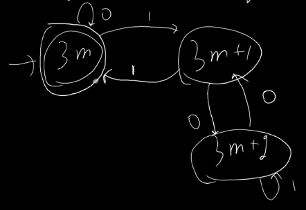
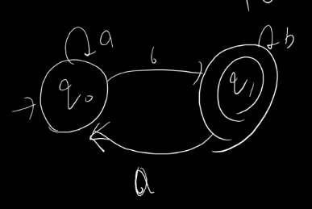

**Construct a R.E. which represent all those binary no. whose decimal equivalent is divisible by 3**  

- Step 1:
  - $q_{0} = q_{0}0 + q_{1}1 + \epsilon$ --(1)
  - $q_{1} = q_{0}1 + q_{2}0$ --(2)
  - $q_{2} = q_{1}0 + q_{2}1$ --(3)
- Step 2:
  - $q_{0} = (q_{1}1 + \epsilon).0^{*}$ --(4)
  - $q_{2} = q_{1}01^{*}$ --(5)
  - $q_{1} = q_{0}1 + q_{1}01^{*}0$
  - $q_{1} = q_{0}1(01^{\*}0)^{\*}$ --(6)
- From (4) & (6)
  - $q_{0} = (q_{0}1(01^{\*}0)^{\*}1 + \epsilon).0^{\*}$
  - $q_{0} = q_{0}1(01^{\*}0)^{\*}10^{\*} + 0^{\*}$
  - $q_{0} = 0^{\*}[1(01^{\*}0)^{\*}10^{\*}]^{\*}$

**Question 4**  

- Step 1:
  - $q_{0} = q_{0}a + q_{1}a + \epsilon$ --(1)
  - $q_{1} = q_{0}b + q_{1}b$ --(2)
- Step 2:
- In (2)
  - $q_{1} = q_{0}bb^{\*}$ --(3)
- In (1)
  - $q_{0} = (q_{1}a + \epsilon)a^{\*}$ --(4)
- From (3) & (4)
  - $q_{1} = (q_{1}a + \epsilon)a^{\*}bb^{\*}$
  - $q_{1} = (q_{1}aa^{\*}bb^{\*} + a^{\*}bb^{\*})$
  - $q_{1} = a^{\*}bb^{\*}[aa^{\*}bb^{\*}]^{\*}$

**Question 5**
- R = Q + PR => ???
- R = Q + P[Q + PR]
- R = Q + PQ + PPR
- R = Q + PQ + PPQ + PPPR
- R = P*Q
