# State Elimination Method

### 3 Steps
- **Step 1:** If initial state has an incoming edge then make new initial state & apply null move to actual initial state
- **Step 2:** If final state has an outgoing edge then make new final state & apply null move from actual final state to new final state [Same is followed if more than one final state has outgoing edge]
- **Step 3:** Eliminate states one by one in any order except initial and final leaving all paths intact.
---
**Question 1**
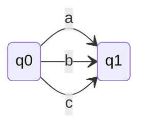
### q0 is initial state and q1 is final state.
### Solution
- S1 ❌
- S2 ❌
- S3 ❌
- (a + b +c)
---
**Question 2**
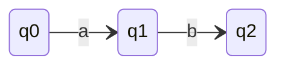
### q0 is initial state and q2 is final state.
### Solution
- S1 ❌
- S2 ❌
- S3 ✅ (We need to eliminate q1)
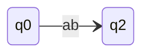
- (ab)
---
**Question 3**
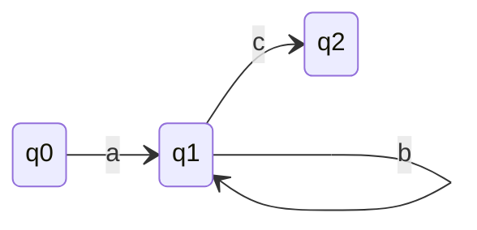

### q0 is initial state and q2 is final state.
### Solution
- S1 ❌
- S2 ❌
- S3 ✅ (We need to eliminate q1)
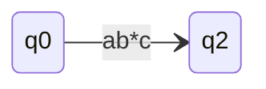
- (ab*c)
---
**Question 4**
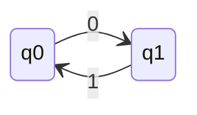
### q0 is initial state and q1 is final state.
### Solution
- S1 ✅ (There is an incoming edge to initial state)
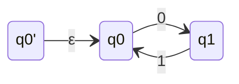
- S2 ✅ (There is an outgoing edge from final state)
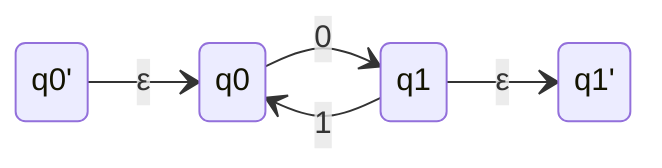
- S3 ✅ (There are two state q0 and q1 to eliminate)
- Eliminate q0
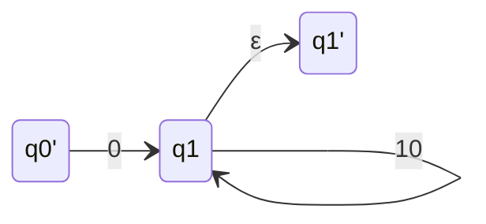
- Eliminate q1
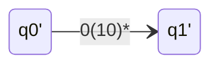
- 0(10)*
### Second Sequence
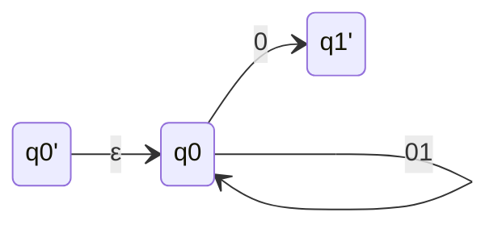
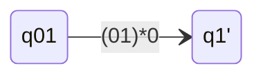
- (01)*0
---
**Question 5**
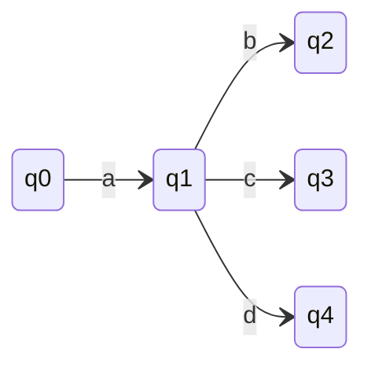
### q0 is initial state and q2,q3,q4 are final states.
### Solution
- S1 ❌
- S2 ✅
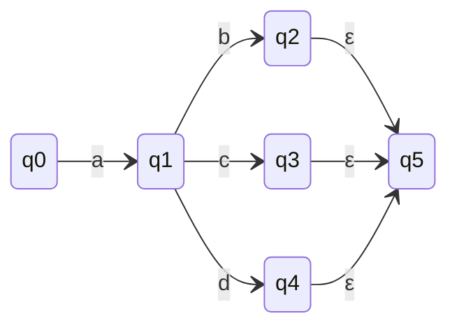
- Removing q2,q3,q4
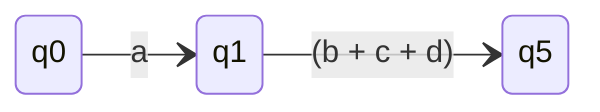
- S3 ✅

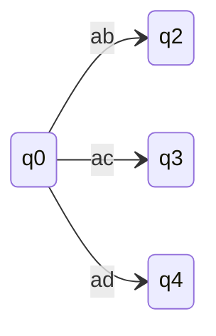
- (ab + ac + ad)
---
**Question 6**
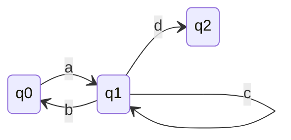
### q0 is initial state and q2 is final state.
### Solution
- S1 ✅ (There is an incoming edge to initial state)
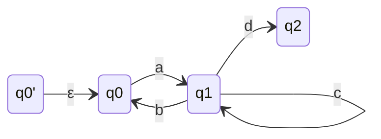
- S2 ❌
- S3 ✅ (We need to eliminate q0,q1)
- ***Eliminating q0***
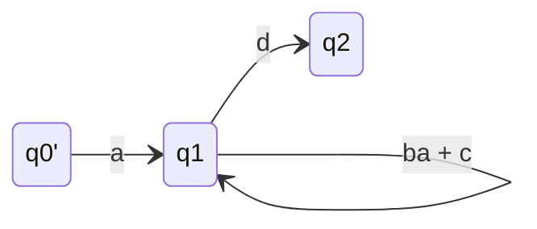
- **Eliminating q1**
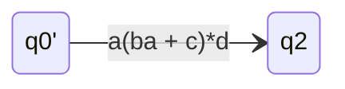
- a(ba + c)*d
### Second Sequence
- ***Eliminating q1***
```mermaid
stateDiagram
    direction LR
    q0' --> q0 : ε
    q0 --> q0 : ac*b
    q0 --> q2 : ac*d
```
- **Eliminating q0**
```mermaid
stateDiagram
    direction LR
    q0' --> q2 : (ac*b)*ac*d
```
- (ac\*b)\*ac\*d
---
**Question 7**
```mermaid
stateDiagram
    direction LR
    q0 --> q0 : a
    q0 --> q1 : b
    q1 --> q0 : a
    q1 --> q1 : b
```
### q0 is initial state and q1 is final state.
### Solution
- S1 ✅ (There is an incoming edge to initial state)
```mermaid
stateDiagram
    direction LR
    q0' --> q0 : ε
    q0 --> q0 : a
    q0 --> q1 : b
    q1 --> q0 : a
    q1 --> q1 : b
```
- S2 ✅ (There is an outgoing edge from final state)
```mermaid
stateDiagram
    direction LR
    q0' --> q0 : ε
    q0 --> q0 : a
    q0 --> q1 : b
    q1 --> q0 : a
    q1 --> q1 : b
    q1 --> q1' : ε
```
- S3 ✅ (We need to eliminate q0,q1)
- ***Eliminating q0***
```mermaid
stateDiagram
    direction LR
    q0' --> q1 : a*b
    q1 --> q1 : aa*b + b
    q1 --> q1' : ε
```
- **Eliminating q1**
```mermaid
stateDiagram
    direction LR
    q0' --> q1' : (a*b)(aa*b + b)*
```
- a*b(aa*b + b)*
### Second Sequence
- ***Eliminating q1***
```mermaid
stateDiagram
    direction LR
    q0' --> q0 : ε
    q0 --> q0 : a + bb*a
    q0 --> q1' : bb*
```
- **Eliminating q0**
```mermaid
stateDiagram
    direction LR
    q0' --> q1' : (a + bb*a)*(bb*)
```
- (a + bb*a)*bb*
---