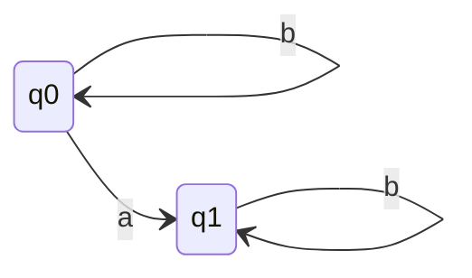
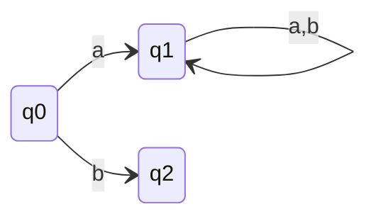
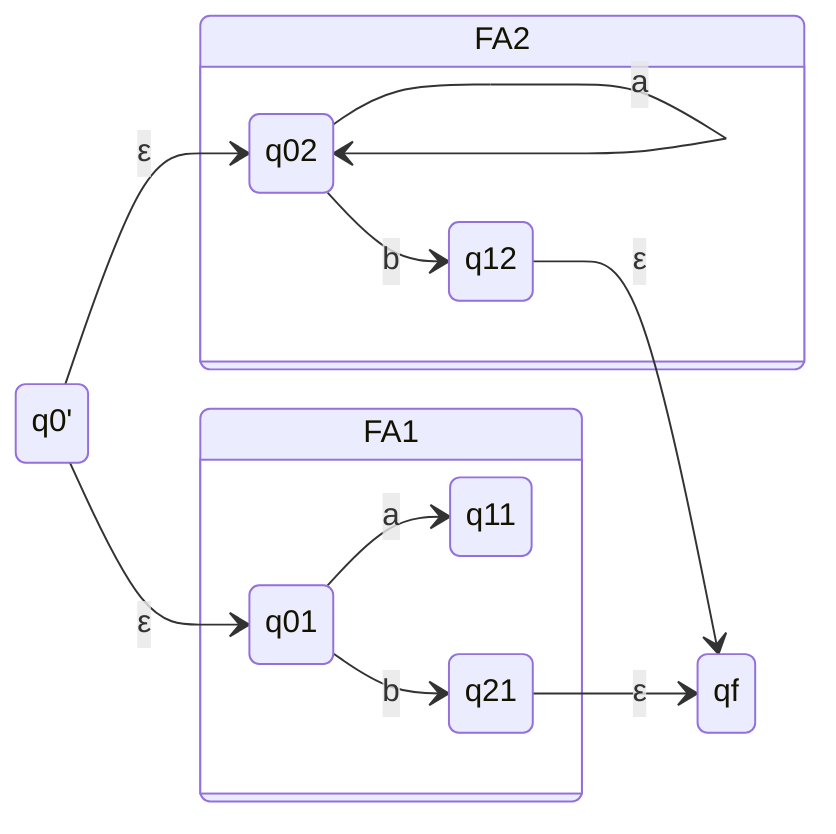
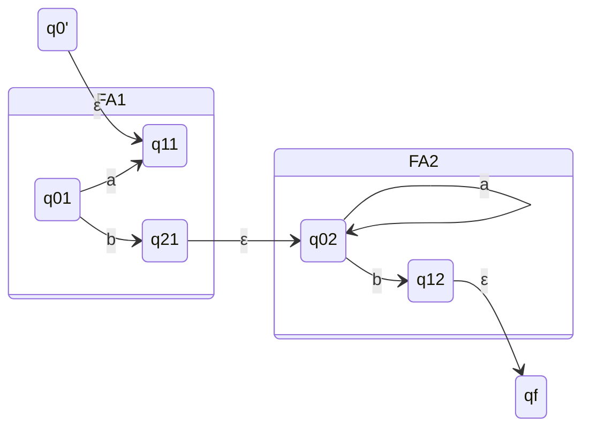
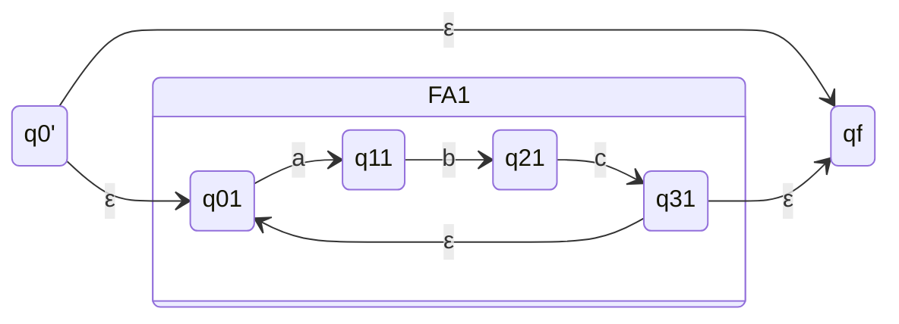
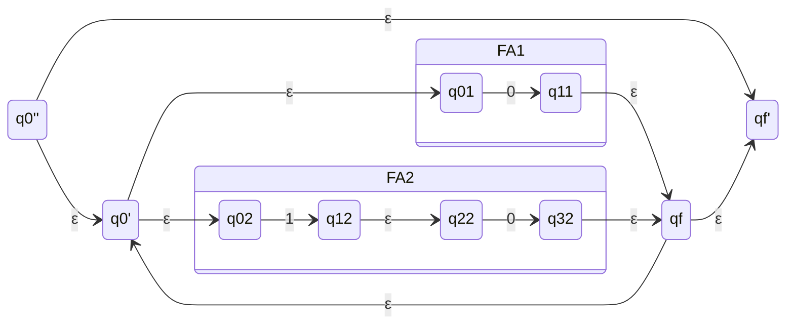
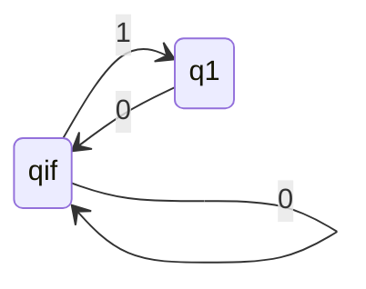
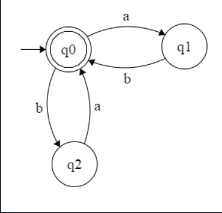

# For RE to FA
> ### Convert RE to RL then to FA

## 1. Convert RE = $b^{*}ab^{*}$ to FA
- First we need to identify language of this RE, it is a language of all strings that contain exactly one a.
- So, FA for this language is:

### q0 is initial state and q1 is final state.

## 2. Convert RE = $a(a+b)^{*}$ to FA
- It is a language of all strings that start with a and then contain any number of a or b.
- So, FA for this language is:

### q0 is initial state, q2 is Dead state and q1 is final state.

### We can Show using FA If R1 and R2 are RE then R1+R2 is also RE.
---

### We can Show using FA If R1 and R2 are RE then R1.R2 is also RE.
---

### We can Show using FA If R is RE then R* is also RE.
---

- Null move from q0' to qf is to accept null string which is also a part of R*.
- Rest $R^{+}$ is handled by FA1.
- Null move from q31 to q01 is for looping back to start state concatenating R*.

## NFA with Null move for RE = $(0+10)^{*}$

- We can directly make it as well but this is for information purpose that about the three diagrams we made above using that we can make any NFA with null move.
**Direct**

## NFA with Null move for RE = $(ab + ba)^{*}$

  

