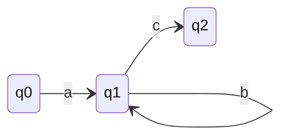
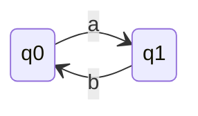

### If FA has n states then it accepts a string of length n-1 at max without repeating any state.
### If FA has n states then it accepts a string of length 0 at min.
### If FA has n states then it accepts a string of length more than n-1 then there exists a loop in FA.
---
---

## What is the maximum and minimum content of loop if string accepted is of length 'n' and FA has 'n' states?
- Minimum content of loop is 1. (Else string will not be of length n)  
- Maximum content of loop is n.  
**Example for minimum content of loop:**

- For string 'abc' FA has 3 states and string length is 3. Content of loop is 'b'. We need atleast one b to make string of length same as number of states in FA.
**Example for maximum content of loop:**

- q0 in initial and final state. For string 'ab' FA has 2 states and string length is 2. Content of loop is 'ab'. We need both a and b to make string of length same as number of states in FA. So, maximum can be of length n.

# Pumping Lemma for Regular Languages
- Lemma: Statement which need not be proved.
- P.L. gives necessary condition but not sufficient condition for a language to be regular.
    - Means if PL test failed then language is not regular.
    - If PL test passed then language may or may not be regular.
---
### With help of Pumping Lemma can we prove that
1. L is regular
2. L is not regular
3. Both
4. None
### Answer: 2. L is not regular
---
### Assume Pumping Lemma is sufficient condition for a language to be regular. Then
1. L is regular
2. L is not regular
3. Both
4. None
### Answer: 1. L is regular
---
> Pumping Lemma is a negative test.
> Pumping Lemma uses peigeon hole principle.
---
Pumping Lemma uses proof by contradiction.
- Assume L is regular.
- Then step by step we will arrive at contradiction and prove that L is not regular.
- If no contradiction is found then L may or may not be regular.
---
