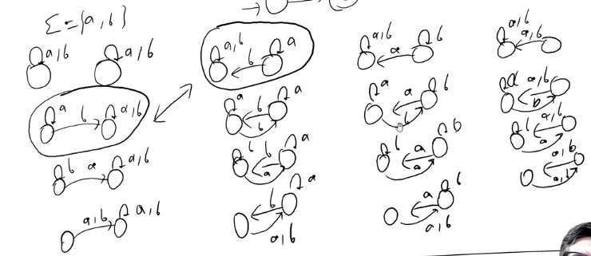
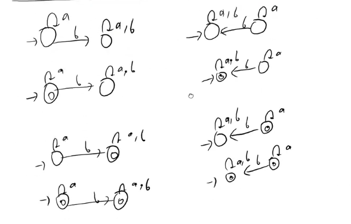
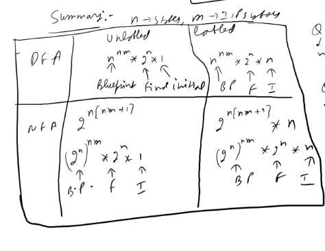

## How many DFA can be designed using 2 states and 2 input symbols?
- Total there will be 16 blue prints, shown below.
- 
- Each Blue printn can be drawn in 4 ways,
    - one initial and no final
    - one initial and final
    - one initial and other final
    - one initial and both final
- Here wwe have LHS as initial for all 4 caes, we might think now if we make RHS as inital we would get 4 more states but no those are either same as LHS(in case of Blueprint 00,11,22,33) or some other blueprint will cover it (in case of Blue print 10 and 01 isomorphic to each other).
- 
 
- Number of Transition functions = $2^{4}$ = 16
- 2 is for 2 states and 2 is for 2 input symbols.
- $\therefore$ Q x $\Sigma$ = 2 x 2 = 4
- Number of states = 2
- Number of functions = 16
- Number of DFA depends selection of final states.
- Number of final states = 4 (none, one, other, both)
- Number of final states =  $\binom{2}{0}$ + $\binom{2}{1}$ + $\binom{2}{2}$ = 1 + 2 + 1 = 4
- Number of DFA = 4 x 16 = 64

## Number of DFA with 3 states and 2 input symbols?
- Q x $\Sigma$ = 3 x 2 = 6
- Q = 3
- Number of functions(blueprints) = $3^{6}$ = 729
- Number of final states = $\binom{3}{0}$ + $\binom{3}{1}$ + $\binom{3}{2}$ + $\binom{3}{3}$ = 1 + 3 + 3 + 1 = 8
- Number of DFA = 729 x 8 = 5832

## Number of DFA with n states and m input symbols?
- Q x $\Sigma$ = n x m
- Q = n
- Number of functions(blueprints) = $n^{nm}$ = $n^{n x m}$
- Number of final states = $\binom{n}{0}$ + $\binom{n}{1}$ + $\binom{n}{2}$ + $\binom{n}{3}$ + ... + $\binom{n}{n}$ = $2^{n}$
- Number of DFA = $n^{n x m}$ x $2^{n}$

## Number of NFA with n states and m input symbols?
- Q x $\Sigma$ = n x m
- $2^{Q} = 2^{n}$
- Number of functions(blueprints) = ${2^{n}}^{nm}$ = ${2^{n^{2}m}}$
- Number of final states = $2^{n}$
- Number of NFA = ${2^{n^{2}m}}$ x $2^{n}$  = ${2^{n^{2}m + n}}$ = ${2^{n(nm + 1)}}$

## Number of labeled DFA with 2 states and 2 input symbols?
- Q x $\Sigma$ = 2 x 2 = 4
- Q = 2
- Number of functions(blueprints) = $2^{4}$ = 16
- Number of final states = $2^{2}$ = 4
- Number of labeled DFA = 16 x 4 x 2 = 128 (2 because as this is labeled so we can swap the states and still it will be different DFA)

## Number of labeled DFA with n states and m input symbols?
- Q x $\Sigma$ = n x m
- Q = n
- Number of functions(blueprints) = $n^{nm}$
- Number of final states = $2^{n}$
- Number of labeled DFA = $n^{nm}$ x $2^{n}$ x n = $n^{nm + 1}$ x $2^{n}$ (n because as this is labeled so we can swap the states and still it will be different DFA)
> Think of Last term as it is number of possibilities of initial state

## Number of labeled DFA with 3 states(x,y,z) and 2 input symbols and x or y is initial?
- Answer = $3^{6}$ x $2^{3}$ x 1 = 729 x 8 x 2 = 5832*2 = 11664 (2 because x is initial so we can't swap it with any other state)

## Number of labeled DFA with 3 states(x,y,z) and 2 input symbols and x isi initial and y is final?
- Answer = $3^{6}$ x 1 x 1 = 729 x 1 x 1 = 729

## Number of labeled NFA with n states and m input symbols?
- Answer = ${2^{n}}^{nm}$ x $2^{n}$ x n = ${2^{n^{2}m}}$ x $2^{n}$ x n = ${2^{n^{2}m + n}}$ x n

## Summary

## Number of DFA with x state 'a' can go to y state only
- Transition possibility = 1*2*2*2 (1->(x,a), 2->(x,b), 2->(y,a), 2->(y,b))
- Number of DFA = 8 * $2^{2}$ * 2 = 64