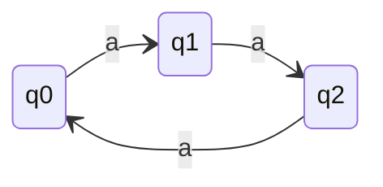
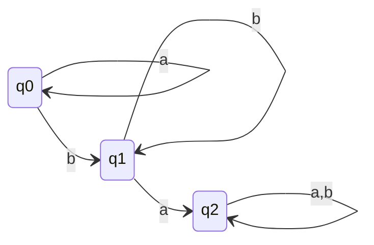
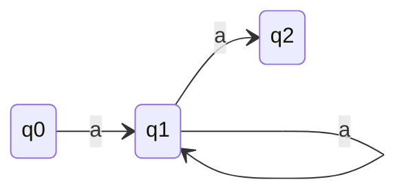

# MY HILL NERODE THEOREM

- This is necessary and sufficient condition for a language to be regular.
- Test fail then language is not regular.
- Test pass then language is regular.

### L is regular iff L has finite Myhill Nerode equivalence classes.
- Since L is regular so we have unique minimal DFA accepting L.
- Let's define an equation on $\Sigma^*$.
- Any 2 strings from $\Sigma^*$ are related iff they pushes DFA to the same state starting from the initial state.
- Mathematically $\Rightarrow$ If $\hat{\delta}(q_{0},x) = \hat{\delta}(q_{0},y)$ then x R y. (This states equivalence relation)

### Myhill Nerode equivalence classes
- Set of all those strings which pushes DFA to the same state starting from the initial state.
- Number of equivalence classes = Number of states in minimal DFA.

## L = {$a^{3n}|n\geq 0$} $\Rightarrow$ L is regular. $\Sigma = \{a\}$

- q0 is initial and final state.
- Number of equivalence classes = Number of states in minimal DFA = 3.

> Number of equivalence classes for L = {$a^{n}b^{n}|n\geq 0$} = $\infty$, because L is CFL but not regular so we can't apply Myhill Nerode theorem.

### 3 Properties of Equivalence classes
1. Equivalence classes can't be empty.
2. Equivalence classes are disjoint.
3. Union of all equivalence classes = $\Sigma^*$.

 

- Let E1, E2, E3, ... En be the equivalence classes of $\Sigma^*$.
1. $\forall$ i | |Ei| $\geq$ 1. 
2. i $\neq$ j $\Rightarrow$ Ei $\cap$ Ej = $\phi$.
3. Union Ei = $\Sigma^*$.

### Proof (Not complete but some important points)
- Equivalence class represents regular expression for the given state.
- Regular expression for initial state which has no incoming edge is $\epsilon$.

## L = a\*b\*, then how many M.N. equivalence classes are there?

- q0 is initial state and q0,q1 are final, q2 is dead state.
- M.N. equivalence classes = 3.

## Find Equivalence Classes in this DFA

- q0 is initial state and q2 is final state.
- M.N. equivalence classes = 3.
- Looking at the diagram, L = {$a^{2n}|n\gt 0$}.
- R.E. for initial is null
- R.E. for q1 = aa* = $a^{+}$
- R.E. for q2 = (aa)+

### Number of equivalence classes for $a^{kn}$ = k+1.

## Application of Myhill Nerode Theorem
- Minimum of number of states of DFA
- We proove L is regular or not.