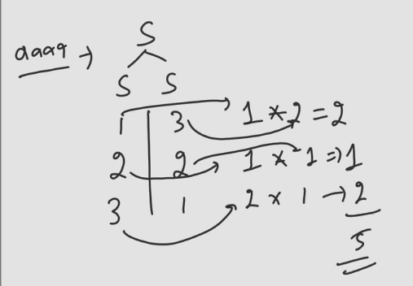

## Revising CFG

- In CFG:
  - LHS contains exactly one non-terminal symbol
  - RHS can contain any combination of terminal and non-terminal symbols
```
        S
      / | \
     a  S  b
      / | \
      a S  b
        |
        ε
```
- This kind of structure is called a Parse Tree or Derivation Tree.
- It is a inverted tree, where the root is the start symbol and the leaves are the terminal symbols.
- We get parsed tree while deriving strings from CFG.

### Important Points
1. Process of deriving string from type -2 grammar looks like a rooted tree like structure. This is known as Parse Tree or Derivation Tree.
2. We are able to construct tree because of the fact that LHS of production rule contains exactly one non-terminal symbol.
3. Parse tree is a inverted tree, where the root is the start symbol and the leaves are the terminal symbols.
4. Yeild of tree is concatenation of leaf nodes from left to right & these leaf nodes must be terminal symbols only including $\epsilon$ else is not parse tree.

## Q2 S -> aSb | a  L(G) = {$a^{n+1}b^{n} | n \geq 0$} Height of parse tree while deriving $a^{5}b^{4}$?
```
           S
        /  |  \
         a   S   b
            / | \
             a S  b
              / | \
               a S  b
                / | \
                 a S b
                    |
                    a
```
- Height of parse tree = Longest path from root to any leaf node = 5

## Q3 S -> SS/a, L(G) = {a,aa,aaa,aaaa,...} = $a^{+}$
- Given grammar is CFG, but language is Regular,CFL,CSL,RE.

## Q4 S -> SS/a, while deriving string aaa, how many parse trees are possible?
```
        S
       /  \
      S    S
     / \   |
    S   S  a
    |   |
    a   a 
```
- 2 parse trees are possible.
- Other will be in way where a S S in Level-2 and rest two a in last level.
### for aaaa
- 
- for 1 or 2 a's we have only 1 parse tree.
- for 3 a's we have 2 parse trees.
- Above diagram just shows the calculation for 4 a's, using the parse tree requirement of 1,2,3 a's.
### for aaaaa
```
  S
S | S 
1 | 4 = 1 * 5 = 5
2 | 3 = 1 * 2 = 2
3 | 2 = 2 * 1 = 2
4 | 1 = 5 * 1 = 5
------------------
              = 14
```
- for 6 = 42
- **Formula** = $a^{n} = \frac{\binom{2n}{n}}{n+1}$

## Q5 S -> aS/Sa/a How many parse trees for aaa?
- for a --> 1
- for aa --> aS/a or Sa/a --> 2
- for aaa --> aS/aS/a or Sa/aS/a or aS/Sa/a or Sa/Sa/a --> 4
- for aaaa --> aS or Sa where S is reposnsible to make 3a's which is 4 ways so total 4 + 4 = 8
- for aaaaa --> 8 + 8 = 16

## LMD & RMD  
S -> S + S|S * S|a|b|c, we need to make a +b *c
- LMD = Left Most Derivation
- S -> S + S -> a + S -> a + S * S -> a + b * S -> a + b * c
- Here we used Left to right derivation.
- RMD = Right Most Derivation
- S -> S + S -> S + S * S -> S + S * c -> S + b * c -> a + b * c
- We can also use S*S for derivation as well.
- Derivation can also be LMD and RMD both or neither.
- Niether LMD nor RMD
- S -> S + S -> S + S * S -> a + S * S -> a + S * c -> a + b * c

## S-> aSb|$\epsilon$, aabb
- Here S is in the middle so whatever we do we are always in the center so we can say this will make use of both LMD and RMD
- LMD = S -> aSb -> aaSbb -> aabb