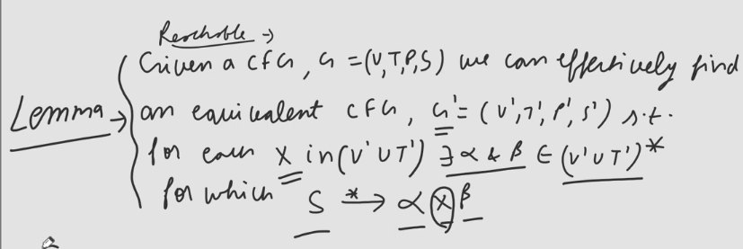

## Remove all Unreachable Symbols from the Grammar 
### S -> AB|aS|bS| $\epsilon$ , A -> aA|b, D -> Ec|F
- Ans: S -> AB|aS|bS| $\epsilon$ , A -> aA|b

## Remove all useless Symbols from the above Grammar
- Ans: S -> aS|bS| $\epsilon$

## Steps of Removal
1. Remove all Useless Symbols
2. Remove all Null Productions
3. Remove all Unit Productions

## Remove $\epsilon$ Productions
### S -> AB|aA|bB| $\epsilon$ |cS, A -> aA| $\epsilon$ , B -> bB| $\epsilon$
- Remove B -> $\epsilon$
  - S -> AB|aA|bB| $\epsilon$ |cS, A -> aA| $\epsilon$ , B -> bB
  - Now add all the LHS or RHS of B where it appears
  - S -> AB|aA|bB| $\epsilon$ |cS|A|b, A -> aA| $\epsilon$ , B -> bB|b
- Remove A -> $\epsilon$
  - S -> AB|aA|bB| $\epsilon$ |cS|A|b, A -> aA, B -> bB|b
  - Now add all the LHS or RHS of A where it appears
  - S -> AB|aA|bB| $\epsilon$ |cS|A|b|B|a, A -> aA|a, B -> bB|b
- Remove S -> $\epsilon$
  - S -> AB|aA|bB|cS|A|b|B|a, A -> aA|a, B -> bB|b
  - If S -> $\epsilon$ is removed we won't get actual grammar equivalent

### S -> ASA|aB, A -> B|S, B -> b| $\epsilon$
- Remove B -> $\epsilon$
  - S -> ASA|aB, A -> B|S, B -> b
  - Add all the LHS or RHS of B where it appears
  - S -> ASA|aB|a, A -> B|S| $\epsilon$ , B -> b
- Remove A -> $\epsilon$
  - S -> ASA|aB|a, A -> B|S, B -> b
  - Add all the LHS or RHS of A where it appears
  - S -> ASA|aB|a|SA|AS|S, A -> B|S, B -> b

### S -> SaSbS| $\epsilon$
- S -> SaSbS|aSbS|SabS|SaSb|abS|Sab|aSb|ab 
- It will still not create $\epsilon$ so to make this grammar's language equivalent to the previous one we need to make a union with { $\epsilon$ }

## Unit Production of Removal
### S -> ASA|aB, A -> B|S, B -> b| $\epsilon$
- Remove A -> B
  - S -> ASA|aB, A -> S|b| $\epsilon$ , B -> b| $\epsilon$
- Remove A -> S
  - S -> ASA|aB, A -> b| $\epsilon$ |ASA|aB, B -> b| $\epsilon$

