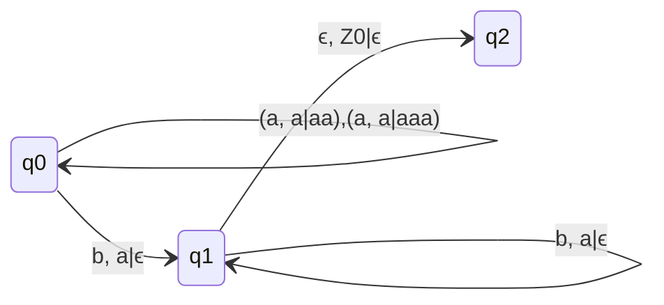
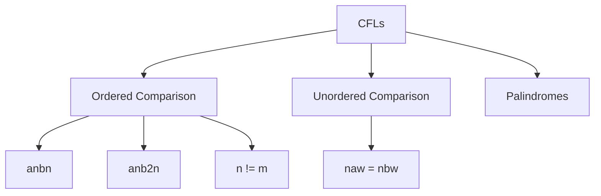
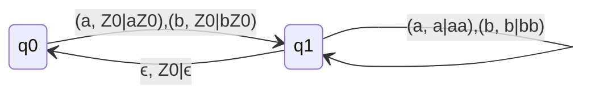
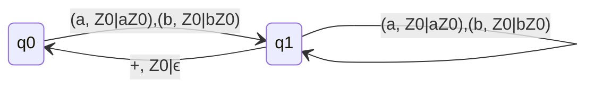
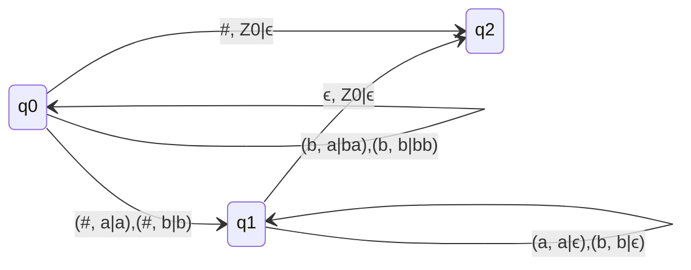
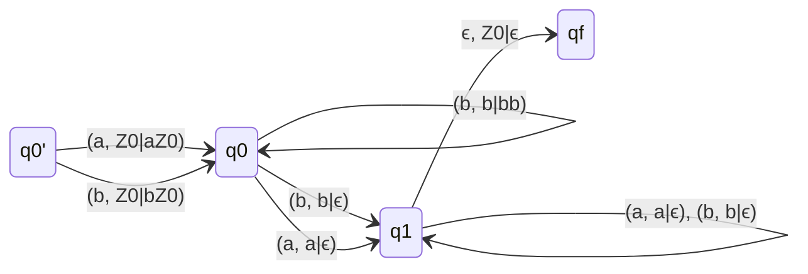

## Q. L = { $a^mb^n| m \leq n \leq 2m$ }

### We cannot make a DPDA for this language, as there will always be confusion whether the reading a a we have to push single a or two a's.

### q2 is final state

If ordered are DCFL, then their respective conditions unordered languages are also DCFL.

## If ordered is DCFL then unordered is also DCFL, vice versa is also true.

## Q. L = { $w | n_a(w) = n_b(w)$ }

### q0 is final state and initial state
- Look for 'abab' after reading ab stack will have Z0 and we need to read a at q1 but we can't as move not defined but have a look at null move it is the saviour here, we can jump back to q0 through null move and then again read a with Z0.

### With End Marker

### q0 is final state and initial state
- Here we have defined the extra moves [q1 --> q1 : (a, Z0|aZ0),(b, Z0|bZ0)] So that we can read a or b at q1 with Z0.

## Q. L = { $w\#w^T | w \in \{a,b\}^{*}$ }

### q2 is final state
- We can see this is DPDA, so Language is DCFL.

## Q. L = { $ww^T| w \in \{a,b\}^{*}$ }

- Here # is not there which was telling that from this point we have to read the reverse of the string.
- So DPDA is not possible for 

### q0' and qf are final states