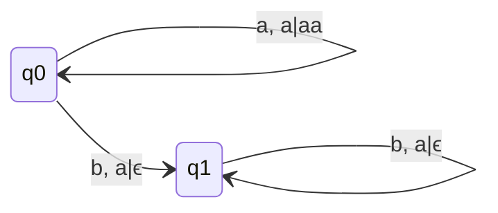
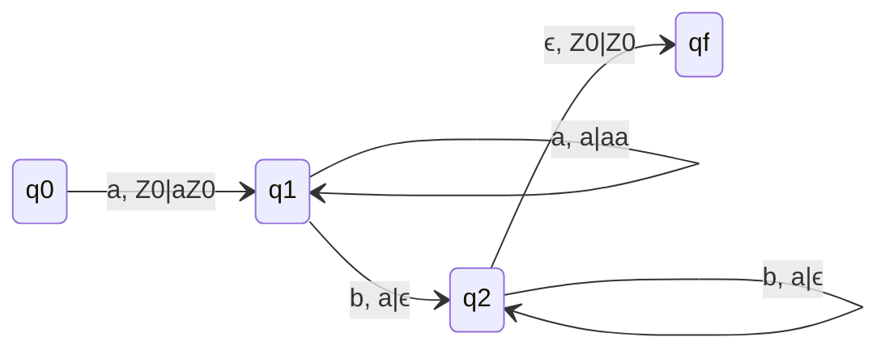
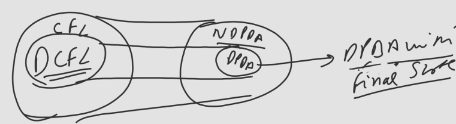
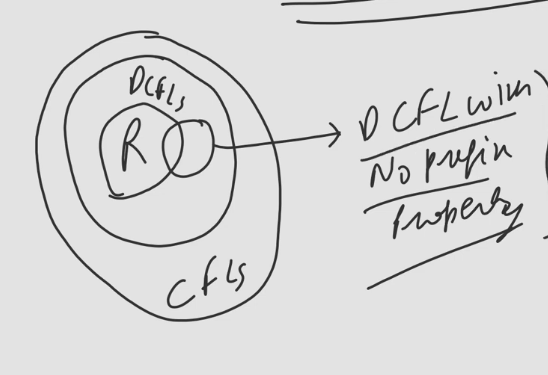

## Q. Identify the Language of this PDA

### q1 is final
- Look here at q0 we are pushing a's to stack, while moving from q0 to q1 we are popping one a from stack, and then at q1 we are popping a's from stack.
- One thing if b's are more than a then string will not be accepted, as we might be at final state but the string is not completely consumed.
- If b's are equal or less doesn't mattehr because string will be completely consumed and we will be at final state.
- $\therefore$ Language of this PDA is $\{a^{n}b^{m} | n \geq m \& m\geq 1\}$

## Q. L ={$a^nb^n | n \geq 0$} Construct DPDA for this

### q0 is initial & final, qf is final

## Q. L = {$a^nb^n | n \geq 0$} Construct PDA accepting L using null stack
### Delta Moves
- $\delta(q_0, \epsilon, Z_0) = (q_0, \epsilon)$
- $\delta(q_0, a, Z_0) = (q_0, aZ_0)$
- $\delta(q_0, a, a) = (q_0, aa)$
- $\delta(q_0, b, a) = (q_1, \epsilon)$
- $\delta(q_1, b, a) = (q_1, \epsilon)$
- $\delta(q_1, \epsilon, Z_0) = (q_1, \epsilon)$
- Here on which state we are when stack is empty doesn't matter.
- Given is NPDA
- Using null store for accepting $\epsilon$ with other strings also present we need NPDA only, we can't make DPDA with null store for this.

> To accept $\epsilon$ string with other strings also possible, by PDA using null store, $\epsilon$ move is compulsory.

### If L has preix property then it will never be accepted by DPDA and Null Store.
- Prefix proferty means if any proper prefix of w is present in L. (It is a one-way theorem)

## Example L = {a,ab}
- ab will have proper prefix = {$\epsilon$, a}
- a is present in the language so it will never be accepted by DPDA with null store.
### DPDA with null store
- It will contain one path for null move and one path for true for same combination.
  - $\delta(q_0, a, Z_0) = (q_1, Z_0)$
  - $\delta(q_0, \epsilon, Z_0) = (q_1, \epsilon)$
  - $\delta(q_1, b, Z_0) = (q_1,\epsilon)$
- Any language which have null is string in it, will never be accepted by DPDA with null store.
### DPDA with final state
- $\delta(q_0, a, Z_0) = (q_1, Z_0)$
- $\delta(q_1, b, Z_0) = (q_2, Z_0)$
- $q_1$ and $q_2$ are final states

> DPDA with FInal state is more powerful than DPDA with null store.  
> NDPDA with final state is equally powerful to NDPDA with null store.  
> NDPDA is more powerful with DPDA and class of languages accepted by DPDA and final state is DCFL.  
>   
> Class of languages accepted by DPDA & null store is DCFL with no prefix property.  

### DCFL with no prefix property in heirarchy diagram

- So not every regular language will be accepted by DPDA with null store. Ex: a*
