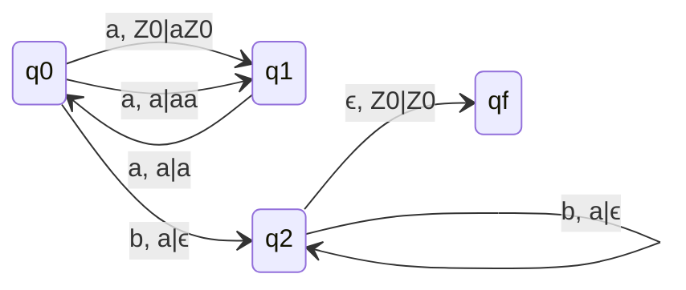
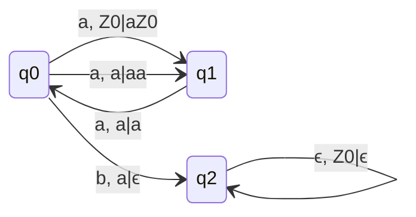
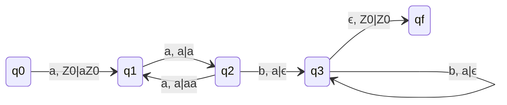
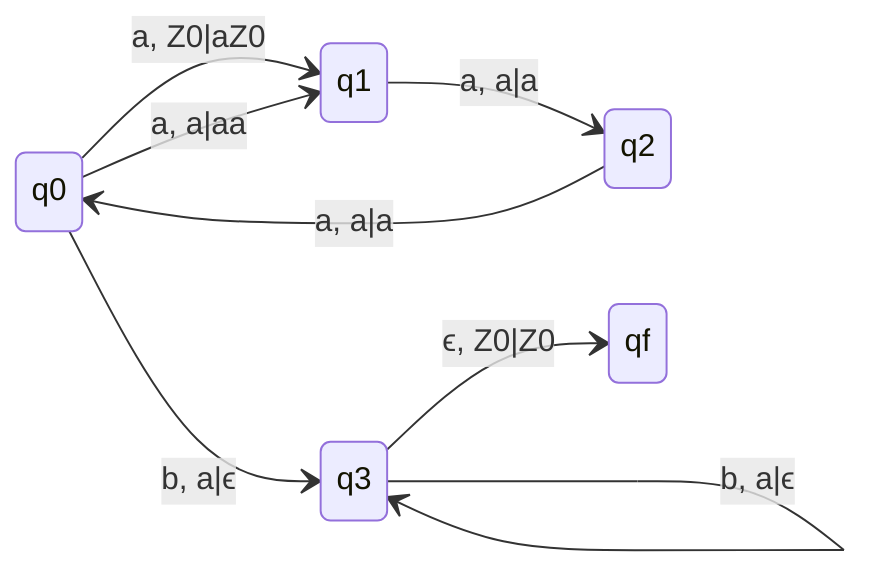
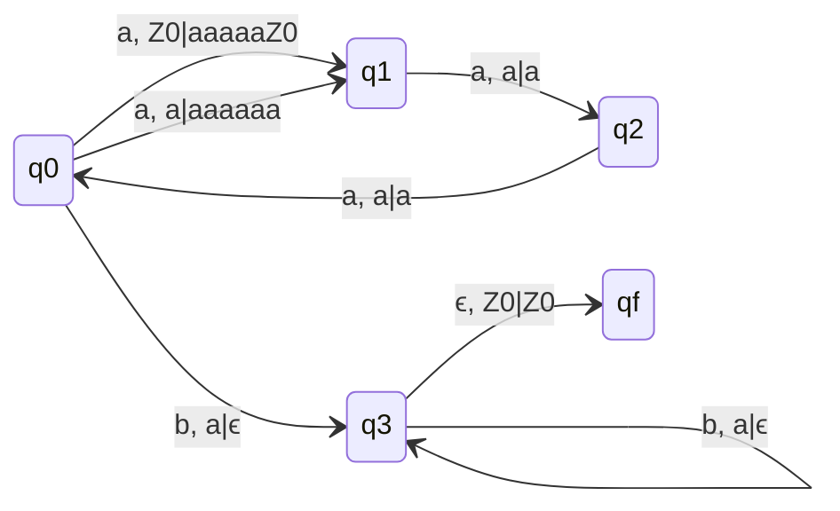

## Q. L = {$a^2nb^n | n \geq 1$}
### Delta Moves
- $\delta(q_0,a,Z_0) = (q_1,aZ_0)$
- $\delta(q_1,a,a) = (q_0,a)$
- $\delta(q_0,a,a) = (q_1,aa)$
- $\delta(q_0,b,a) = (q_2,\epsilon)$
- $\delta(q_2,b,a) = (q_2,\epsilon)$
- $\delta(q_2,\epsilon,Z_0) = (q_f,Z_0)$

### DPDA with final state

### DPDA with null stack

## Q. L = {$a^2nb^n | n \geq 0$}
### DPDA with final state

### q0 and qf are final

## Q. L = {$a^3nb^n | n \geq 1$}

## Q. L = {$a^3nb^5n | n \geq 1$}
