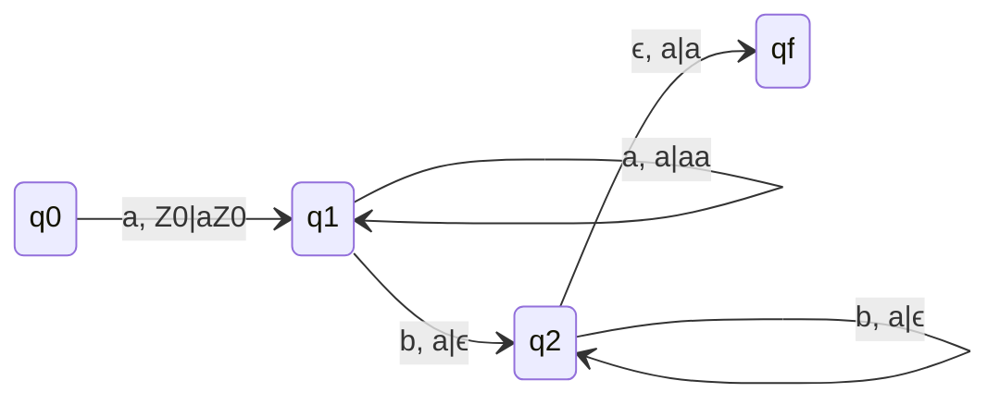
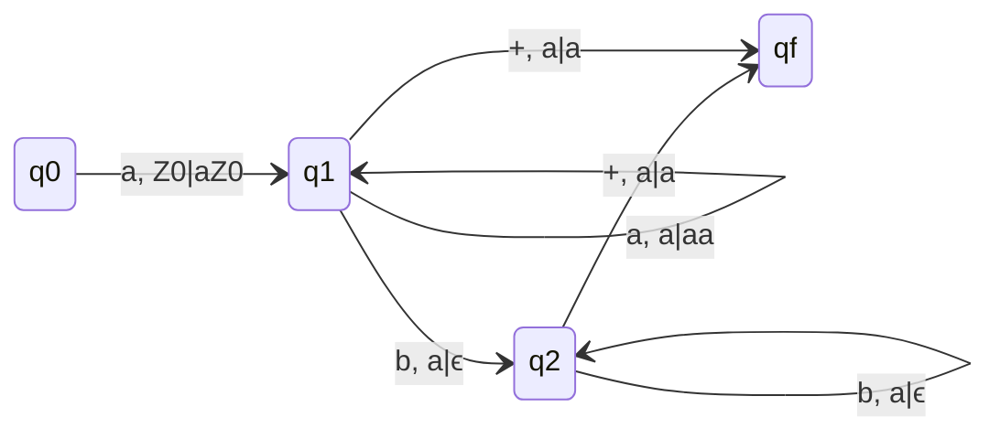
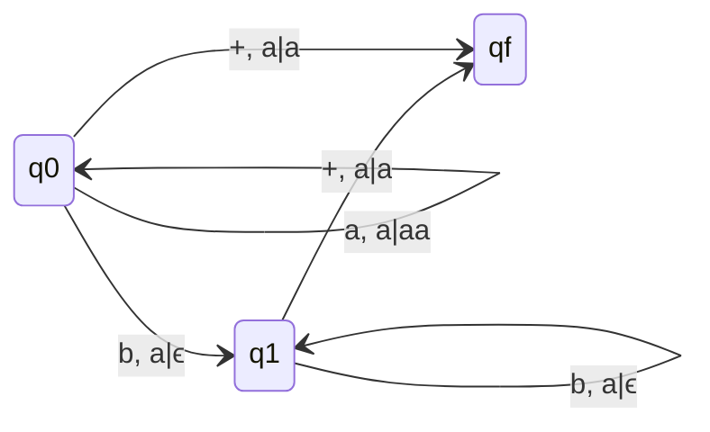
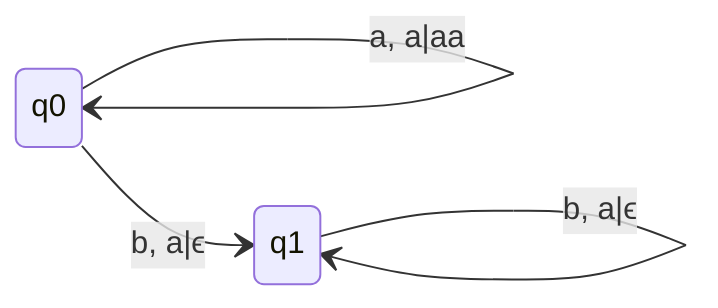
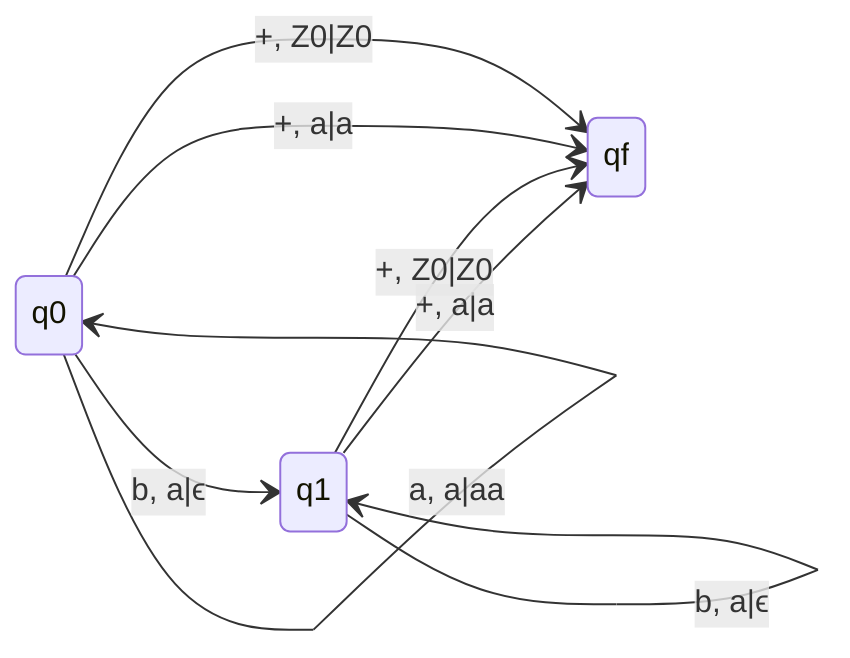

## Q. L = { $a^n b^m | n \gt m$ }

### q1 and qf are final
### This is NDPDA
### Using End Marker to create DPDA

### qf is final
### Easier Diagram

### qf is final

> If DPDA is possible with or without end marker doesn't matter, the language accepted by DPDA is called **DCFL**.

## Following Languages are DCFL
- $L = \{a^nb^n | n \geq 0\}$
- $L = \{a^{n}b^{kn} | n \geq 0\}$
- $L = \{a^{kn}b^{n} | n \geq 0\}$
- $L = \{a^{k_1n}b^{k_2n} | n \geq 0\}$
- $L = \{a^nb^m | n \gt m\}$

## Q. L = { $a^nb^m | n \geq m$ }

### q0 and q1 are final
### This is DPDA
### Using End Marker
