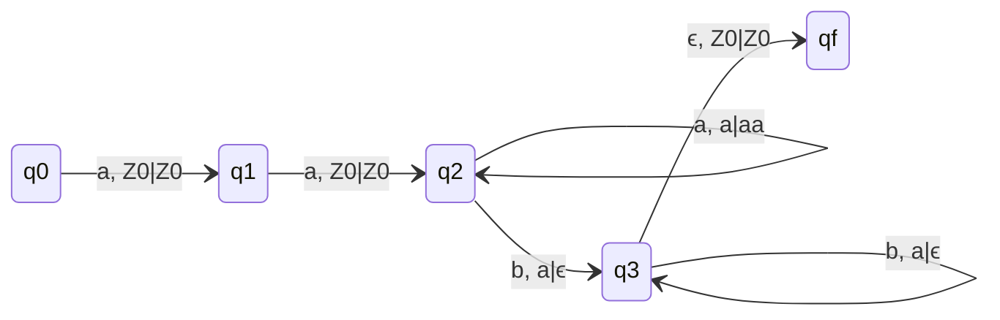
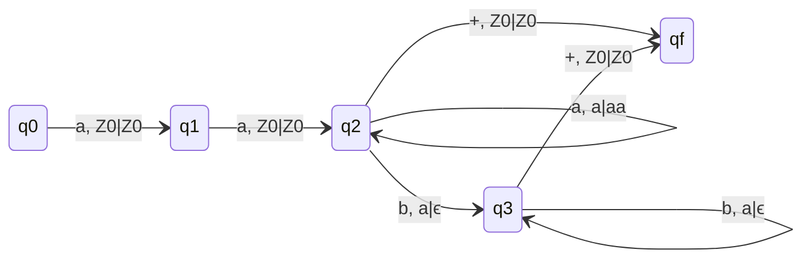
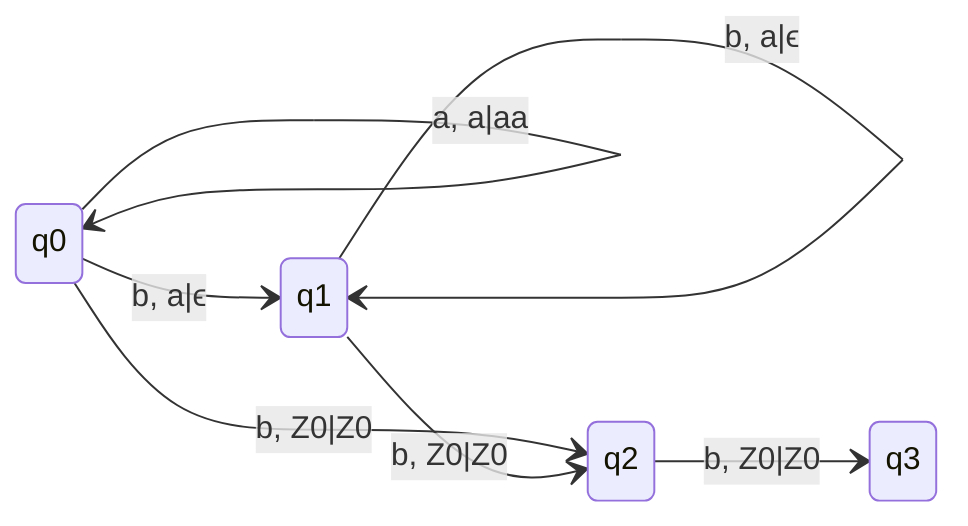
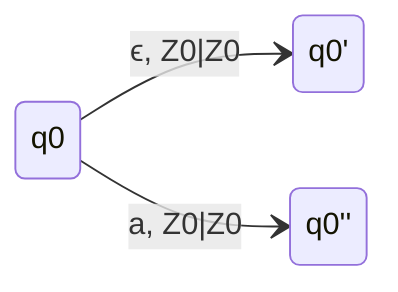
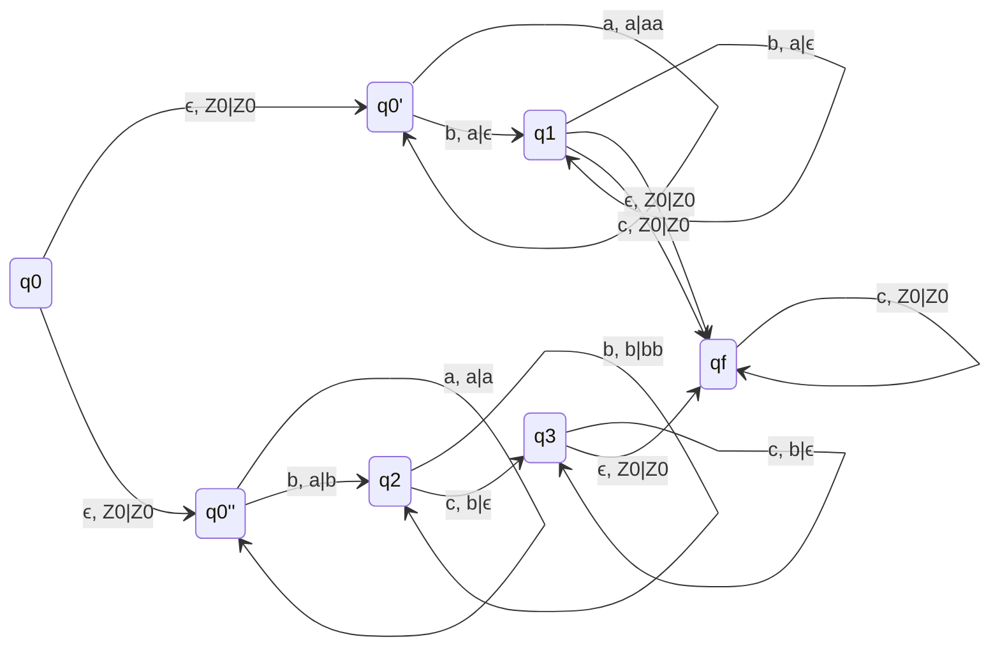

## Q. L = { $a^nb^m | n - m =2$ }

### Logic:- Ignore first 2 a's and then check if the number of a's and b's are equal.

### Without End Marker (DPDA)

### q2 and qf are final states.

### with End Marker (DPDA)

### Only qf is final

## Q. L = { $a^nb^m | m - n =2$ }

### q3 is final state

## Q. L = { $a^nb^n \cup a^nb^{2n}$ }

- Draw PDAs for both language at q0' and q0'' respectively.
- There will always be confusion whether the input a is for first language or second language.
- No DPDA possible for this language, So this is not DCFL.
- Both the languages are DCFL and union of DCFLs is not closed.

## Identity
- DCFL is not closed under union property

## Q. L = { $a^mb^nc^p | m = n$ or $n = p$ }

### L = { $a^nb^nc^m \cup a^nb^mc^m$ }
### Logic: For L1 Push a's and Pop b's, For L2 Push b's and Pop c's, ignore the third variable not discussed in respective languages.

- Only NDPDA will be possible

## L = { $a^nb^mc^{n+m}$ } is DCFL