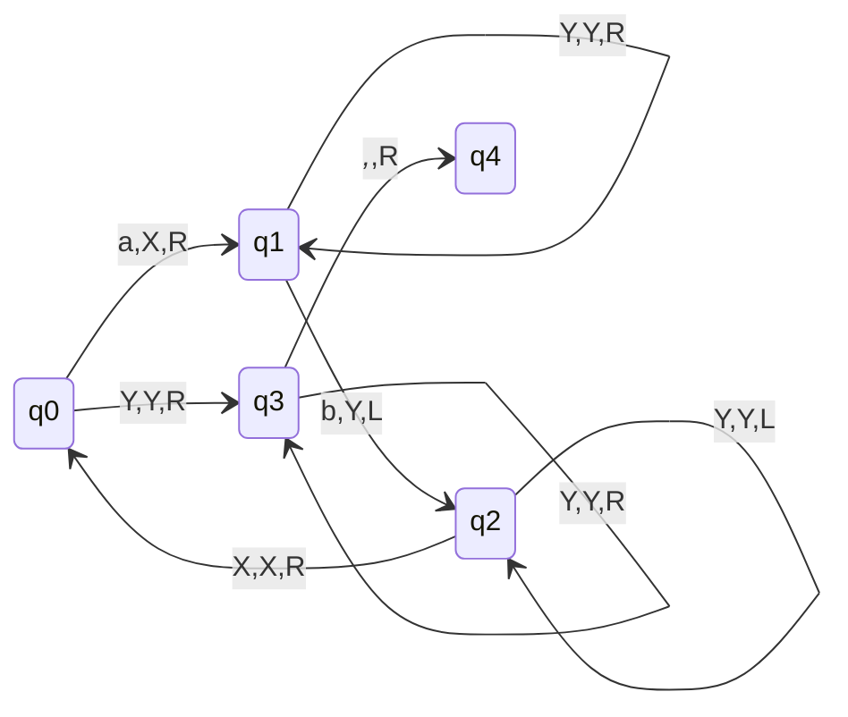
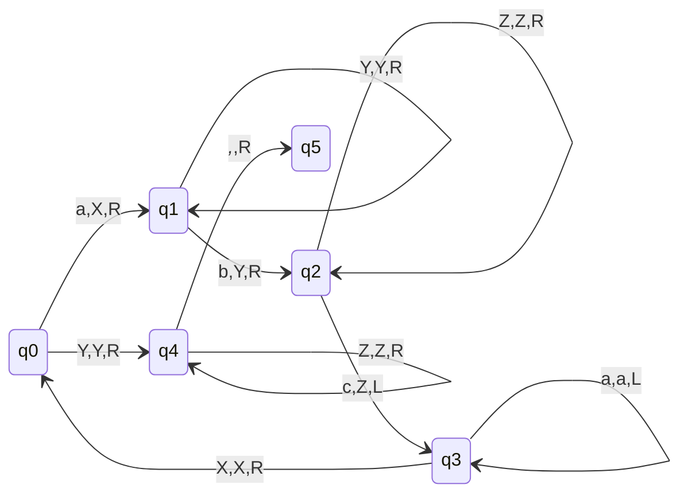

# Examples of CFL

## L = { $a^{n}b^{n}|n\geq 1$ }
**Approach**
- First read an 'a' replace it with 'X' then move right, then skip all the a's.
- Read first 'b' replace it with 'Y' and move left.
- Moving left skip all the a's.
- Read 'X', replace it with 'X' and move right.
- Read second 'a' and replace it with 'X' and move right. Further skip 'a's and 'Y's coming in between.
- Read second 'b' and replace it with Y and move left. Further skip all a's and Y's in b/w.
- Read 'X' and replace it with 'X' and move right.
- If Further any 'a' is encountered repeat the process.
- If in right we encounter Y means we have read same number of a's and b's.
- So, read Y, write Y and jump to other state.
- Read, Y's replaced by B in that state.
- Finally, read blank and move to the final state. 

### q4 is the final state
- If there are more number of b's we will go in dead configuration in q3 state, as there will be no move to read extra b's left.
- If more number of a's then we will go in dead configuration in q1 state, as there will be no move there to read blank symbol.

## L = { $a^{n}b^{n}c^{n}|n\geq 1$ }
