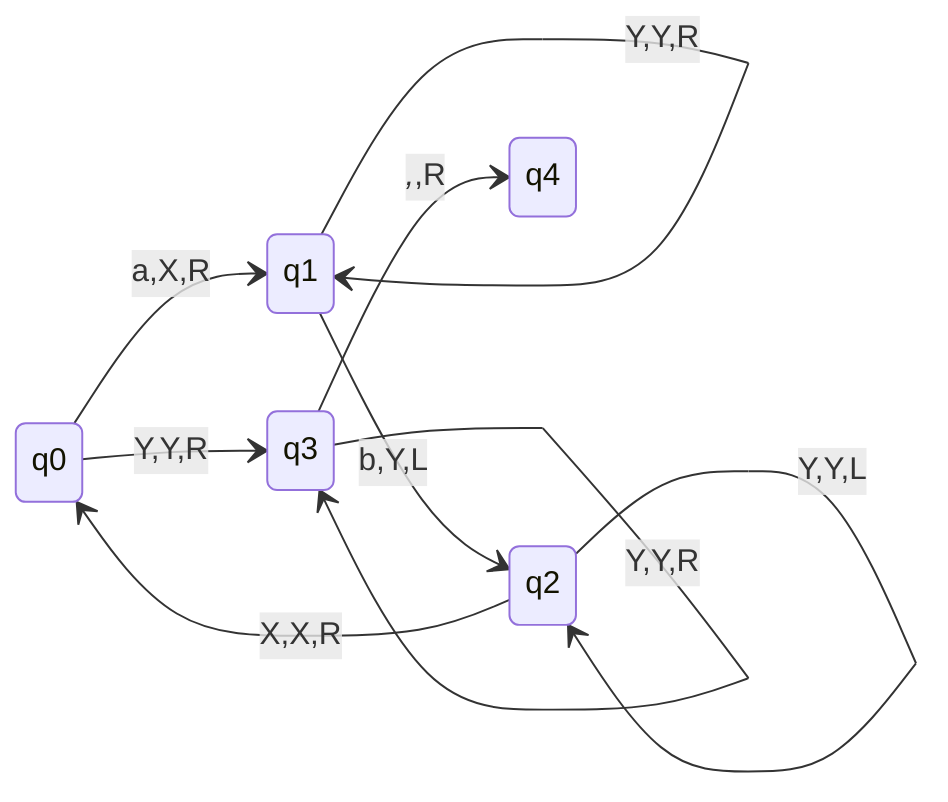
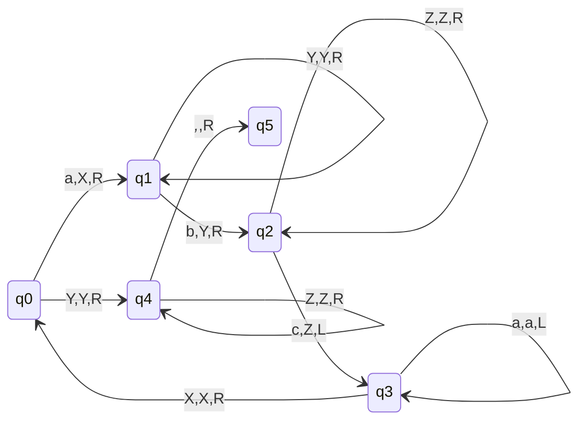

# Examples of CFL

## L = {$a^{n}b^{n}|n\geq 1$}

### q4 is the final state
- If there are more number of b's we will go in dead configuration in q3 state, as there will be no move to read extra b's left.
- If more numbero f a's then we will go in dead configuration in q1 state, as there will be no move there to read blank symbol.

## L = {$a^{n}b^{n}c^{n}|n\geq 1$}
