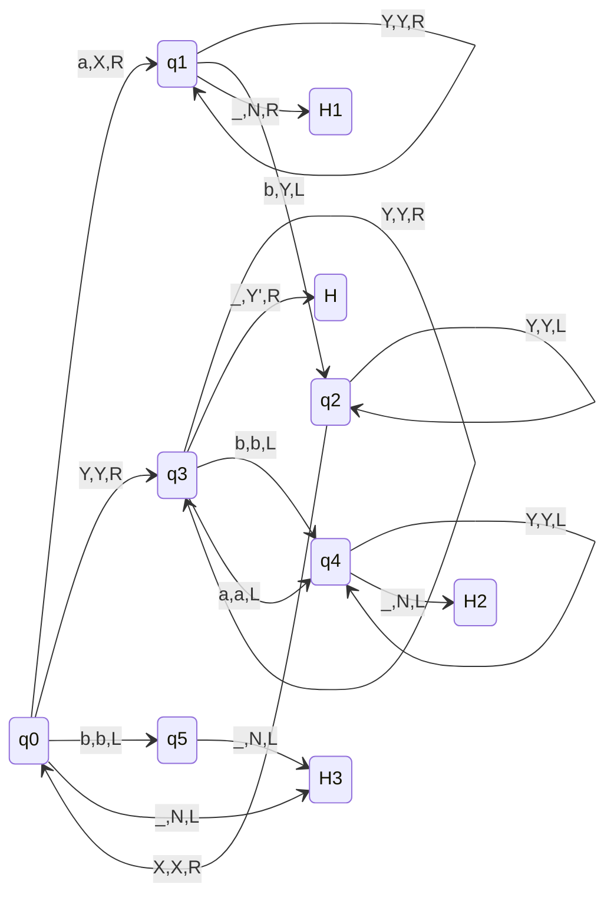
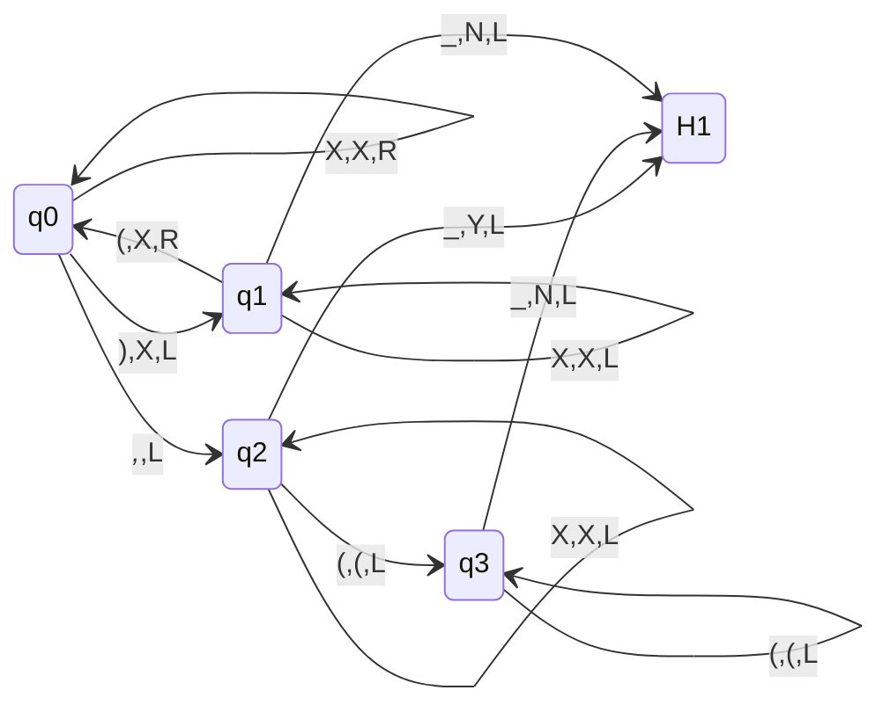
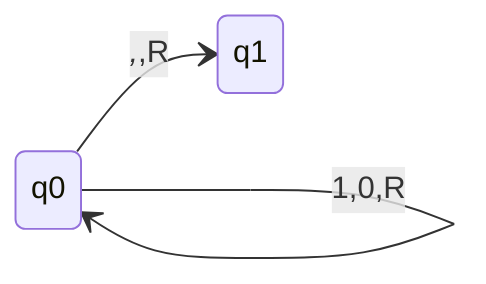
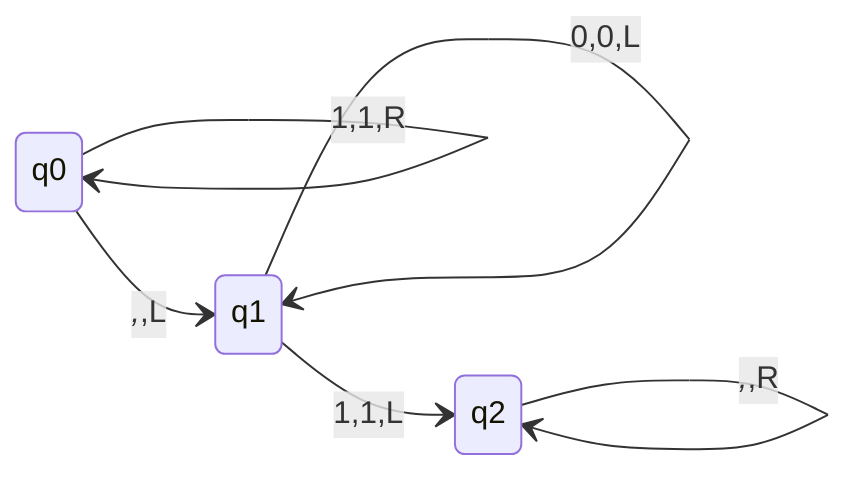
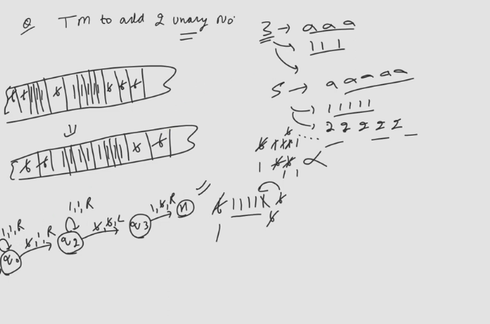

# Turing Machine as Transducer

## L = { $a^nb^n|n\geq 1$ } if w $\in$ L then print Y' on tape else print N.

### H,H1,H2 are halting states
### From q3 --> H:_,Y',R are the state which handle printing cases
### Such questions are very rare to come in exam

## Language of Dyck Set
- This diagram I guess is wrong, add a Pull Request with the correct diagram if possible.

## 1's complement of binary number

## 2's complement of number

- Go upto end, traverse back, while traversing back when 1 is encountered after that take one's complement of further numbers.

