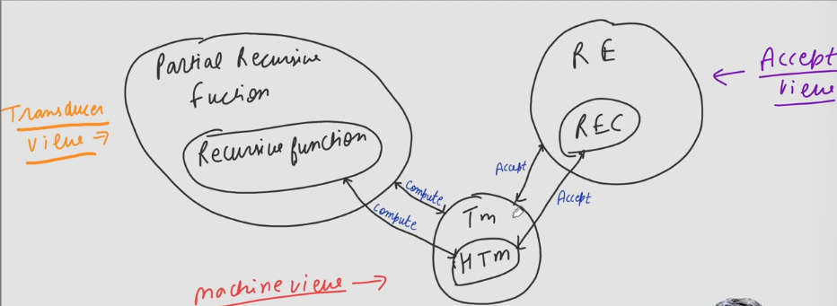

# Chruch Turing Thesis:
- What could naturally be called as effective procedure can be realized by Turing Machine.
- Means that for any problem if we are able to design a procedure then to implement that procedure we have a Turing Machine.

## Turing Machine as an Acceptor:
- Every logically recognizable language can be accepted by a Turing Machine.

## Turing Machine as a Transducer:
- Every logically computable function can be computed by a Turing Machine.
  - Those are calles Partial Recursive Function.

## Note:-
> R.E. are called Turning Recognizable Language.  
> REC are called Turing Decidable Language.  
> Whatever Logic can do can be done by Turning Machine.  
Random function are not Turing computable.

- There are some basic functions and some basic operations through which we can perform trigonometric, logarithmic, exponential, etc. functions.