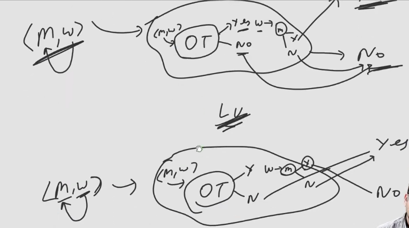

# Reduciton Theorem:
- A reduction is a way of converting one problem to another problem in such a way that a solution to the second problem can be used to solve the first problem.
- Reducibility always involves two problems, which we call A and B. If A reduces to B, we can use a solution to B to solve A.
- A < B, means A is reduced to B.
  - Ex:
  - India to US < Buy Ticket
  - Buy Ticket < Earn Money
- We can say if B is Decidable then A is Decidable
- **To prove given problem as decideable simply reduce given problem to known decidable problem.**
- **To prove problem is Undecidable simply reduce a known Undecidable problem to your problem.**
- Reducibility says nothing about solving A or B alone, but only about the solvability of A in the presence of a solution to B.
- We can say A is Less Hard than B. 

## Question
To prove Problem A as Decidable we will  
1. Reduce A to Subset Sum problem
2. Reduce A to Halting Problem of Turing Machine
3. Reduce subset Sum to A
4. Both A & B

### Answer
- Option A

## Question
To prove Problem A as Undecidable we will  
1. Reduce Halting Problem of FA to A 
2. Reduce Halting Problem of TM to A
3. Reduce Halting Problem of PDA to A
4. Reduce Halting Problem of LBA to A

### Answer
- Option B
- Other all problems are decidable problems.

## How Reduction is Done
- Many Reduction types are there, two of them are
1. Turing Reduction
2. Mapping Reduction

### Turing Reduction
- Here we use Oracle Turing Machine, like GOD turing machine which gives answer to the string provided by Yes or No.
- This Turing machine is under other Turing machine, which is used for the case of the type of problem.
- Using Turing reduction we can reduce 
  - RE membership problem to Halting problem of Turing Machine
  - Compliment of RE Mermbership Problem to Halting Problem of Turing Machine
  - Hence Halting Problem is Undecidable
  - Also we reduced, ***Non-RE to RE.***  

- In Above Figure,
- Above Diagram is of Compliment of Membership set of RE
- Below Diagram is of Halting Problem of TM.

> **NOTE:**  
> If Halting Problem is decidable then every RE will be REC and hence all those Non-RE whose compliment is RE will also become REC.  
> A Turing Reduction can be of ***Non-RE or RE to RE.***

## Mapping Reduction
- Mapping the instances of one Language to the instances of the other language.
- Care must be taken that all yes instances are mapped with the yes instances and all the no instances with the no instances.
  - w $\in$ L(A) iff f(w) $\in$ L(B)
- Mapping reducible means there is a Halting turing machine which takes input w and gives output f(w).
- Only RE Membership problem is mapping reducible to Halting Problem of TM.

## Questions
1. If A $<_{m}$ B, If B is decidable
  - A is also Decidable

2. If A $<_{m}$ B, If A is undecidable
  - B is also undecidable

3. If A $<_{m}$ B, If B is RE
  - A is also RE

4. If A $<_{m}$ B, If A is Non-RE
  - B is also Non-RE

5. If A $<_{m}$ B, If A is Decidable
  - B we can't say anything about it

6. If A $<_{m}$ B, If B is Undecidable
  - We can't say anything about A

7. If A $<_{m}$ B, If A is RE
  - B can be RE/Non-RE

## Practice Questions on Reduction

1. If $L_{1} <_{m} L_{2}$ & $L_{2} <_{m} L_{3}$, $L_{2}$ is RE but not REC then

| L1 | L3 | Possible |
| -- | -- | -------- |
| RE | Non-RE | ✅ |
| Non-RE | RE | ❌ |
| RE | RE | ✅ |
| Non-RE | Non-RE | ❌ |
| D | UD | ✅ |
| UD | D | ❌ |
| D | D | ❌ |
| UD | UD | ✅ |
- For last possiblity is asked so TRUE, as UD contains RE but not REC as well as Non-RE, so if **always** UD UD asked then **No.**

2. $L_{1} <_{m} L_{2}$, L2 is REC, then L1 is
  - REC,
  - Since every REC is RE, so we can also say it as RE.

3. $L_{1} <_{m} L_{2}$, L2 is RE, then L1 can be
  - REC, not REC

4. $L_{1} \cup L_{2} <_{m} L_{3}$, L1 is RE and L2 is REC, then L3 can be
  - RE, REC, Non-RE all are possible

5. $L_{3} <_{m} (L_{1} \cup L_{2})$, L1 is RE, L2 is REC then L3 is
  - RE
  - REC is possible but we can't say it for sure

6. $\bar{L_{1}} <_{m} L_{2}$, L1 is RE but not REC, then L2 is
  - $\bar{L_{1}}$ will be Non-RE
  - $\therefore$ L2 will be Non-RE