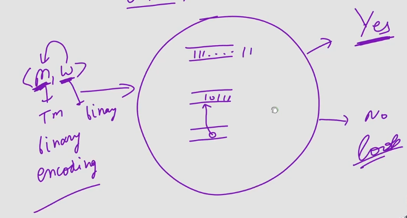

# Universal Turing Machine
- It has three tapes
- It is given input of Machine and String pair by doing Binary encoding.
  - Machine Encoding is stored on First Tape.
  - String Binary Code is stored on Second Tape.
  - On third tape state is stored, initial it will have binary code of initial state, and then keeps on updating according to the simulation.

## Important Points
- It can simulate any TM
- I/P to UTM is binary encoding of TM & string w
- If TM accept w then UTM accept w
- If TM reject w & halt then UTM reject and halt.
- If TM doesn't halt on w then UTM also doesn't halt on w.
- Hence, Language accepted by UTM is Lu.
- It was invented by Lan Turing in 1936-37.
- This mathematical model was used by Von-Neumann to build computer in 1946.
- Hence, computer is nothing but mechanical implementation of UTM.
- In other words UTM is mathematical model of computer.
- UTM can solve any problem for which we can write algo.
- UTM can identify YES instances of the problem for which we can write procedure.