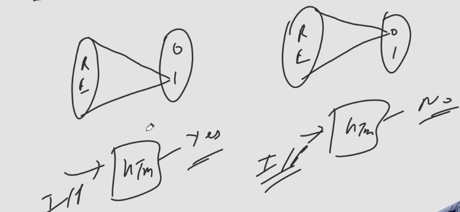
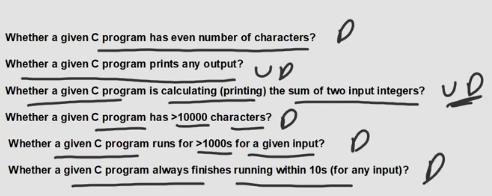

# Rice Theorem
- Any non-trivial property of RE languages is undecidable.
- It can be applied only on RE languages & not on Turing machines or Type 0 grammar
- It can be applied if TM is given & question is about L(M).
- It can be applied if Type 0 grammar is given & question is about L(G).

# Property:
- Property is a function from set of languages to {0,1}
- Domain = $2^{\Sigma^{*}}$ and Range = {0,1}
- P(L) = 1, means L satisfy property P
- P(L) = 0, means L doesn't satisy property P
- Rice Theorem is all about properties of RE languages.
  - Hence, Doamin of this function is restricted to RE languages.
- Domain = "Set off all RE languages" and Range = {0,1}

## Non-Trivial Property
- $\exists$ L (P(L)=0) & $\exists$ L (P(L)=1)
  - L is regular
    - Here regular will map to 1, other which belong to RE maps to 0
  - L is finite 
  - |L| $\leq$ 1000
  - L = $\phi$
    - $\phi$ maps to 1, rest maps to 0
  - 101 $\in$ L

## Trivial Property
- $\forall$ L (P(L) = 0) OR $\forall$ L (P(L) = 1)
  - L is RE
  - L is non RE
  - L is accepted by TM
  - L is not accepted by TM
  - L(M) is recognized by a TM having even number of states
  - L(M) is a subset of $\Sigma^{*}$

- For YES case L = $\Sigma^{*}$
- For No case L = $\phi$

## Question
L1 $\cup$ L2 = RE is trivial property?

### Answer
- This is not even a property
- Property is from RE to 0,1
- But here we are trying to define from (RE x RE to 0,1)
- FALSE

## What is the language corresponding to property P?
- We need to consider set of all RE Languages which satisfy property P.
- But we can't call it as language because language is set of strings & not set of binary strings
- For each RE language we have infinite TM accepting it.
- Hence consider binary encoding of all such TMs & that will make language corresponding to property P.
- Lp = { \<M\> | L(M) satisfies property P}
- M is the binary encoding of the Turing Machine
- Rice Theorem says that, If P is non-trivial then Lp is not REC.
- Rice Theorem does not say
  - If P is trivial property then Lp is REC.

## How to apply Rice Theorem:

1. Does 010 belong to given RE Language?
    - This will be Undecidable problem
    - Because there would be some languages which will have 010 and there would be some languages which will not have 010.
    - It belongs to the non-trivial property.
    - The language is not Recursive
    - L = { \<M\> | 010 $\in$ L(M) }

2. Is the given RE language empty? (OR) Does the given TM accept empty language
    - There will be a language which is empty and other will be non-empty.
    - Hence non-trivial property.
    - So, it is Undecidable.
    - L = { \<M\> | L(M) = $\phi$ }
    - This language is not Recursive

3. Does the given Language is $\Sigma^{*}$?
    - Undecidable Problem
    - Non-trivial Property
    - L = { \<M\> | L(M) = $\Sigma^{*}$ }

4. Does the given RE Language has more than 5 strings?
    - Undecidable Problem

5. Does the given RE language Regular? (OR) Does the given TM accept Regular Language?
    - Undecidable Problem

6. Does the given RE language REC?
    - Undecidable Problem

7. Does the given TM accept CFL? (OR) Does the given Type 0 grammar generate CFL?
    - Undecidable Problem

8. Does the given TM accept RE language?
    - Decidable
    - Trivial Property

9. Does the given Type 0 grammar generate Regular Language?
    - Undecidable, similar to Q5.

10. Does the given Type 0 grammar generate RE language?
    - Decidable
    - Trivial Property

## Question which look like Rice Theorem question but they are not

1. Does the given TM has 10 states?
    - Here we are not talking about RE language
    - This has nothing to do with property
    - It is Decidable

### Any Questions regarding computation of TM is Undecidable

2. Does the given TM print 111 on the Tape?
    - It asks about printing not accepting.
    - So, it has nothing to do with the language
    - It is Undecidable

3. Does the given TM produces any output?
    - It is Undecidable

4. Does the given TM takes 2014 steps on any input?
    - It is decidable

5. Does the given TM compute product of two numbers?
    - It is Undecidable

6. Does the given Type 0 grammar regular?
    - It is decidable as it has nothing to do with Re language.

### NOTE
- If asked about accpetance of TM then mostly it will be of Rice Theorem.
- If asked about generation by grammar then mostly it will be of Rice Theorem.

## Questions

1. L = { <M1,M2> | L(M1) = L(M2) }
    - Equivalence of RE
    - It is Undecidable

2. L = { <M1,M2> | L(M1) $\cap$ L(M2) = RE }
    - Intersection of RE
    - It is Decidable

3. L = { <M1,M2> | L(M1) $\cup$ L(M2) = RE }
    - Union of RE
    - It is decidable

4. L = { <M1,M2> | L(M1) $\cup$ L(M2) != RE }
    - It is Decidable

5. L = { <M1,M2,M3> | L(M1) = L(M2).L(M3) }
    - M2 and M3 concatenation of RE
    - then, equivalence of RE
    - Equivalance of RE is not closed
    - It is Undecidable

# Advance Rice Theorem
- Normal Rice Theorem states that the given Language is not REC
- By Advance Rice Theorem, we can come to know that the given Language is Non-RE.
- Any non-monotone property of the Language is non-RE
- Non-Monotone $\implies$ Non-RE
- ~Non-RE $\implies$ ~Non-Monotone
  - RE $\implies$ Monotone

## Monotone Property
- If a RE language satisfy property P, then all it's superset must satisfy property P.
- A property P is monotone if for any RE language L if P(L) = 1 then $\forall$ L' (L $\subseteq$ L'), P(L') must be 1.

### Examples
1. |L| $\geq$ 5: L is monotone
2. L is regular: L is not monotone(Superset has CFL,CSL,REC, etc. but cannot be REG)
3. L is not Regular: L is not Monotone (Superset can contain REG, those will not satisfy the property)
4. |L| $\leq$ 5: L is not monotone (Superset can contain L greater than 5)
5. L = $\phi$ : L is not monotone
6. L $\neq \phi$ : L is monotone
7. L is finite: Non-Monotone
8. L is infinite: Monotone
9. L = $\Sigma^{*}$ : Monotone
10. Every Trivial Property is Monotone: True
11. If P( $\phi$ ) = 1, then non-trivial property is non-monotone?
    - As it is called non-trivial there will be a language which will not satisfy the property.
    - So, the given statement is true.
12. If P( $\phi$ ) = 0, then non-trivial property is non-montonic?
    - Here we got to compare with 0, we don't have any property compared to 1.
    - We can't derive any conclusion from this.
    - Henc given statement is FALSE.
13. If P( $\phi$ ) = 0, then compliment of non-trivial property is non-monotone
    - $\bar{P(\phi)}$ = 1
    - Given that it is non-trivial
    - So, the given statement is TRUE

### NOTE
- As Discussed any non-monotone property of RE Languages is Non-RE
- THereofre above whichever are non-monotne language corresponding to them is non-RE.

## Questions

1. L = { \<M\> | 010 $\in$ L(M) }
    - The given property is non-trivial so, it is Undecidable
    - The given property is monotone, because any superset of it will obviously contain 010
    - Since, Monotone we cannot tell directly about language, we need to check whether we can make TM for it or not.
    - The TM for this is Possible
      - 3 tapes
      - First contains M(Binary encoding of machine)
      - Second Tape contains 010
      - Third Tape contains states
    - Hence, the given Language is RE but not REC

2. $\bar{L}$ = { \<M\> | 010 $\notin$ L(M) }
    - Since above one was RE but not REC, hence this is it's compliment and will be Non-RE.

3. L = { \<M\> | L(M) = $\phi$ }
    - The given property is non-trivial so it is Undecidable.
    - Also it is non-monotonic, Since there would be superset of it where L(M) will not be $\phi$.
    - Therefore the given language will be Non-RE.

4. $\bar{L}$ = { \<M\> | L(M) $\neq \phi$ }
    - The given L(M) has Language has non-trivial Property
    - Also, the property is monotone.
    - So, we need to check by making a TM for it.
    - TM for it is possible, just read one character and you arrive to final state
    - Therefore the given language is RE but not REC.

5. L = { \<M\> | L(M) = $\Sigma^{*}$ }
    - The property is non-trivial (There will be other languages != $\Sigma^{*}$ )
    - Also, the property is monotone
    - As $\Sigma^{*}$ contains infinite number of strings, so there is no way we can reach them in finite time even with Dow Tilling process of constructing TM.
    - Hence, TM for this is not possible.
    - Given Language is Non-RE.

6. L = { \<M\> | L(M) $\neq \Sigma^{*}$ }
    - It is non-trivial property (There will be a Language = $\Sigma^{*}$ )
    - Also, the property is non-monotone
    - Therefore, the language is Non-RE.

7. L = { \<M\> | L(M) is finite }
    - It is non-trivial (There will be infinite languages)
    - Also the property is non-monotonic
    - Hence the given L is Non-RE.

8. $\bar{L}$ = { \<M\> | L(M) is infinite }
    - It is non-trivial property
    - Also the property is monotonic, so we need to check by whehter TM for it is possible or not.
    - Not possible because in finite time we cannot reach to infinite length string
    - Therefore the language is Non-RE.

9. L = { \<M\> | |L(M)| > 5 }
    - It is non-trivial (String with length less than 5)
    - It is monotonic property
    - TM for the string is possible ( We don't have to check upto infinite we just need to check if length crosses 5 or not)
    - Hence, it is RE but not REC.

10. $\bar{L}$ = { \<M\> | |L(M)| $\leq$ 5 }
    - Compliment of that hence non-RE.

11. L = { \<M\> | L(M) is regular }
    - Non-trivial ( There would be RE languages which will not be regular.)
    - Non-monotone as superset can be languages which are CSL,CFL,REC,RE but not REG.
    - Therefore the language is Non-RE.

12. $\bar{L}$ = { \<M\> | L(M) is not Regular }
    - Non-trivial
    - Non-monotone (Superset 0\*1\* is regular)
    - Non-RE language

13. L = { \<M\> | L(M) is CFL }
    - Same case as of regular, Non-RE

14. L = { \<M\> | L(M) is RE }
    - Trivial property
    - Decidable
    - REC

15. L = { \<M\> | L(M) is Non-RE }
    - Trivial property
    - Decidable
    - REC

16. L = { <M1,M2> | L(M1) = L(M2) }
    - Rice Theorem won't work as there are 2 inputs
    - Given question is on equivalance of RE
    - It is Undecidable for RE
    - We can't design TM for it, suppose both languages are of infinite length we can't say YES about it.
    - Non-RE

17. L = { <M1,M2> | L(M1) $\neq$ L(M2) }
    - To check what we do is to find the L which is present in L(M1) but not in L(M2) or vice versa.
    - We can't find, in case because the smaller Turing machine will go to halt and hence UTM will halt, can't say Yes about it.
    - Non-RE Language

18. L = { <M1,M2> | L(M1) $\subseteq$ L(M2) }
    - Can't check upto infinite
    - Non-RE

19. L = { <M1,M2> | L(M1) $\cap$ L(M2) $\neq \phi$ }
    - We just need to find one language which is common in both
    - We can get it in finite time
    - So, TM possible
    - It is RE

20. L = { <M1,M2> | L(M1) $\cap$ L(M2) = $\phi$ }
    - Non-RE (Compliment of Above)

21. L = { <M1,M2> | L(M1) = L(M2) & both accept finite language}
    - Both accept finite language, but they can contain infinite number of language, hence to check each of them in finite time is not possible.
    - It is Non-RE.

## Note

> Questions regarding computation of the Turing Machine is Undecidable

1. Does the given TM produces any O/P?
    - Undeicdable

2. Does the given TM prints 111 on tape?
    - Undecidable

3. Does the given TM compute product of 2 number?
    - Undecidable

4. Does the given TM **takes (at least/ at most/ exactly) K** steps for **(some all)** inputs?
    - Decidable

5. Does the TM **halts (before exactly)** K steps for **(some all)** inputs?
    - Decidable

6. Does the TM **halts (after)** K steps for **(some all)** inputs?
    - Undecidable

7. Does the TM **halts immediately (after)** K steps for **(some all)** inputs?
    - Decidable
    - Immediately means in the next step so countable, hence decidable

