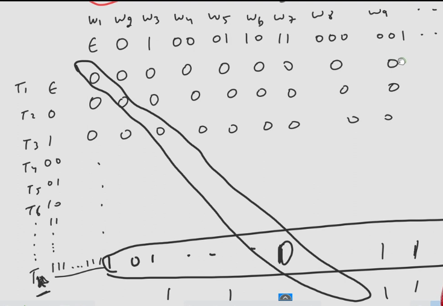

- In countability we have seen that for every turing machine there exists a binary string.
- We can also claim that every for binary string there exists a Turing Machine, now if string is not according to the standards of encoding we learnt, we can say that the turing machien we got from the string accepts $\phi$ language.
- Like if String is 0 or 1 or 01 or 11, these strings are not proper binary encoding of a Turing machine.
  - Still we can say there exists a turing machine whose binary encoding is like those given above but the thing is those TMs will not accept any language.
  - All those binary encoding of TMs are subset of **Diagonalization Language.**

### Infinite Matrix of TM with W

## What if we give Turing Machine a binary string which is it's own encoding? Will it accept or reject?
- The case is some accepts and some do not.
- Set of all Binary Encodings of all TM which **REJECT** by their own Encoding(TM) are called as **DIAGONALIZATION LANGUAGE.**
- Represented by $L_{d}$
- This Diagonalization Language is **Non-RE**.
- Thee set of all Binary Encodings of all TM which is **ACCEPTED** by their own Encoding(TM) are **RE but not REC.**
- All those strings which are not properly encoded comes under Diagonalization Language as those TMs do not accept any language.
- Strings with proper encoding may or may not come in Diagonalization language, it depends upon their definition.

## Examples of Non-RE
- $L_{d}$ = {e(T) | e(T) $\notin$ L(T)}
  - e(T) is binary enocding of TM T
  - L(T) is Language accepted by TM T
  - It consists of all those strings w such that the TM represented by w does not accept the input w.
- $\bar{L_{u}}$ = { <M,W> | W $\notin$ L(M)}

## Example of RE whose compliment is Non-RE
- Set of all TMs which accept their own encoding
  - $\bar{L_{d}}$ = { e(T) | e(T) $\in$ L(T)}
- $L_{u}$ = { <M,W> | W $\in$ L(M)}