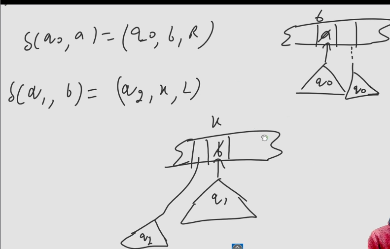

Invented by Alan Turing in 1936.

- It consist of a tape of infinite length divided into cells.
- Finite no. of cells are filled with symbols from a finite set of symbols.
- Rest of the cells are blank.
- There is a read/write head positioned at the $1^{st}$ symbol which can read & write on the tape, one hand is connected to the tape & other hand is connected to the FSCM (control Machine) which stores current state of TM.
- Write means it can change the symbol on the tape which was not possible in FA and PDAs.
- R/W can move in both direction (Not possible in FAs and PDAs).
  - As moves in both direction so there is problem of infinite loop(hang).
- R/W can change one symbol at a time, move one step at a time.
- Three States:
  - Hang State $\rightarrow$ Reject
  - Accept State
  - Reject State

## Formal Definition of TM
It can be formally defined as a 7 Tuple.
$$M = (Q, \Sigma, \Gamma, \delta, q_0, f, \square)$$
- $Q$ is a finite set of states.
- $q_0$ is the initial state.
- $f$ is the set of final state.
- $\square$ is the blank symbol.
  - $\square \in \Gamma$ and $\square \notin \Sigma$ 
- $\Sigma$ is the finite set of input alphabet.
- $\Gamma$ is the finite set of tape alphabet.
  - $\Sigma \subseteq \Gamma - \{\square\}$
  - If $\Sigma = \{a, b, c\}$ then $\Gamma = \{a, b, c, \square\}$
  - If R/W head makes a to 0, b to 1 and c to 2, then $\Gamma = \{0, 1, 2, a, b, c, \square\}$,  $\Sigma = \{a, b, c\}$
- $\delta$ is the transition function.
  - $\delta: Q \times \Gamma \rightarrow Q \times \Gamma \times \{L, R\}$
  - Again just like PDA here $\delta$ is a partial function so it's not necessary that we define move for every state and every symbol.

> All this we talked is about Deterministic Turing Machine (DTM) also the Standard TM, there is another type of TM called Non-Deterministic Turing Machine (NTM) which we will study in variation of TM.
> Power of DTM and NDTM is same.

### Moves in TM

### RE Language $\rightarrow$ Turing Acceptable Language
### REC Language $\rightarrow$ Turing Decidable Language