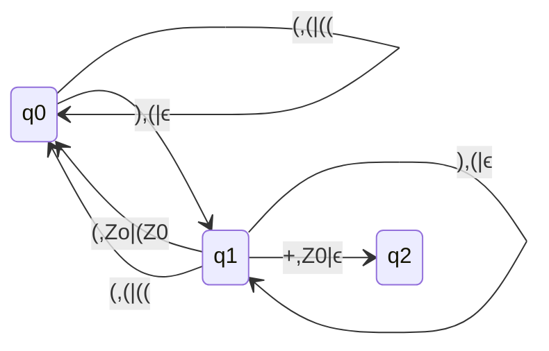

## Check Whether DCFL or not

1. $a^mb^nc^pd^q | m+n = p+q$
   - push a & b, pop c & d
   - While cutting c & d moves consist both
     - $\delta(q,c,a) = (q,ϵ)$ & $\delta(q,c,b) = (q,ϵ)$
   - DPDA is possible
   - Hence Language is DCFL
2. $a^mb^nc^pd^q | m+p = n+q$
    - push reading a and pop reading d is confirm
    - For b and c three cases are possible
      - if m>n
        - pop a's from stack reading b, and push c in stack reading a from the stack
      - if m<n
        - pop a's reading b's until Z0 occurs, then push b's in the stack, later pop b's reading c's until Z0 occurs, then push c's in the stack.
      - if m = n
        - Same as m > n but thing is for c pushing path will be reading Z0 from stack
3. $a^mb^nc^pd^q | m+q = n+p$
    - push a and pop reading d is confirm
    - For b & c
      - if n > m
        - pop a's reading b's until Z0 occurs, then push b's and c's in the stack.
      - if m > n
        - pop a's reading b's, pop a's reading c's until Z0 occurs, then push c's in the stack. 
      - if m = n
        - pop a's reading b's, push c's in the stack.

### All the above three are DCFL

## CFL but not DCFL
- $waw^T|w\in \{a,b\}^*$
- $wbw^T|w\in \{a,b\}^*$
- Language of odd Palindromes over a&b
- Language of Even Palindromes over a&b
- Language of all palindromes over a&b
  - Above languages we cannot distinguish the middle character because number of a's and b's are there so which is the seperator we don't know
- $wc^mw^T|w \in \{a,b\}^* \& m \geq 0$ (m $\geq$ 0 so if no c in between, then we cannot distinguish)

### DCFL
- $wcw^T|w \in \{a,b\}^*$
- $wc^mw^T|w \in \{a,b\}^*$

## Dyck Set:-
- push '(' in the stack and pop while reading ')'

## Representation of Dyck set in terms of a and b.
- L = ${ w|w \in (a,b)^{*} }$ & in any prefix of w $n_a(w) \geq n_b(w)$.
