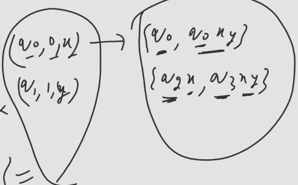

# Types of PDA
1. DPDA (Deterministic PDA)
   1. $\delta$ : $Q\times(\Sigma\cup\{\epsilon\})\times\Gamma \rightarrow Q\times\Gamma^{*}$
   2. $Q\times(\Sigma\cup\{\epsilon\})\times\Gamma$ are all possible combinations of arguments to $\delta$
   3. $\delta$ is a partial function i.e. $\delta$ can be undefined for some values of its arguments.
   4. Unlike DFA dead configuration is allowed in DPDA
   5. 
2. NPDA (Non-Deterministic PDA)
   1. $\delta$ : $Q\times(\Sigma\cup\{\epsilon\})\times\Gamma \rightarrow$ (Finite Subset of $Q\times\Gamma^{*}$)
   2. We haven't written $2^{Q\times\Gamma^{*}}$ because $Q\times\Gamma^{*}$ is infinite set and we can't have infinite number of transitions from a state.
   3. Subset contains of $\phi$, so we can to give dead configuration we can give $\phi$ as a transition.
   4. 

## 2 Conditions for PDA to be deterministic
1. $\forall q\in Q, \forall Z\in\Gamma$, if we have defined a true move for $q$ and $Z$ then we cannot have null move for $q$ and $Z$ and vice versa.
2. There must be unique move for every combination of $q$, $Z$ and $a$ [No need to give all possible moves]

### By default PDA is NDPA and DPDA is special case of NPDA
### DPDA is less powerful than NPDA
### Every DPDA is also NPDA but not vice versa

## Acceptance of String
1. Acceptance by final state
   1. Starting from initial state
   2. After reading entire input string
   3. PDA is at any one of final state
2. Acceptance by empty stack(Null Store)
   1. Starting from initial state
   2. After reading entire input string
   3. Null Store must be empty [It must not contain Z0]