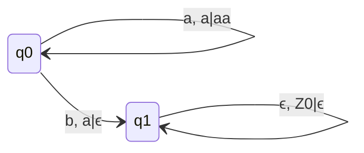
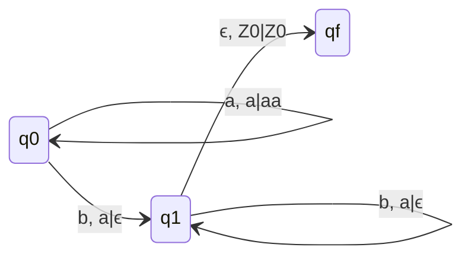
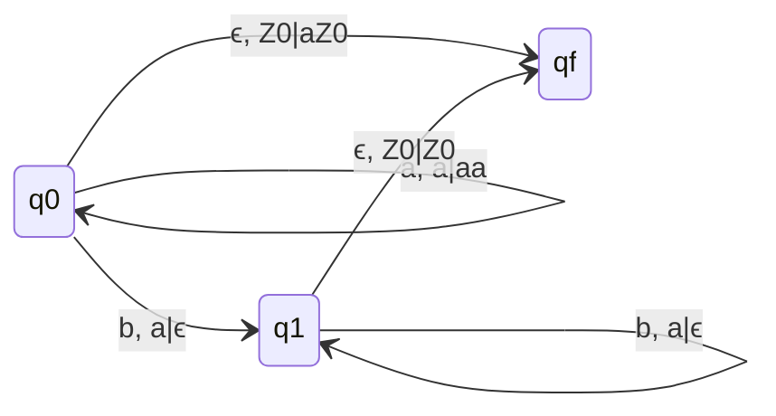

## Q. L = {$a^{n}b^{n}$ | $n\geq 1$} Connstruct PDA which accepts L by null store
- a -> Push, b -> Cutting
### Delta Moves
- $\delta(q_{0}, a, Z_{0}) = (q_{0}, aZ_{0})$
- $\delta(q_{0}, a, a) = (q_{0}, aa)$
- $\delta(q_{0}, b, a) = (q_{1}, \epsilon)$
- $\delta(q_{1}, b, a) = (q_{1}, \epsilon)$
- $\delta(q_{1}, \epsilon, Z_{0}) = (q_{1}, \epsilon)$
### State Transition Diagram

## Q. L = {$a^{n}b^{n}$ | $n\geq 1$} Connstruct PDA which accepts L by final State

### Delta Moves
- $\delta(q_{0}, a, Z_{0}) = (q_{0}, aZ_{0})$
- $\delta(q_{0}, a, a) = (q_{0}, aa)$
- $\delta(q_{0}, b, a) = (q_{1}, \epsilon)$
- $\delta(q_{1}, b, a) = (q_{1}, \epsilon)$
- $\delta(q_{1}, \epsilon, Z_{0}) = (q_{f}, \epsilon)$ $\longleftrightarrow$ $\delta(q_{1}, \epsilon, Z_{0}) = (q_{f}, Z_{0})$
- In last whatever we push to stack does not matter as we are going to final state.

### State Transition Diagram

## Q. L = {$a^{n}b^{n} | n \geq 0$} Connstruct PDA which accepts L by final State
### Delta Moves
- $\delta(q_{0}, \epsilon, Z_{0}) = (q_{f}, aZ_{0})$
- $\delta(q_{0}, a, Z_{0}) = (q_{0}, aZ_{0})$
- $\delta(q_{0}, a, a) = (q_{0}, aa)$
- $\delta(q_{0}, b, a) = (q_{1}, \epsilon)$
- $\delta(q_{1}, b, a) = (q_{1}, \epsilon)$
- $\delta(q_{1}, \epsilon, Z_{0}) = (q_{f}, Z_{0})$
- This is NPDA as among first two moves one is selected according to input string.

### State Transition Diagram
