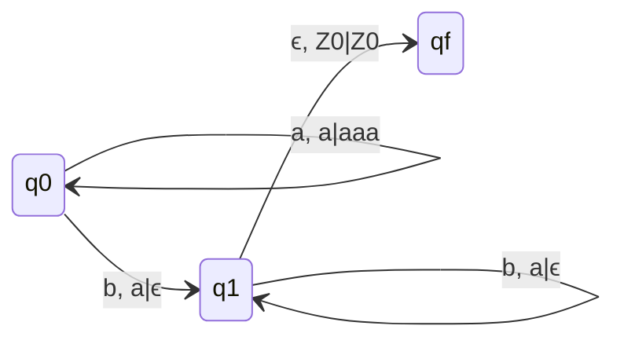
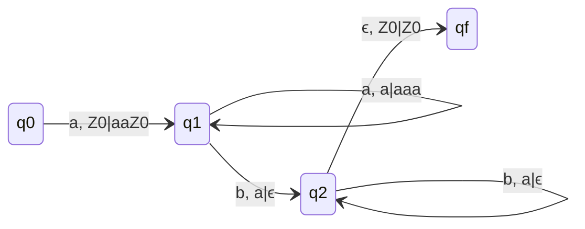
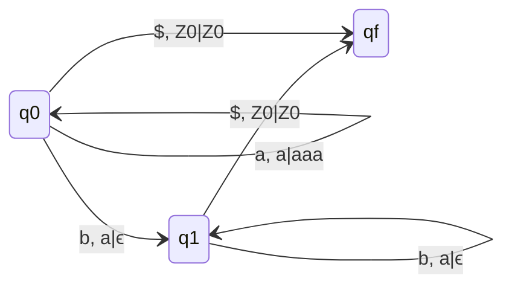

# Questions

## Q. L = {$a^nb^2n | n \geq 1$}
### Delta Moves
- $\delta(q_0, a, Z_0) = (q_0, aaZ_0)$
- $\delta(q_0, a, a) = (q_0, aaa)$
- $\delta(q_0, b, a) = (q_1, \epsilon)$
- $\delta(q_1, b, a) = (q_1, \epsilon)$
- $\delta(q_1, \epsilon, Z_0) = (q_f, Z_0)$

### State Transition Diagram

## Q. L = {$a^nb^2n | n \geq 0$}
### Delta Moves
- $\delta(q_0, a, Z_0) = (q_1, aaZ_0)$
- $\delta(q_1, a, a) = (q_1, aaa)$
- $\delta(q_1, b, a) = (q_2, \epsilon)$
- $\delta(q_2, b, a) = (q_2, \epsilon)$
- $\delta(q_2, \epsilon, Z_0) = (q_f, Z_0)$

### Consider L = {$a^nb^2n | n \geq 0$}, Assume every string ends with $ [$ as 'end Marker'] then L is accepted by DPDA with empty stack.
- This removesthe null move and adds $ in place of $\epsilon$ which makes it a true move.

> Whenever concept of end marker is used, no need of null move in PDA.
> Whenever concept of end marker is used, then language will never have prefix property.
> If concept of end marker is used, DPDA with null Store is equally powerful with DPDA with final State.

## Q. L = {$a^nb^3n | n \geq 0$}
### Delta Moves
- $\delta(q_0, a, Z_0) = (q_1, aaZ_0)$
- $\delta(q_1, a, a) = (q_1, aaaa)$
- $\delta(q_1, b, a) = (q_2, \epsilon)$
- $\delta(q_2, b, a) = (q_2, \epsilon)$
- $\delta(q_2, \epsilon, Z_0) = (q_f, \epsilon)$
### q0 is also final state
