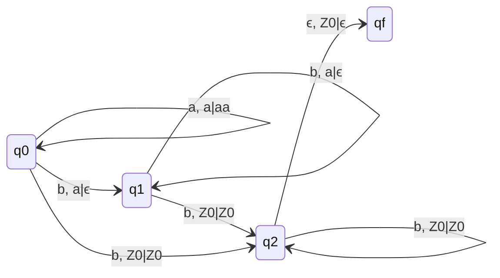
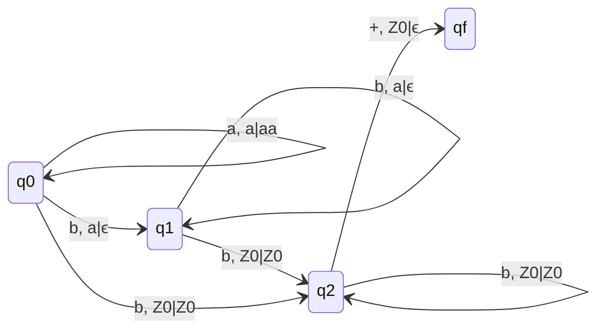
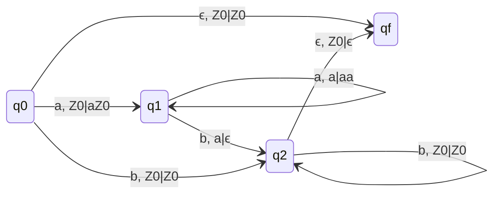
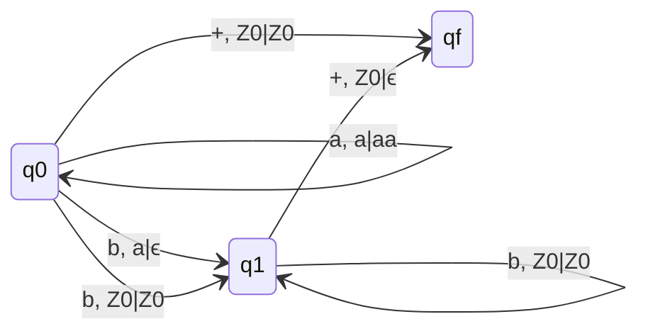
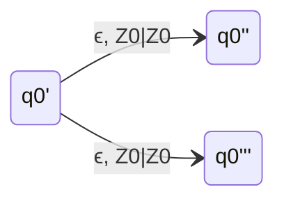
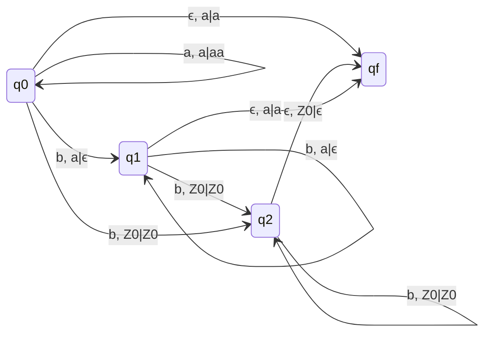

## Q. L = {$a^nb^m|n \lt m$}

### Without Marker

### With End Marker

- Possible DPDa with end marker, So it is DCFL.

## Q. L = {$a^nb^m|n \leq m$}

### Without Marker

### q0 and qf are final states

### Replace ϵ with + and we get a DPDA with end marker, So it is DCFL.

### Smaller Diagram

## L = {$a^nb^m|n \neq m$}

### L = {$a^nb^m|n \lt m$} $\cup$ {$a^nb^m|n \gt m$}

- Further draw for n\<m and n\>m at q0'' and q0''' respectively.

### Another smaller diagram

- q1 --> qf : ϵ, a|a is for $n \gt m$
- q0 --> qf : ϵ, a|a is for only a's
- q2 --> qf : ϵ, Z0|ϵ is for $n \lt m$
- q0 --> q2 : b, Z0|Z0 is for only b's
### Replace ϵ with + and we get a DPDA with end marker, So it is DCFL.