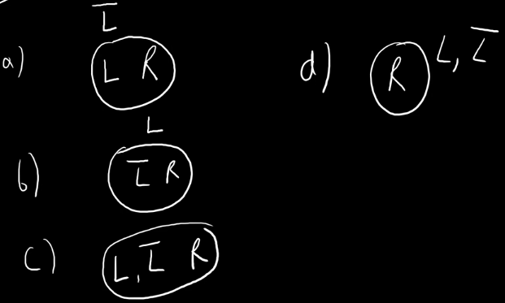
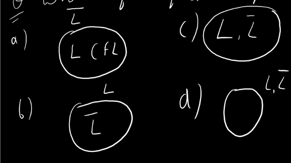
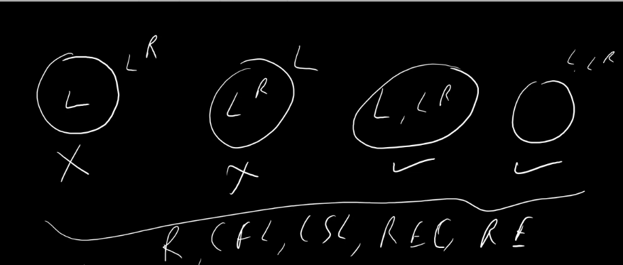

## Closure Properties discussion on Complement and Reversal

> Complement and Reversal are two way theorems:
 >> L is Regular then L' is Regular. ✅(P ->Q)  
 >> L' is Regular then L is Regular. ✅(Q -> P)  
 >> L is not Regular then L' is not Regular. ✅(~P -> ~Q)  
 >> L' is not Regular then L is not Regular. ✅(~Q -> ~P)

- Useful in solving questions for example:
    - Check L = {$a^{n}b^{m} | n + m \ge 10$} is Regular or not.
    - L' = {$a^{n}b^{m} | n + m < 10$} U ba is substring
    - In L' both strings are regular so L' is regular
    - As L' is regular so L is regular.

### Question
**Which of the following is Possible?**

- As L is regular so L' must be regular so option 1 is not possible.
- As L' is regular so L must be regular so option 2 is not possible.
- As L is regular so L' must be regular so option 3 is possible.✅
- As L is not regular so L' must be not regular so option 4 is possible.✅

**For the Case of CFL**  
- L is CFL then L' is CFL. ❌(P ->Q)
- L' is CFL then L is CFL. ❌(Q -> P)
- L is not CFL then L' is not CFL. ❌(~P -> ~Q)
- L' is not CFL then L is not CFL. ❌(~Q -> ~P)

### Question
**Which of the following is Possible?**

- As L is CFL so L' may or may not be CFL so option 1 is possible.
- As L' is CFL so L may or may not be CFL so option 2 is possible.
- As L is CFL so L' may or may not be CFL so option 3 is possible.
- As L is CFL so L' may or may not be CFL so option 4 is possible.

### Example
**For L is not CFL but L' is CFL**  
- L = {$a^{n}b^{n}c^{n} | n \ge 0$} is CSL
- L' = {$a^{n}b^{m}c^{k} | n \ne m \vee m \ne k$} U ba as substring U cb as substring U ca as substring
- L' is CFL but L is not CFL

### Example **(Gate 2020)**
- L = {w.w | w \in {a, b}*} is CSl
- L' will be CFL

**For the Case of CSL**
- L is CSL then L' is CSL. ✅(P ->Q)
- L' is CSL then L is CSL. ✅(Q -> P)
- L is not CSL then L' is not CSL. ✅(~P -> ~Q)
- L' is not CSL then L is not CSL. ✅(~Q -> ~P)

**Same goes for REC**  

**For RE but no REC**  
One case of L and L' both being RE is not posible.

## If L is Regular then $L^{R}$ is Regular
## If L is CFL then $L^{R}$ is CFL
## If L is CSL then $L^{R}$ is CSL
## If L is REC then $L^{R}$ is REC
## If L is RE then $L^{R}$ is RE
