### Ending with something

**Q. COnstruct an FA which accepts all those strings over a & b which ends with 'a'.**

- L will consist of Strings like a,ba,aa,aba,aaa, etc.

#### Intuition
- Starting whatever we give ending must be from a
- So to reach final state we have a and oje more state will b required for looping over first state.
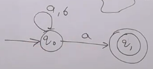

### Converting given NFA to DFA
- Look there are two option at q0 first is self loop and other is to q1.
- Definately we need to select q1 as we are required to reach final state.
- Also at q1 no paths is defined so we need to define paths
    - Reading a we have to make self loop as ends with 'a' must satisfy after readinf we are at final state.
    - Second, now we need path for b, we can't define it to other new state as it might go either dead state or the same thing as q1 will happen.
    - One thing is we give the path to q0 as any accpeted stirng will have atleast one a which will again redirect us to q1.
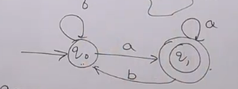

For understanding purpose

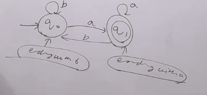

**Q. COnstruct an FA which accepts all those strings over a & b which ends with 'aa'.**

#### Intuition
- Anything in start but end in aa
- So two paths, one indicating transition from one state to other, then other to final

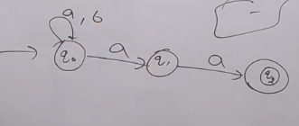

**Q. COnstruct an FA which accepts all those strings over a & b which ends with 'ba'.**

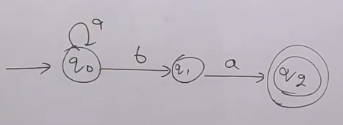
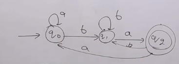

**Q. How many minimum states will be required for constructing FA with String ending with 'aabaabab'**

- From above question we may have got this that we require one state more than length of given string
- **Answer:** 9 (Whether NFA or DFA)

**Q. COnstruct an FA which accepts all those strings over a & b which ends with 'ba' or 'ab' or 'bb' or 'aa'.**

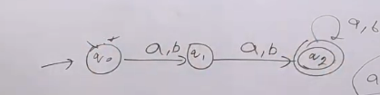

**Q. COnstruct an FA which accepts all those strings over a & b which ends with 'bb' or 'aa'.**

- Don't mingle up a,b else it will interpret another FA discussed above
- Hence we created different part to not mingle up things
- 4 states

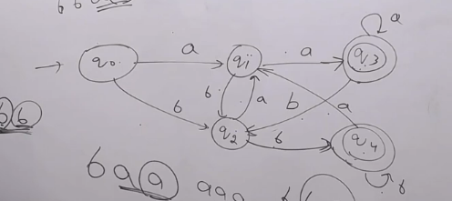
- Here we have made 2 final states as we to store from which path final state is reached
- Using single state can cause conflict with strin like baaa, abbb, etc.
- 5 states

## FA has Limited Memory

**Q. Construct an FA which accepts all those strings over a & b which ends with 'ba' or 'ab'.**

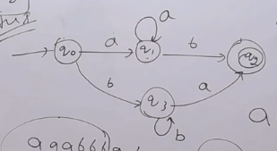

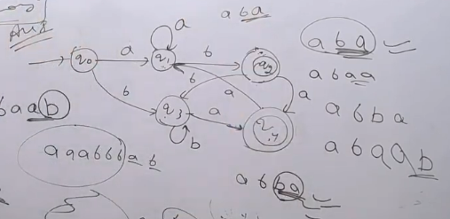
- In final first do for the stuff which that final state does not handle like q2 if get's b we need a to end and q3 deals with if input a b to end. So, pass a from q2 to q3. Similarly for other.
- now if a is at q2 for 'aba' self loop is fine but for 'abaa' also it will be working so we need other way. Here we trasferred 'a' to q4 so ending with 'aba' satisfied also if 'abaa' occurs q4 will redirect to q2.
- q2 handles ending with ab
- q4 handles ending with ba

**Q. Construct an FA which accepts all those strings ends with 'cat' or 'rat'.**

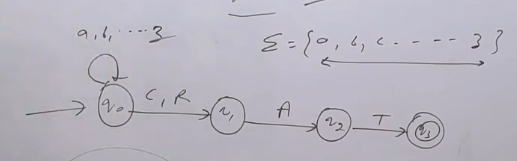
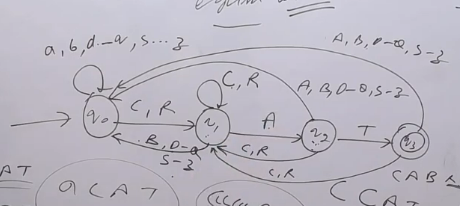

# Ending with 'n' length string then NFA, DFA of (n+1) length regardless of Sigma
> $\Sigma$ = {a}
> Ending with aa
> Min states 3