**Q. Consist of SubString 'aa'**

- L = {aa, aaa, aaaa, baa, aab, ... }
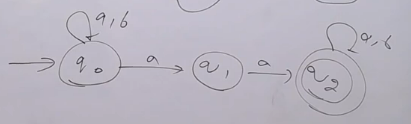
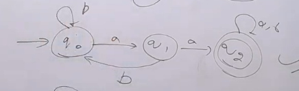

**Q. Consist of SubString 'ab'**
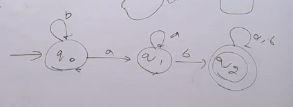

**Q. Consist of SubString 'a' OR atleast one a**

> If n length of string then NFA,DFA = n+1

## Divisible by something

> Whenever there are talks about divisibilty by something no self loops for that character
> For other character self loop is okay

### For mod n => Number of states = n

**Q. Number of 'a' divisible by something**

**Q. Number of 'a' % 3 = 1**
- Change the final state to q1

**Q. Number of 'a' are not divisible by three**

- Complementary state so we know how to change with it
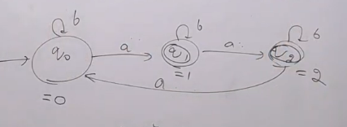

**Note: L ($\overline{M}$) = $\overline{L}$(M) in DFA, not in NFA**

**Q. L = { w | w $\in$ {a,b}* and $n_{a}$(w) congruent to 1 mod 3}**

$ n_{a} $(w) congrunet 1 mod 3 => $ n_{a} $(w) mod 3 = 1
- Same as one question above

**Q. L = { w | w $\in$ {a,b}* and $n_{a}$(w) congruent to k mod m}**
- There would be m states and $(k^{th}+1)$ state would be final state

**Q. Divisible by 2 & 3**
- Means divisible by 6
- 6 states and 1st state is final state

**Q. Divisible by 2 or 3**
- 6 states (As LCM(2,3) = 6)
- 1st, 3rd, 4th and 5th states are final state
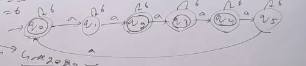

**Q. Divisible by 4 or 6**
- 12 states (As LCM(4,6) = 12)
- 1st, 5th, 7th and 9th states are final state

## a divisible by something and b divisible by something
>- Here we use Grid Automata
>- Number of states = 3 * 2 = 6

**Q. a is divisible by 3 and b is divisible by 2**

- Create col of 3 as a divisible by 3
- Create row of 2 as b divisible by 2
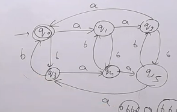

**Q. a mod 3 = 1 and b mod 2 = 1**
- From the above image, now we need a mod 3 =1 so col selete will be 2 and b mod 2 = 1 so row select will be 2 hence q4 is final state

**Q. a mod 3 = 2 and b mod 2 = 0**
- q2 will be our final state

**Q. a mod 3 = 0 or b mod 2 = 0**
- a mod 3 = 0 => col 1 (q0, q3)
- b mod 2 = 0 => row 1  (q0, q1, q2)
- Hence, q0, q1, q2, q3 are final state

**Q. a mod 3 != 0 or b mod 2 != 0**
- L = { a mod 3 != 0 or b mod 2 != 0 }
- $\overline{L}$ = { a mod 3 = 0 and b mod 2 = 0 }
- L = $\overline{ \{a mod 3 = 0 and b mod 2 = 0 \} }$
- We have diagram for a mod 3 = 0 and b mod 2 = 0
- Now for complement we need to change final state to non final state and non final state to final state
- q1, q2, q3, q4, q5 are final states

**Q. a mod 3 != 0 and b mod 2 != 0**
- L = { a mod 3 != 0 and b mod 2 != 0 }
- $\overline{L}$ = { a mod 3 = 0 or b mod 2 = 0 }
- L = $\overline{ \{a mod 3 = 0 or b mod 2 = 0 \} }$
- We have diagram for a mod 3 = 0 or b mod 2 = 0
- Now for complement we need to change final state to non final state and non final state to final state
- q4, q5 are final states

**For Questions like number of a's are even and number of b's are odd**
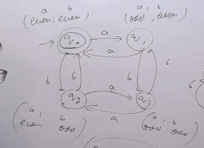

**Q. Number of 0 mod 3 = 0 and number of 1 mod 4 = 1**
> Note: the diagram orientation is transposed
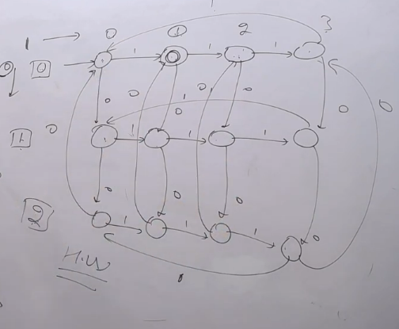

### Number of a's - Number of b's divisible by something

**Q. Number of a's - Number of b's divisible by 3**

- First create for number of a's divisible by 3
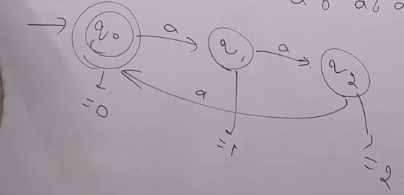

- now direct b in such according to how we get remainder 0, 1, 2
- If b occurs at q0 we will have strings like b, aaab, aaaaaab, ... (Number of a's - Number of b's mod 3 will be 2, So direct b to q2)
- If b occurs at q1 we will have strings like ab, aaaab, aaaaaaab, ... (Number of a's - Number of b's mod 3 will be 0, So direct b to q1)
- If b occurs at q2 we will have strings like aab, aaaaab, aaaaaaaab, ... (Number of a's - Number of b's mod 3 will be 1, So direct b to q1)
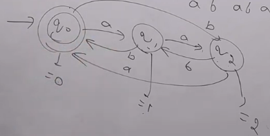

### **Q. Construct an FA which accepts all those binary strings whose decimal equivalent is divisible by 3**

- No mater what is input we need to check divisibility by 3 so there will be three states.

- First of all for decimal values the property is
    - By adding 0 behind any string the decimal value will be double
    - By adding 1 behind any string the decimal value will be double + 1

- Now first of all create 3 states let's name them 3m (q0), 3m+1 (q1), 3m+2 (q2).
- let's say we are on string 3m and we get 0 then we will be on 3m*2 = 6m = 3(2m) = 3m. So the path of 0 will be q0 -> q0
- let's say we are on string 3m and we get 1 then we will be on 3m*2 + 1 = 6m + 1 = 3(2m) + 1 = 3m + 1. So the path of 1 will be q0 -> q1

- let's say we are on string 3m+1 and we get 0 then we will be on 3m+1*2 = 6m + 2 = 3(2m+1) + 2 = 3m + 2. So the path of 0 will be q1 -> q2
- let's say we are on string 3m+1 and we get 1 then we will be on 3m+1*2 + 1 = 6m + 3 = 3(2m+1) + 3 = 3m + 3 = 3(m+1). So the path of 1 will be q1 -> q0

- let's say we are on string 3m+2 and we get 0 then we will be on 3m+2*2 = 6m + 4 = 3(2m+1) + 1 = 3m + 1. So the path of 0 will be q2 -> q1
- let's say we are on string 3m+2 and we get 1 then we will be on 3m+2*2 + 1 = 6m + 5 = 3(2m+1) + 2 = 3m + 2. So the path of 1 will be q2 -> q2

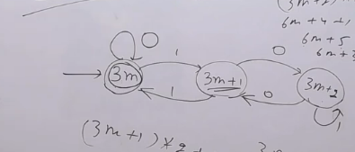

### **Q. Construct an FA which accepts all those binary strings whose decimal equivalent is divisible by 3 except null**

- Just insert a dummy initial state which performs task of 3m
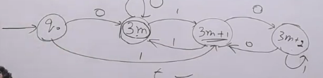

### **Q. Construct an FA which accepts all those binary strings whose decimal equivalent is divisible by 5**

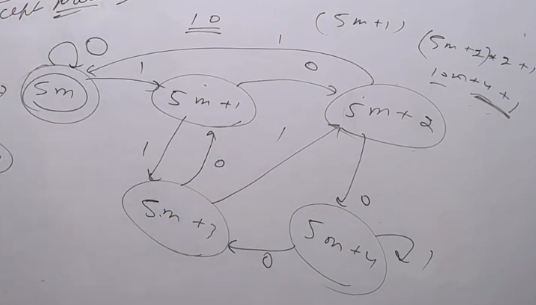

### **Q. Construct an FA which accepts all those strings whose decimal equivalent is divisible by 3**

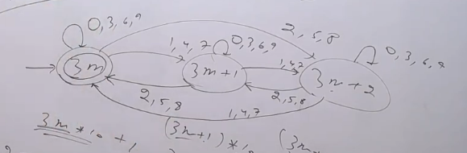