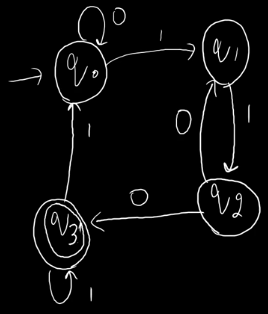
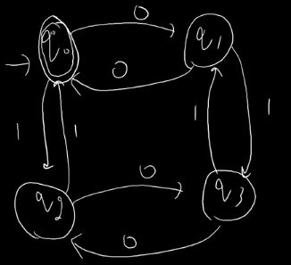

### Equivalence of R.E., R.G. and FA
- For R.L. 
  - DFA, NFA, NFA with null moves --> Accepting Devices
  - Regular Expression --> Representing Device
  - Regular Grammar --> Generating Device

### FA to RE Conversion (Arden's Theorem)
- R = Q + RP
  - R,Q,P --> Combination of State and Terminal Symbols
- R = Q + (Q + RP)P
- R = Q + QP + $RP^{2}$
- R = Q + QP + (Q + RP)P
- R = Q + QP + $QP^{2}$ + $RP^{3}$
- R = Q + QP + $QP^{2}$ + $QP^{3}$ + $QP^{4}$ + ...
- R = QP* (Solution)
- Solution is Independent of R
- There will be some component of R but that we will neglect 

**Convert FA to RE**  

- Step 1: Write State Equations
  - q0 = $q_{0}0 + q_{3}1 + \epsilon$ --(1)
  - (Epsilon because without reading anything we are on q0)
  - q1 = $q_{0}1 + q_{2}0$ --(2)
  - q2 = $q_{1}1$ --(3)
  - q3 = $q_{2}0 + q_{3}1$ --(4)
- Step 2: Solve for all final states
  - $q_{3}(R) = q_{2}0(Q) + q_{3}1(RP)$ 
  - $q_{3}(R) = q_{2}01^{*}(QP^{*})$ --(5)
- From (3) & (5)
  - $q_{3} = q_{1}101^{*}$ --(6)
- Here, if further we substitute q1, it contains q2 we may get into infinite loop. So, Using Arden's Theorem on q1 and q2
- From (2) & (3)
  - $q_{1}(R) = q_{0}1(Q) + q_{1}10(RP)$
  - $q_{1}(R) = q_{0}1(10)^{*}(QP^{*})$ --(7)
- From (6) & (7)
  - $q_{3} = q_{0}1(10)^{*}101^{*}$ --(8)
- From (1)
  - $q_{0}(R) = q_{0}0(RP) + q_{3}1 + \epsilon (Q)$
  - $q_{0}(R) = (q_{3}1 + \epsilon)0^{*}$ --(9)
- From (8) & (9)
  - $q_{3} = (q_{3}1 + \epsilon)0^{*}1(10)^{*}101^{*}$
  - $q_{3}(R) = q_{3}10^{*}1(10)^{*}101^{*}(RP) + 0^{*}1(10)^{*}101^{*}(Q)$
  - $q_{3} = 0^{*}1(10)^{+}1^{*}[10^{*}1(10)^{+}1^{*}]^{*}$

**Construct RE for even 0's and even 1's**  

- Step 1: Write State Equations
  - $q_{0} = q_{1}0 + q_{2}1 + \epsilon$ --(1)
  - $q_{1} = q_{0}0 + q_{3}1$ --(2)
  - $q_{2} = q_{0}1 + q_{3}0$ --(3)
  - $q_{3} = q_{1}1 + q_{2}0$ --(4)
- Step 2: Solve for all final states
  - $q_{0} = (q_{0}0 + q_{3}1)0 + (q_{0}1 + q_{3}0)1 + \epsilon$
  - $q_{0} = q_{0}00 + q_{3}10 + q_{0}11 + q_{3}01 + \epsilon$
  - $q_{0} = q_{0}(00 + 11) + q_{3}(10 + 01) + \epsilon$
  - $q_{0} = (q_{3}(10 + 01)+\epsilon)(00 + 11){*}$ --(5)
- From (2), (3) & (4)
  - $q_{3} = (q_{0}0 + q_{3}1)1 + (q_{0}1 + q_{3}0)0$
  - $q_{3} = q_{0}(01 + 10) + q_{3}(11 + 00)$
  - $q_{3} = q_{0}(01 + 10)(11 + 00)^{*}$ --(6)
- In (5)
  - $q_{0} = (q_{0}(01 + 10)(11 + 00)^{*} + \epsilon)(00 + 11)^{*}$
  - $q_{0} = q_{0}(01 + 10)(11 + 00)^{*}(00 + 11)^{*} + (00 + 11)^{*}$
  - $q_{0} = (00 + 11)^{*}[(01 + 10)(11 + 00)^{*}(00 + 11)^{*}]^{*}$