# FA to RE Part-2

## 8) Which is/are R.E. for the following FA?
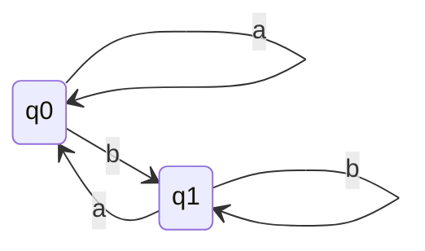
### q0 is initial state and q1 is final state
1. $a^{*}b(aa^{*}b + b)^{*}$
2. $(a^{+}bb^{*}a)^{*}bb^{*}$
3. $a^{*}b^{+}[a^{+}b^{+}]^{*}$
4. $a^{+}b^{*}(a+b)^{*}$

### Solution:
- Checking option one 
  - Keeping second term null we can reach final state using a*b
  - Also if power of second term is not zero still we can reach final state so, Option 1 is correct.
- Checking option two
  - Keeping first term power 0 we can reach final state using bb*
  - Also if power of first term is not zero still we can reach final state so, Option 2 is correct.
- Checking option three
  - Keeping second term null we can reach final state using a*b+
  - Also if power of second term is not zero still we can reach final state so, Option 3 is correct.
- Checking option four
  - Through $a^{+}b^{*}$ we can't reach final if from $b^{*}$ we choose $\epsilon$ so, Option 4 is incorrect.

### Answer: 1, 2, 3
---

## 9) Write R.E. for given FA

### q0 is initial state and final state
### Solution:
- S1 ✅
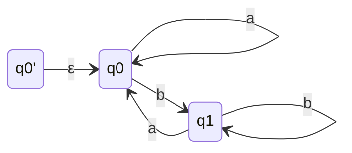
- S2 ✅
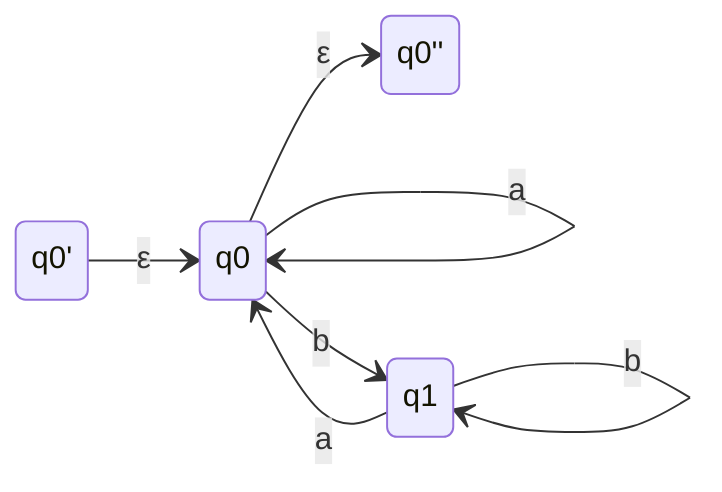
- S3 ✅
- **Eliminating q0**
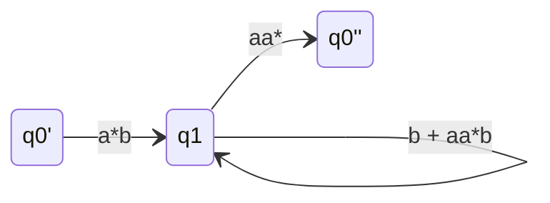
- We have gone to final from q1 not from q0', Why❓
- **Eliminating q1**
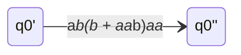
### Answer: $a^{*}b(b + aa^{*}b)^{*}aa^{*}$
### Second Sequence of S3
- **Eliminating q1**
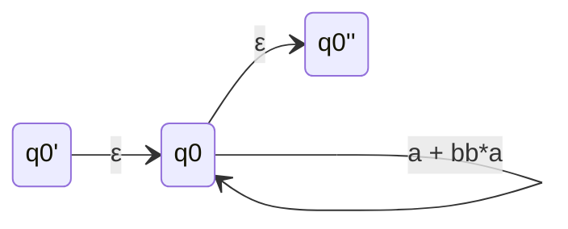
- **Eliminating q0**
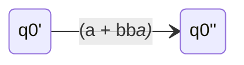
### Answer: $(a + b^{+}a)^{*}$
---

## 10) Write R.E. for given FA
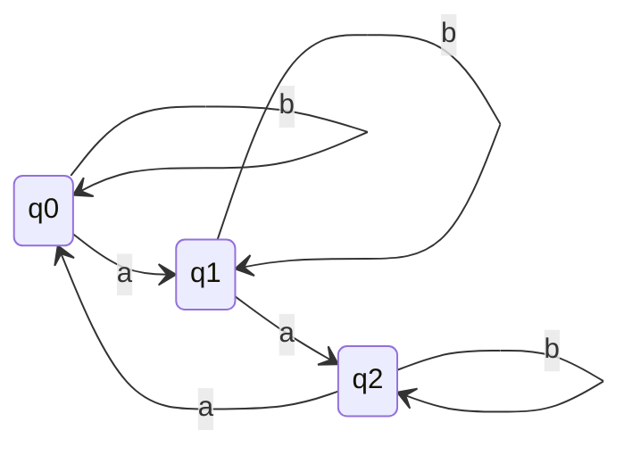
### q0 is initial state and final state
### Solution:
- S1,S2 ✅
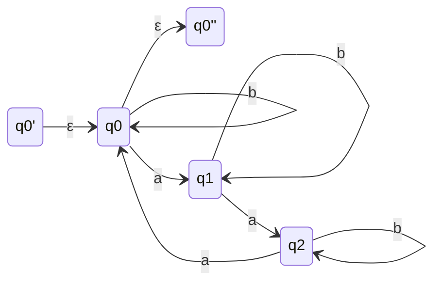
- S3 ✅
- **Eliminating q1 first as it is bridge between q0 and q2 and less busy**
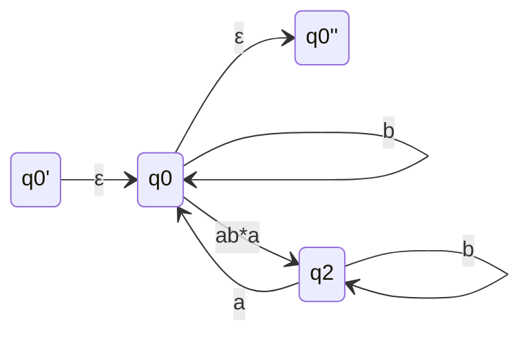
- **Eliminating q2 as q0 is the most busy state**
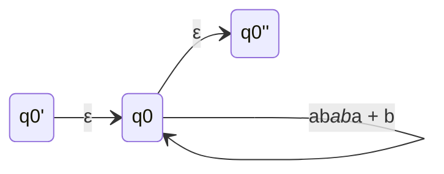
- **Eliminating q0**
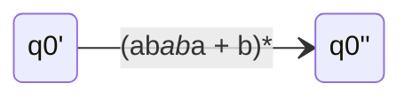
### Answer: $(ab^{*}ab^{*}a + b)^{*}$
---