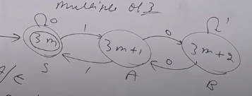
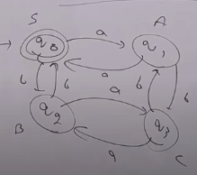

## Contruct a Regular Grammar over binary number whose decimal equivalent is divisible by 3.

- We have already made a DFA for this. We will use that to make a regular grammar.



- As shown suppose q0 as S, q1 as A and q2 as B.
- Now we will make productions for each state.
```
S -> 0S | 1A
A -> 0B | 1S
B -> 0A | 1B
```
- Add $\epsilon$ to final state.
$\therefore$ Regular Grammar is:
```
S -> 0S | 1A | ε
A -> 0B | 1S
B -> 0A | 1B
```

## This is the shortcut method to make a regular grammar from DFA.

## Construct a Regular Grammar over {a, b} with even number of a's and even number of b's.


```
S -> aA | bB | ε
A -> aS | bC
B -> bS | aC
C -> aB | bA
```
