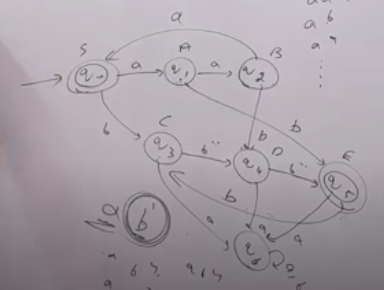
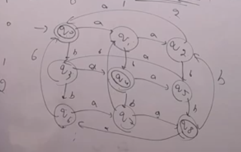

### There are languages for which regular grammar is not possible, nor we can design a finite automata for them. Such languages are called non-regular languages.
- Example: L = {$a^{n} b^{n} | n >= 0$}
- Example: L = {$a^{n} b^{m} | n,m >= 0, n>m$}
- Example: L = {$a^{n} b^{m} | n,m >= 0, n<m$}
- Example: L = {$a^{n} b^{m} | n,m >= 0, n!=m$}
### This languages are not regular. We can prove it using pumping lemma.

---
## Finite Automata has Limited memory it cannot remember the number of a's and b's. That's why it is not possible to design a finite automata for the above languages. Can remember limited strings.

- If the languages are like 
    - L = {$a^{n} b^{n} | n >m, n,m<10,000,000 $}
    - We can still make Regular Language and FA for this although it will be very complex.

# Conclusion
### FA can't accept those infinite languages in which there is comparison between number of a's and number of b's.

# L = {$a^{n} b^{m} | n \ge m OR n \le m$}
- This language is regular. We can make a FA for this.
- It states that n can be greater than m or n can be less than m or n can be equal to m. Which gives us the language
- L = {$a^{n} b^{m} | n,m >= 0$}

### FA for L = {$a^{n} b^{m} | n%3=m%3$}

- First create a%3 = 0 automata
- Now check for b%3 = 0
- For b we aren't going back to q0 after 3b's because this will then allow to generate a after b which is not allowed.
- So we created new state and made it final for checking b%3=0.
- Now we have to check for a%3 = 1
- If a%3 = 1 then b%3 must be equal to 1 as well so after reading 1 b from q1 we will go to q5 final state which will give b%3 = 1.
- Similarly we will check for a%3 = 2 and b%3 = 2.

#### Grammar for this language
- S -> aA | bC
- A -> aB | bE
- B -> aS | bD
- C -> bD
- D -> bE
- E -> bC
- Neglecting the dead states we get
- Also FA is possible for L = {$a^{n} b^{m} | n = m%3$} just remove the loop of a

## L = {w | number of a's mod 3 = number of b's mod 3}

- From this grid ither questions like
- L = {w | number of a's mod 3 > number of b's mod 3}
- L = {w | number of a's mod 3 <= number of b's mod 3}
- L = {w | number of a's mod 3 != number of b's mod 3}
- Can be solved easily.

# ❌ Not Regular Langugaes Extra Exmples
- L = {$a^{n} b^{n+1} | n >= 0 $}
- L = {$a^{n} b^{n+2} | n >= 0 $}
- L = {$a^{n} b^{m} | n=m+1$}
- L = {$a^{n} b^{m} c^{n+m} | n,m >= 0$}
- L = {$a^{n} b^{m} c^{n-m} | n,m >= 0$}

- For comparison in mod cases language is mostly Regular NOTE: not all time
- But comparison in other cases Language is not Regular