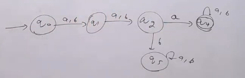
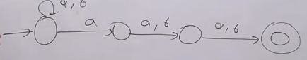
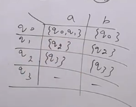
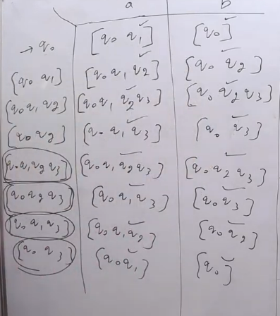
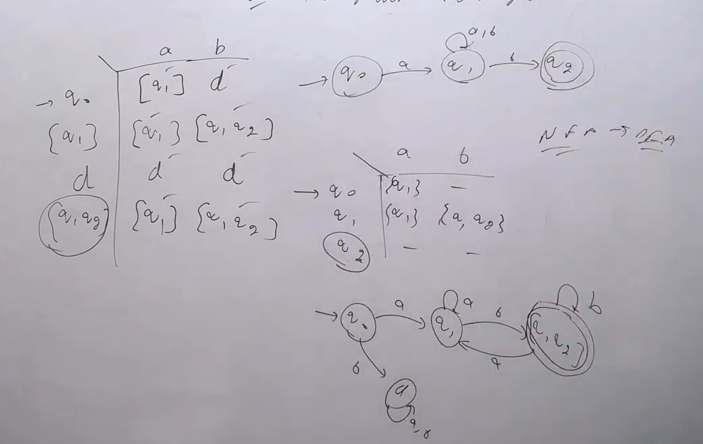

NFA --Algorithm--> DFA

- Any NFA can be converte into DFA
- NFa and DFA have same power i.e. for any language if one can make NFA and it's DFA is also always possible
- It there are Q states in NFA then there are $2^{Q}$ states in DFA
- if there is "min NFA" with Q states then there the range of states in DFA is $[Q,2^{Q}]$

**Q. Construct DFA where $\Sigma = \{a,b\}$ and third symbol from left is a**

**Q. Construct DFA where $\Sigma = \{a,b\}$ and third symbol from right is a**

- For constructing DFA from NFA, now we will use algorithm

- First of all make a table of all states of NFA
- Here
    - 
- Step 1: Initial state of NFA = Initial state of DFA
- Step 2: For each state of DFA, find the states of NFA which are reachable from this state
    - If there are more than one state reacable from this state then make a new state in DFA
- Step 3: In horizontal serial manner, write the states which are reachable from the state of DFA
- Step 4: Repeat step 2 and 3 for all states of DFA
- Step 5: If there is a final state of NFA in the states of DFA then make all those the final state of DFA

- 
- Now make DFA Diagram from this table

- Mark arrows with a and b from table

- If in initial, there is empty just replace it with dead state
**Q. String starting with a and ending with b**
